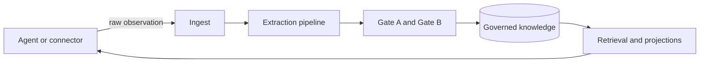

# MemHouse

MemHouse is a governed memory system for agents, built with Elixir, Ash,
Phoenix, Oban, PostgreSQL, pgvector, and Postgres full-text search.

Agents submit observations. A pipeline extracts candidate knowledge, governance
decides what survives and who can see it, and retrieval returns scoped answers
with citations. Agents never write knowledge directly.

**Status:** community beta `0.4.0`. The memory engine, governance, retrieval,
documents, browser console, packaging, and release checks are implemented.
Integration surfaces, gateway proxy, and generated SDKs are not.

- [User documentation](https://memhousehq.github.io/memhouse/)
- [Quickstart](https://memhousehq.github.io/memhouse/getting-started/quickstart/)
- [Known limitations](https://memhousehq.github.io/memhouse/reference/limitations/)

## How it works



The main rules are:

- **Account is the isolation boundary.** Authentication determines it; request
  parameters cannot select it.
- **Scope controls inheritance.** Values flow down the containment tree and the
  nearest value wins.
- **Knowledge is the durable atom.** Profiles, entity rows, projections, and
  indices are rebuildable views.
- **Only the pipeline writes knowledge.** Agents and connectors write raw
  messages or document versions.
- **Visibility has a rising bar.** Peer knowledge may be provisional. Wider
  scope needs Gate B approval; personal knowledge also needs subject consent.
- **Time and provenance stay separate.** Belief-time, valid-time, salience,
  confidence, sensitivity, subject, and source are independent fields.

An ingest request follows one transaction-safe path:

1. Phoenix authenticates the caller and derives the Account.
2. The system commits the raw observation, content-safe audit entry,
   idempotency record, and Oban job together.
3. `MemHouse.Model.Gateway` extracts structured candidates.
4. `MemHouse.Governance.Engine` assigns lifecycle and visibility.
5. Background work updates embeddings, indices, entities, and projections.
6. Search and ask apply authorization and lifecycle filters before ranking.

A model outage delays extraction but does not lose the observation.

## Deployment

One Mix release supports both modes with the same behavior:

| Mode | PostgreSQL |
| --- | --- |
| Local | Release-supervised, checksum-pinned pg0 |
| External | Operator-run PostgreSQL with pgvector |

The container path uses stock PostgreSQL. Local embeddings can use Ortex/ONNX;
generation can use any ReqLLM-supported or OpenAI-compatible endpoint.

## Quick start

### Downloaded release

Download the archive and `.sha256` file for glibc Linux x86_64/ARM64 or macOS Apple Silicon
from [GitHub Releases](https://github.com/memhousehq/memhouse/releases).
Windows, Intel macOS, and Linux musl use external PostgreSQL or the container.
Verify the checksum, unpack the archive, then run:

```bash
bin/server
curl -fsS http://127.0.0.1:4000/api/ready
```

The launcher creates its data directory, starts pg0, migrates the database, and
starts the API. The [release installation guide](https://memhousehq.github.io/memhouse/getting-started/install-release/)
has architecture selection, download, checksum, macOS Gatekeeper, and
a recommended local setup block with signed automatic patch/minor updates.

### Source checkout

Requirements: Elixir/OTP versions from `.tool-versions`, plus PostgreSQL with
pgvector.

```bash
cp .env.example .env
mix deps.get
mix setup
mix phx.server
```

See the [installation guides](https://memhousehq.github.io/memhouse/getting-started/)
for release, Docker, source, and external-Postgres setup.

## Main surfaces

| Surface | Purpose |
| --- | --- |
| `POST /api/v1/ingest` | Store an observation and enqueue extraction |
| `POST /api/v1/search` | Retrieve ranked governed knowledge |
| `POST /api/v1/ask` | Retrieve a grounded answer |
| `POST /api/v1/context` | Assemble reasoning-free context |
| `POST /api/v1/readiness` | Check skill requirements |
| `/console/*` | Human memory browser and self-service controls |
| `/governance` | Curator review in the same human session |
| `GET /api/ready` | Operational readiness |

Authentication, payloads, errors, and complete route availability are in the
[HTTP API reference](https://memhousehq.github.io/memhouse/reference/http-api/).

## Implemented capabilities

- Ten Ash Domains and 38 Resources as the durable policy boundary.
- Transactional ingest, hash-chain audit, replay-safe jobs, and reconciliation.
- Password/JWT humans, hashed agent keys, deny-wins inherited RBAC, and RLS.
- Gate A/B governance, curator review, consent, revalidation, and erasure.
- Provider-neutral model roles, structured extraction, and usage metering.
- Immutable document versions, parsing, connectors, sync, and blob adapters.
- Multi-strategy retrieval, reciprocal-rank fusion, context projections, and
  internal entity resolution.
- Skill requirement cards and reasoning-free readiness checks.
- Human LiveView console with role-appropriate governance and self-service.
- Logical Account export/import, pg0 releases, containers, health, and costs.
- Deterministic evaluation reports and release-readiness checks.

Evidence and real limitations live in
[`specs/implementation-status.md`](specs/implementation-status.md).

## Not implemented

- Generated AshJsonApi OpenAPI and generated TypeScript/Python clients.
- OpenAI- and Anthropic-compatible gateway proxy.
- Full dialectic answering with in-loop citation verification.
- Connector and Account archive administration UIs.
- Upstream-scale benchmark and independent live-judge evidence.

The files under `sdk/` are transport-neutral readiness helpers, not generated
SDKs. Remaining work is tracked in
[`specs/roadmap/beta-roadmap.md`](specs/roadmap/beta-roadmap.md).

## Repository map

| Path | Purpose |
| --- | --- |
| `lib/memhouse/memory.ex` | Main operation facade |
| `lib/memhouse/pipeline/` | Extraction and the only knowledge-write path |
| `lib/memhouse/governance/` | Gates, consent, lifecycle, audit, and erasure |
| `lib/memhouse/retrieval/` | Strategies, fusion, profiles, and indices |
| `lib/memhouse/model/` | Gateway, roles, structured output, and embeddings |
| `lib/memhouse/documents/` | Versions, blobs, parsing, and connectors |
| `lib/memhouse/context/`, `lib/memhouse/skills/` | Context and readiness |
| `lib/memhouse/portability/` | Logical Account export and import |
| `lib/memhouse/eval/` | Evaluation harness and reports |
| `lib/memhouse_web/` | HTTP, authentication, telemetry, and LiveView |
| `lib/mix/tasks/` | Operator and evaluation commands |
| `test/` | Regression and contract evidence |
| `docs/` | Published user documentation |
| `specs/` | Requirements, architecture, decisions, plans, and evidence |

Start reading at `lib/memhouse_web/router.ex`, then
`lib/memhouse/memory.ex`, `lib/memhouse/knowledge.ex`,
`lib/memhouse/governance/engine.ex`, and
`lib/memhouse/retrieval/strategy.ex`.

## Development

Read [`AGENTS.md`](AGENTS.md) before editing and
[`CONTRIBUTING.md`](CONTRIBUTING.md) before opening a PR.

Standard checks:

```bash
mix deps.get
mix ash.codegen --check
mix format --check-formatted
mix compile --warnings-as-errors
mix test
mix credo --strict
mix dialyzer
mix sobelow --config
```

Build the documentation with `mkdocs build`. Evaluation and release commands
are listed in the [Mix task reference](https://memhousehq.github.io/memhouse/reference/mix-tasks/).

## Documentation map

- `docs/`: setup, usage, operations, and current behavior; published with
  MkDocs.
- `specs/memory-system-*.md`: product and architecture blueprints.
- `specs/architecture/`: implemented capability designs.
- `specs/adr/`: architecture decisions.
- `specs/roadmap/beta-roadmap.md`: the only roadmap.
- `specs/eval/`: evaluation method, thresholds, inventory, and results.

## License

MemHouse is source-available fair-code, not OSI open source. Community code is
covered by [`LICENSE.md`](LICENSE.md). Enterprise-marked code is covered by
[`LICENSE_EE.md`](LICENSE_EE.md).
