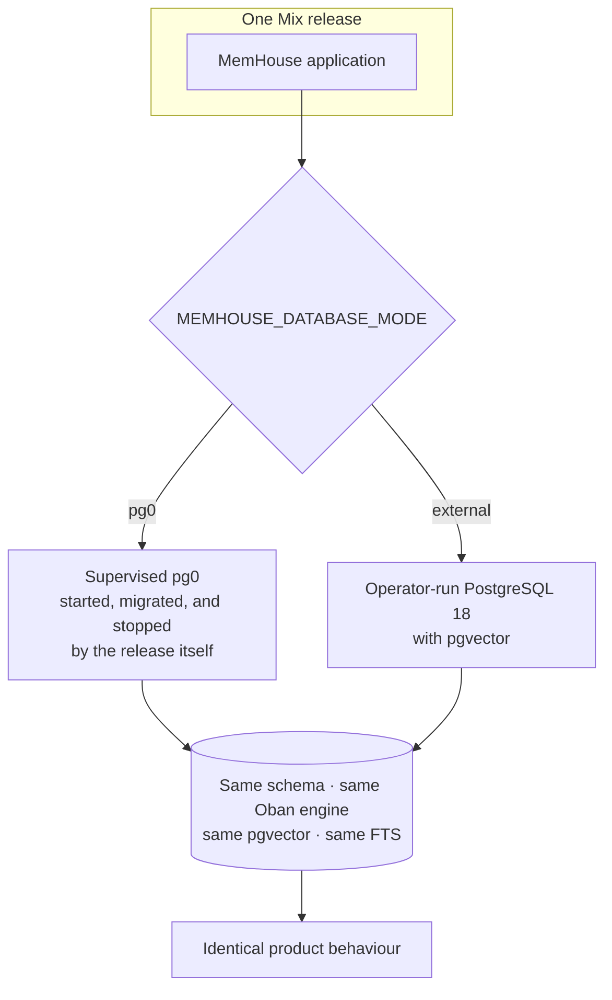

<!-- SPDX-License-Identifier: MemHouse-Sustainable-Use-1.0 -->

# Deployment modes

> **One codebase, two deployment modes, identical guarantees.**

Single-machine and queue-backed deployments run the same Mix release with
different runtime configuration.

## What the mode changes, and what it does not

| Changes | Does not change |
| --- | --- |
| Where PostgreSQL runs | The schema |
| Who starts and stops it | Job execution — Oban on PostgreSQL either way |
| How migrations are triggered | Retrieval, governance, tenancy, or audit behaviour |
| Backup procedure | The API |

Choosing pg0 or external PostgreSQL changes infrastructure. Changing retrieval
or gate rules changes product behavior and requires product review.

## Supervised PostgreSQL (pg0)

The packaged release carries a checksum-pinned pg0 distribution. On start it:

1. verifies the pinned asset;
2. starts pg0 **before** the Ecto repo and migrations;
3. creates the cluster on first run;
4. recovers from a stale lock left by an unclean shutdown;
5. provisions the restricted database role and switches every connection to
   it, so row-level security enforces rather than being silently skipped for
   pg0's superuser bootstrap login;
6. runs migrations, then serves traffic.

Container images never include pg0; containers use external PostgreSQL.

## Operator-run PostgreSQL

Set `MEMHOUSE_DATABASE_MODE=external` and `DATABASE_URL`. Requirements:

- PostgreSQL 18 with pgvector available;
- full-text search (built in);
- permission to create the extensions the migrations declare;
- `DATABASE_URL`'s role either has `CREATEROLE` (MemHouse provisions and
  switches to a restricted role itself) or is already `NOSUPERUSER
  NOBYPASSRLS` (see `MEMHOUSE_DATABASE_APP_ROLE` in
  [Configuration](../reference/configuration.md)). PostgreSQL skips row-level
  security entirely for a superuser or a `BYPASSRLS` role, and MemHouse
  refuses to boot without one of these two paths available.

Migrations can run as a supervised startup step (`MEMHOUSE_AUTO_MIGRATE=true`)
or as a separate `bin/migrate` invocation when change control demands it. Both
paths run migrations over the unrestricted connecting role — the restricted
role owns nothing and cannot alter the schema — and re-grant its rights over
whatever the migration just created afterward.

## No second engine, anywhere

There is no file-based or embedded alternative engine lane, and there never
will be one. Jobs, vector search, and full-text search all depend on
PostgreSQL in both modes; a lane on a different engine would be testing
software nobody ships.

For the same reason, there is no Redis, no external broker, and no separate
worker fleet: durable job insertion must commit in the same transaction as the
state change and the audit entry that requested it, and only a
database-resident queue can do that.

## Free core and enterprise

The free core is the whole memory engine: single-node self-hosting,
local/offline model options, MCP, basic RBAC, governed validation, document
ingestion, retrieval, export/import, and release-grade evaluation.

Enterprise is the scale and compliance tier: multiple Accounts, queue mode,
SSO/SAML/SCIM, schema- or database-per-Account isolation, granular RBAC,
customer-managed keys, SIEM streaming, and advanced compliance operations.

The community build stays coherent and buildable on its own. Core never imports
enterprise code.

## Related

- [Install a release](../getting-started/install-release.md)
- [Run with Docker](../getting-started/install-docker.md)
- [Operations overview](../operations/index.md)
