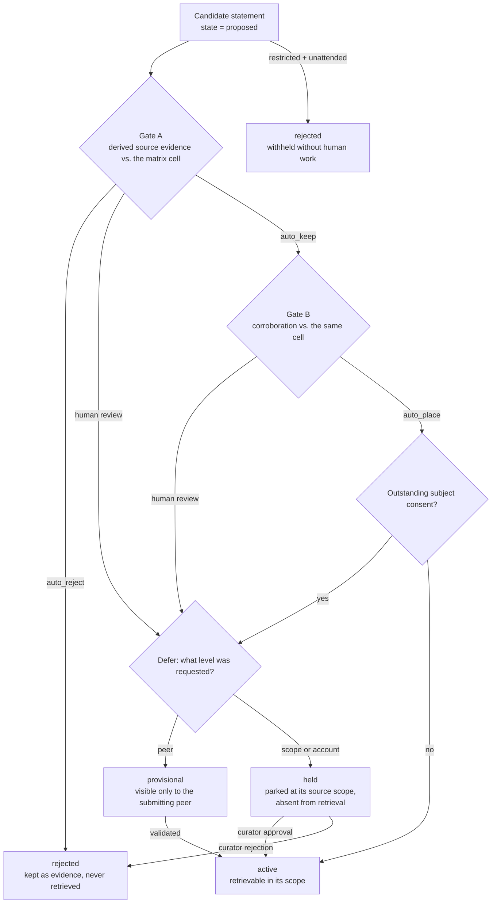
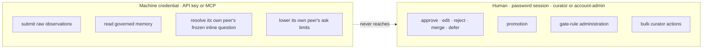

<!-- SPDX-License-Identifier: MemHouse-Sustainable-Use-1.0 -->

# Governance gates

Gate A decides whether a proposal is worth keeping. Gate B decides how widely
it may be exposed. Each writes its own decision record.

## The matrix

A gate decision uses a matrix cell keyed by **target level** and
**sensitivity**, resolved in this order:

1. the active rule attached to the item's own scope;
2. the account-wide rule;
3. a built-in cell that demands human review at both gates.

A missing or invalid matrix falls back to human review, never auto-activation.

Gate A modes are `auto_keep` (keep only when schema-derived source evidence
clears the cell's minimum), `auto_reject` (drop unconditionally), and anything
else meaning human review. A source speaking about itself is `direct`; every
other source-to-subject relationship is `indirect`. Model confidence is shown
to reviewers but never authorizes automatic acceptance.

Gate B has `auto_place` (place knowledge when corroboration clears the cell's
minimum) and human review. It covers public and internal knowledge always, and
personal knowledge only in an Account that consents automatically. Restricted
knowledge needs a human placement decision in an attended deployment.

## Target levels and blast radius

Target levels widen **peer → scope → account**. They express requested blast
radius, not retrieval visibility; visibility follows scope and lifecycle. One
confidence value may activate a peer item but require human review at scope.

| Requested level | Default outcome without an explicit rule |
| --- | --- |
| Peer | `provisional` — visible only to the peer it came from |
| Scope | `held` — parked at its source scope, absent from retrieval |
| Account | `held` — same, with a higher bar to clear |

## Consent for personal knowledge

Curator approval cannot widen personal knowledge without verified subject
consent. Lacking it, the item stays put and the queue entry becomes
`awaiting_consent`.

Consent is:

- **granted by the subject**, not by an administrator;
- **specific to one target scope**, not blanket;
- **only counted when it arrived over a verified channel**.

A *denial* is accepted through any channel, because withdrawing exposure should
never be harder than granting it.

### Declaring an Account or deployment has no real subject

Benchmarks, evaluations, and historical imports may have no reachable subject.
Two off-by-default switches support that case:

- **Account-level:** an account administrator sets that Account's
  `consent_mode` to `auto`. Every other role, including curator and any
  machine credential, is refused.
- **Deployment-level:** `MEMHOUSE_GOVERNANCE_UNATTENDED=true` (see
  [Configuration](../reference/configuration.md#governance)) covers every
  Account in that process, for a deployment that may never have a console
  session at all.

Either switch writes a normal auditable consent record; it does not skip
consent. `GateRule` still controls Gate A/B and cannot waive consent.

Either switch also widens Gate B: an `auto_place` cell then places personal
knowledge, not only public and internal. Restricted knowledge is never placed
automatically. An attended deployment sends it to human review. An unattended
deployment rejects it with the lifecycle reason `restricted_unattended_policy`
and creates no curator queue row. Both switches are off by default, so an
Account that has not opted in still queues every personal item for a human.

## Who may decide

Only browser-session humans with curator or account-admin roles may call
`decide` or `bulk_decide`. A transaction-scoped advisory lock prevents two
curators deciding one entry concurrently.

**Curators never write knowledge text directly.** An edit mints a replacement
row through the pipeline-only create action, supersedes the original, and sends
the replacement back through the gates — so curator-authored text passes the
same checks as extracted text.

## Peer inline validation

A read result may include a validation question so the peer can confirm or
correct a statement in the current conversation.

The selector is deadline-bounded and fail-open: on timeout, the read returns
without a question. A machine may resolve only its peer's frozen question and
may only lower that peer's interruption limits.

## Contest, redact, and erase

A person acting on knowledge about themselves has a separate, human-only
surface:

| Action | Effect |
| --- | --- |
| Self-view | See what the system holds about you |
| Contest | Dispute a statement; it moves to `contested` |
| Redact | Remove a statement about you |
| Erase (proportionate) | Remove subject content and scrub shared provenance |
| Erase (strict) | Remove all knowledge sourced only through the subject path |

Both modes refresh affected projections and entity caches while retaining
content-safe audit evidence. Knowledge with independent surviving provenance
remains.

An agent API key cannot reach these routes even when it belongs to the same
peer — contesting, redacting, and erasing are personal decisions a machine may
not take on a person's behalf.

## Revalidation, decay, and expiry

Governed knowledge changes over time:

- an accepted item gets a **revalidation date** from its matrix cell;
- once that date passes, the item becomes `needs_revalidation` and stops
  satisfying skill requirements — immediately, without waiting for the sweeper;
- confidence **decays** over time at read;
- an item past `expires_at` becomes `expired` and leaves retrieval.

The sweeper in the `lifecycle` job lane makes those transitions durable. It
starts hourly. A delayed or retried start reuses the same Account-scoped sweep
work, so it cannot duplicate lifecycle transitions. The operations readiness
view reports when expiry and revalidation last completed; it reports `never`
before the first completed run.

## Every decision is evidence

Each gate outcome writes in the caller's transaction:

- an immutable decision record naming the gate, the outcome, and the cell;
- a lifecycle event;
- a hash-chained audit entry;
- the derived-cache refresh work the new state implies.

Audit metadata carries ids, states, levels, channels, flags, and the statement
hash — never the statement text.
