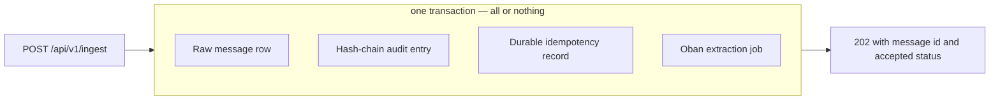
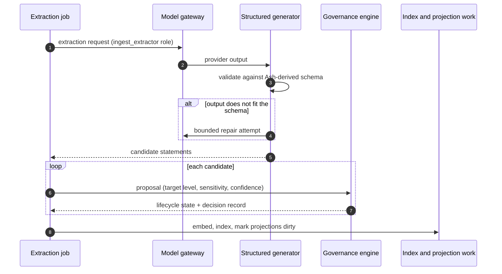
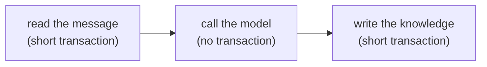

<!-- SPDX-License-Identifier: MemHouse-Sustainable-Use-1.0 -->

# Ingest pipeline

The pipeline is the only writer of knowledge. Ingest commits raw evidence first;
extraction and governance follow.

## What commits together

An ingest request writes four things in **one** database transaction:

All four commit or roll back together, preventing observations without audit
entries and jobs without observations. Oban shares PostgreSQL, so job insertion
participates in the transaction.

## What happens after the response

Extraction always runs after the response in the durable `ingest` job lane:

### The model call holds no database connection

Extraction touches the database in two short bursts with the model call
in between, never in one long transaction:

Model calls may take minutes and up to two repair attempts. Keeping them outside
transactions avoids exhausting the connection pool. The message is marked
extracted only after knowledge commits, so interrupted work retries and
concurrent extraction remains serialized. Usage records survive a later write
failure.

### A background job names its own Account

Every background job declares the Account from its queue row before accessing
Account-owned data. Without that transaction-local Account, row-level security
returns no rows: ingest could return `202` while extraction finds nothing. This
is automatic and has no operator setting.

### Structured extraction, not free text

Candidates must match schemas derived from their Ash resources. Invalid output
gets bounded repair attempts, then rejection.

Extraction also does four things a naive extractor gets wrong:

- **Refuses unreadable text.** A model can collapse into repeated ellipsis or
  invisible padding. Such a statement is rejected: a durable claim must carry
  letters or digits, and above a short length most of its characters must. The
  model is asked to rewrite it; if it cannot, the observation waits for retry.
- **Resolves subject independently of source.** Who a statement is about is
  decided on its own, not assumed to be the speaker.
- **Derives source evidence.** A statement from its own peer subject is direct;
  every other source-to-subject relationship is indirect and receives the
  third-party confidence discount.
- **Records complete provenance.** Provider, model, version, prompt, and
  pipeline identity travel with the result.

### Replay is safe

Deterministic idempotency keys make replay merge provenance instead of creating
duplicate statements. The reconciler finds durable records whose jobs never
ran. Account administrators can enqueue it independently with
`POST /api/v1/operations/reconcile`.

### A provider outage delays freshness; it does not lose data

If the model provider is down, the durable observation remains and the job
retries. Production never silently falls back to the deterministic test adapter.

## The job lanes

Background work is split into named Oban queues, each with its own concurrency
limit:

| Queue | Concurrency | What runs there |
| --- | --- | --- |
| `ingest` | 10 | Message and document extraction — the user-facing lane |
| `dream` | 2 | Background reasoning over already-governed knowledge |
| `lifecycle` | 2 | Revalidation and expiry sweeps |
| `projection` | 2 | Context, scope, and session projection rebuilds; entity resolution |
| `governance` | 2 | Validation continuations and answer correlation |
| `connector` | 2 | External connector polling and sync |
| `portability` | 1 | Rebuild work after a logical archive import |
| `reconciler` | 1 | Durable records whose job never ran |

Portability and reconciliation are serialised to one at a time because each
walks an entire Account.

`MEMHOUSE_INGEST_QUEUE_LIMIT` changes the ingest limit at boot. It must be
paired with a `MEMHOUSE_MODEL_STREAM_POOL_SIZE` at least as large as the
expected concurrent hosted model calls. Keep the stream-pool count at `1`:
Finch chooses among multiple shards randomly, so one shard with enough capacity
does not create an avoidable queue behind a busy shard. For 100 parallel
ingestion flows on one node, set the queue to `100` and the stream-pool size to
`128`, then confirm the provider and database can sustain that load.

Background jobs run through Ash actions **with authorisation on**, exactly like
an HTTP caller. A job is not a privilege-escalation path.

## Dream-time

The `dream` lane consolidates active duplicates and raises corroboration from
independent sources. It also derives a set aggregate for the supported
membership form, such as `Melanie has a pet named Bailey.` The aggregate keeps
each source and has the same scope, sensitivity, and visibility as its inputs.

Dream-time also resolves entities, schedules revalidation, and prepares
validation questions. It is throttled first when token budgets tighten and
never bypasses governance.

## What never enters audit metadata or job arguments

Audit entries and Oban arguments may carry ids, states, levels, channels,
flags, counts, and content hashes. They never carry statement text, messages,
document bytes, extracted text, prompts, answers, connector cursors, or secrets.
Erasure therefore removes content while retaining decision evidence.
