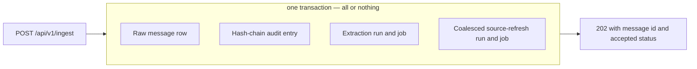
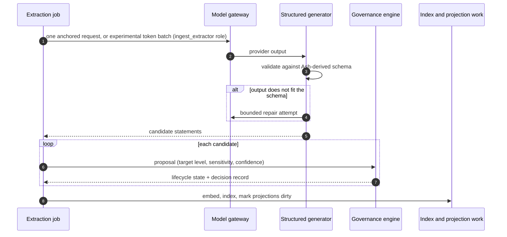
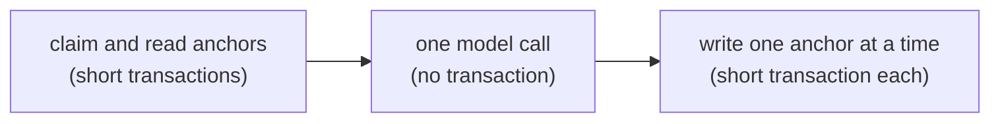

<!-- SPDX-License-Identifier: MemHouse-Sustainable-Use-1.0 -->

# Ingest pipeline

The pipeline is the only writer of knowledge. Ingest commits raw evidence first;
extraction and governance follow.

## What commits together

An ingest request writes the observation and both kinds of durable work in
**one** database transaction:

All effects commit or roll back together, preventing observations without audit
entries and jobs without observations. The refresh is keyed by scope and a
ten-second creation-time bucket, so a burst of messages and any facts extracted
from them share one delayed projection job. Extraction and projection runs
capture the same content-safe, versioned maintenance plan when they are enqueued,
so a delayed extraction worker, projection worker, or retry
cannot observe a later runtime-profile change. The current plan indexes source
messages and Knowledge, rebuilds RecallDocuments, resolves entities, and
refreshes context projections. The isolated experimental minimal-profile plan
retains the first three stages and records entity and context projection work as
`profile_disabled` instead of executing it. That selector is local to the
experiment execution process; concurrent requests retain the current plan.
Reconciliation reads the latest durable plan for each scope, so it neither
mistakes an intentional minimal cache omission for damage nor widens a required
repair back to full maintenance. Neither provider runs in the ingest transaction.
Oban shares PostgreSQL, so job insertion participates in the transaction.

## Who a turn is attributed to

A turn belongs to the speaker, not to the credential that sent it. An agent that
relays somebody else's conversation names that speaker as `peer_key` in the
body. The Peer is created on first use, and an existing Peer is resolved rather
than rewritten, so relaying an agent's key cannot re-file it as a person.

The named key is trusted. Per-peer authentication is not implemented yet, so a
machine credential can attribute an observation to any Peer in its Account.

Authority does not travel with the attribution. The write keeps the calling
credential's own roles and authorized scopes, so speaking as a Peer with wider
grants cannot widen what the request may write.

A password session always speaks as itself and ignores a `peer_key` in the body.
An internal caller carries no Peer and must supply one. The audit entry records
both identities: the relaying credential as the actor, and the speaker as
`speaker_peer_id`.

## What happens after the response

Extraction and scheduled source indexing run after the response. Source
indexing is the first stage of the durable scope `projection_refresh`; the
diagram below shows the extraction lane that may later coalesce into that same
profile-versioned refresh:

### Anchors batch without becoming one replay unit

By default an executing message job processes only its own anchor, preserving
the established one-message provider request and replay outcome. When
`MEMHOUSE_EXPERIMENTAL_EXTRACTION_BATCHING=true`, it may claim adjacent
unstamped messages from the same Account, scope, and session. It does not
create a batch row. Every message keeps
its original deterministic PipelineRun and job identity. The model returns one
envelope per explicit `anchor_id`, and validation applies that anchor's own
participant, scope, exact-span, date, and supplied-source allowlists.

Before the provider call, `utf8-bytes-v1` counts the complete serialized
instructions, schema, anchors, and evidence windows. MemHouse reserves output
capacity and a safety margin against the configured context limit. This
provider-independent tokenizer deliberately over-counts ordinary BPE input and
is part of the experiment identity. Provider usage is post-call accounting, not
admission. An anchor that cannot fit alone is marked `repairable` as
`oversized`; it is never silently truncated.

The provider call produces independent anchor outcomes. One short transaction
commits an anchor's governed candidates, lifecycle/audit effects, completion
stamp, and PipelineRun completion. A completed sibling is skipped after a
crash. Structured poison becomes terminal only after bounded repair; transient
provider/network/capacity errors remain retryable. The Account- and resolved
extractor-role/provider-scoped circuit opens after a bounded sequence of those
transient failures, preventing retries from continuing to reach a failing
provider. An open rejection makes no billed call and does not advance its open
window; one monitored half-open request probes recovery. Credential,
configuration, and oversized failures are repairable. Normal reconciliation excludes
repairable and terminal anchors until an administrator explicitly requeues
them.

### The model call holds no database connection

Extraction touches the database in two short bursts with the model call
in between, never in one long transaction:

Model calls may take minutes and up to two repair attempts. Keeping them outside
transactions avoids exhausting the connection pool. The message is marked
extracted only after knowledge commits, so interrupted work retries and
concurrent extraction remains serialized. Usage records survive a later write
failure.

### A background job names its own Account

Every background job declares the Account from its queue row before accessing
Account-owned data. Without that transaction-local Account, row-level security
returns no rows: ingest could return `202` while extraction finds nothing. This
is automatic and has no operator setting.

### Structured extraction, not free text

Candidates must match schemas derived from their Ash resources. Invalid output
gets bounded repair attempts. If an extraction response still mixes valid and
invalid candidates, MemHouse keeps the valid candidates and omits the invalid
ones. A malformed or wholly invalid response fails the job for retry.

An evaluation-only compact contract can be selected with
`MEMHOUSE_EXPERIMENTAL_COMPACT_EXTRACTION=true`. It asks the model only for an
explicit atomic statement, exact support, subject/source references, and exact
source text for nullable valid-time boundaries. MemHouse then derives `fact`,
confidence/evidence, `restricted` sensitivity, and the narrow peer or current
scope target and runs the same ordinary validator below. The flag changes no
writer, queue, table, lifecycle, or Gate A/B behavior. Its prompt version
`extract-compact-exp-1` identifies resulting provenance and usage. It remains
off because the held-out non-inferiority and privacy evidence plus human
architecture and licensing review are still required; turning it off restores
`extract-14` without a data migration.

Extraction also does what a naive extractor gets wrong:

- **Keeps durable knowledge.** The extractor records stable facts,
  preferences, relationships, possessions, skills, commitments, plans, and
  lasting events. It drops greetings, thanks, reactions, encouragement,
  questions, and a record that somebody spoke. A candidate must state the fact
  directly. Validation rejects a question, a speech-act transcription, or a
  peer claim that does not name its subject.

- **Refuses unreadable text.** A model can collapse into repeated ellipsis or
  invisible padding. Such a statement is rejected: a durable claim must carry
  letters or digits, and above a short length most of its characters must. The
  model is asked to rewrite it; if it cannot, the observation waits for retry.
- **Resolves subject independently of source.** Who a statement is about is
  decided on its own, not assumed to be the speaker. A first-person claim maps
  to the cited message's speaker key during validation. The model cannot change
  this mapping. Stored prose must replace first-person wording with a person's
  name; MemHouse does not turn an opaque peer key into display text.
- **Bounds who a statement may be about.** The model is offered the session's
  participants, minus agent peers, and a peer subject must be one of them. The
  speaker is on that list only because it took part, not automatically, so an
  agent that merely relayed the conversation is not a possible subject. Document
  extraction has no session and uses the Account's non-agent peers instead.
- **Refuses a claim about a machine.** Validation rejects a statement that names
  an agent peer key, or a generic machine referent such as "the assistant", "the
  agent", "the ai", "the chatbot", or "the bot". Such a statement is a claim
  about a person, misfiled onto the process that carried it.
- **Derives source evidence.** A statement from its own peer subject is direct;
  every other source-to-subject relationship is indirect and receives the
  third-party confidence discount.
- **Uses bounded conversation evidence.** Message extraction sends the target
  message and up to five earlier messages from the same session and scope. A
  candidate can cite only ids from that window. It must also quote an exact
  supporting span from a cited message. Validation rejects a statement date
  that appears in neither the cited text nor a resolvable relative-time phrase.
  Each cited id becomes durable provenance. The supporting span validates the
  proposal but is not copied into knowledge, logs, or job arguments.
- **Derives dated start events from elapsed durations.** A statement such as
  "I have had X for about six months" can imply when the possession or
  relationship started. The extractor records the start as an `event`, not the
  elapsed duration as a timeless fact. For an approximate month duration,
  `relevant_from` can be any date in the implied calendar month and
  `relevant_until` is null. The statement does not claim an exact day.
- **Records complete provenance.** Provider, model, version, prompt, and
  pipeline identity travel with the result.

### Replay is safe

Deterministic idempotency keys make replay and overlapping message windows merge
provenance instead of creating duplicate statements. The hourly reconciler
finds stale durable records whose jobs never ran. It ignores work younger than
5 minutes and reads at most 100 records of each type per pass. Account
administrators can enqueue an extra pass with
`POST /api/v1/operations/reconcile`.

### A provider outage delays freshness; it does not lose data

If the model provider is down, the durable observation remains and the job
retries. Production never silently falls back to the deterministic test adapter.

## The job lanes

Background work is split into named Oban queues, each with its own concurrency
limit:

| Queue | Concurrency | What runs there |
| --- | --- | --- |
| `ingest` | 10 | Message and document extraction — the user-facing lane |
| `dream` | 2 | Background reasoning over already-governed knowledge |
| `lifecycle` | 2 | Revalidation and expiry sweeps |
| `projection` | 2 | Context, scope, and session projection rebuilds; entity resolution |
| `governance` | 2 | Validation continuations and answer correlation |
| `connector` | 2 | External connector polling and sync |
| `portability` | 1 | Rebuild work after a logical archive import |
| `reconciler` | 1 | Durable records whose job never ran |

Portability and reconciliation are serialised to one at a time. Reconciliation
uses bounded batches, so its cost does not grow with the full Account backlog.

`MEMHOUSE_INGEST_QUEUE_LIMIT` changes the ingest limit at boot. It must be
paired with a `MEMHOUSE_MODEL_STREAM_POOL_SIZE` at least as large as the
expected concurrent hosted model calls. Keep the stream-pool count at `1`:
Finch chooses among multiple shards randomly, so one shard with enough capacity
does not create an avoidable queue behind a busy shard. For 100 parallel
ingestion flows on one node, set the queue to `100` and the stream-pool size to
`128`, then confirm the provider and database can sustain that load.

Background jobs run through Ash actions **with authorisation on**, exactly like
an HTTP caller. A job is not a privilege-escalation path.

## Dream-time

The `dream` lane consolidates active duplicates and raises corroboration from
independent sources. It also derives a set aggregate for the supported
membership form, such as `Melanie has a pet named Bailey.` The aggregate keeps
each source and has the same scope, sensitivity, and visibility as its inputs.

Dream-time also reasons over changed scope knowledge, resolves entities,
schedules revalidation, and prepares validation questions. Each scope keeps a
durable input watermark. MemHouse advances it only after governed reasoning
output and derived-refresh requests commit. A provider or write failure leaves
the watermark unchanged for retry. A retrieval candidate with an invalid shape
ends that pass with a content-safe diagnostic instead of retrying the same
deterministic error. The lane is throttled first when token budgets tighten and
never bypasses governance.

Before consolidation or model reasoning, a scoped gate checks four independent
bounds: accumulated eligible changes, time since the latest change, time since
the last completed pass, and the maximum delta/working-set/call duration for one
pass. The elapsed allowance is one monotonic deadline shared across split
reasoning operations, including their repairs and retries. Skips emit only
scope ids, counts, decisions, and reason classes. They do
not advance the watermark. A bounded partial pass stores both the last processed
timestamp and knowledge id, so same-microsecond rows resume without being lost
or billed twice. Dream-produced deductions and deterministic consolidation
outputs do not feed the eligible-change counter back into themselves.

When `MEMHOUSE_EXPERIMENTAL_DREAM_IDLE_SCHEDULER=true`, activating or changing
a governed direct fact also creates a content-free, scope-targeted `PipelineRun`
and Oban job in that same transaction. Its wakeup
is the fact's activity time plus `MEMHOUSE_DREAM_IDLE_SECONDS`. Exact duplicate
activity reuses the replay key; newer activity schedules a later generation.
When an older generation wakes, it compares its timestamp-and-id cursor with
the latest surviving direct fact under the scope lock and completes as
superseded before retrieval or model work. The switch defaults off pending
matched evidence and human review. The hourly Account sweep and the manual
operations endpoint remain fallback and operator paths in either state.

Reasoning behind that gate is split into two small contracts. The enabled
update operation can record `supports` and `contradicts` edges between exact
working-set ids; contradictions remain visible and enqueue governance review.
The synthesis operation can propose a statement only when its authorized
contributors resolve to at least two distinct durable source observations.
Two knowledge rows extracted from the same message or document version still
count as one source. The model-time validator receives only content-free source
references from the authorized working set, and the writer re-reads provenance
and enforces the same rule before persistence. Synthesis is disabled by default
pending matched ablation. Both operations finish before the one writer
transaction validates their ids, applies common governed effects, and advances
the scoped cursor.
Prompt rationale is validation input only and is never stored as chain-of-thought.

## What never enters audit metadata or job arguments

Audit entries and Oban arguments may carry ids, states, levels, channels,
flags, counts, and content hashes. They never carry statement text, messages,
document bytes, extracted text, prompts, answers, connector cursors, or secrets.
Erasure therefore removes content while retaining decision evidence.
