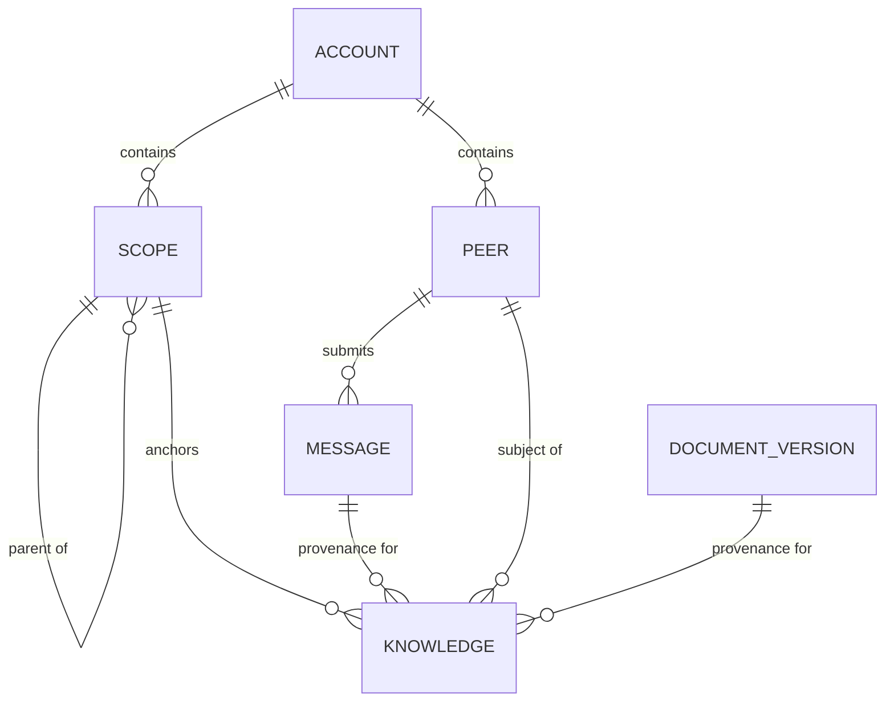
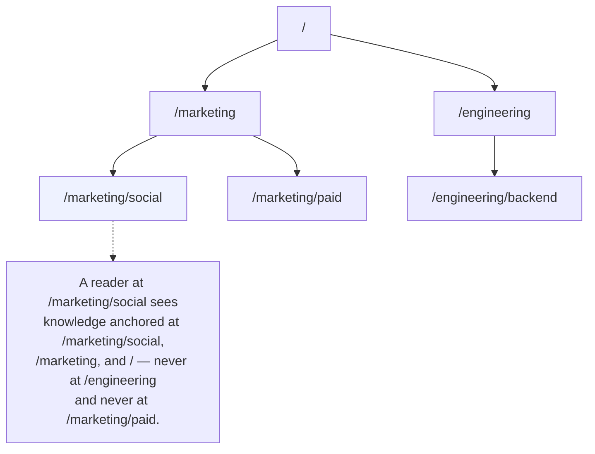
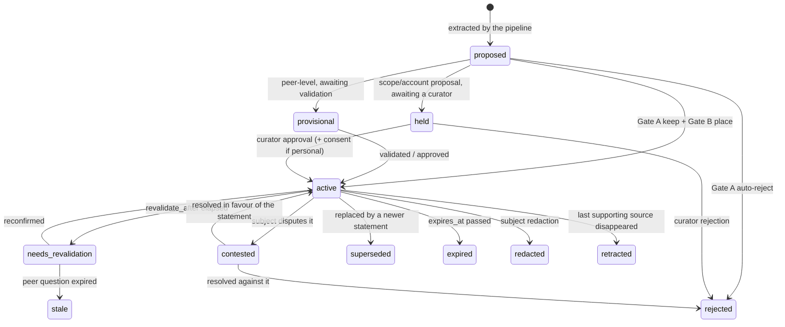

<!-- SPDX-License-Identifier: MemHouse-Sustainable-Use-1.0 -->

# Memory model

Everything MemHouse stores hangs off four structures — Account, Scope, Peer,
and Knowledge — plus the raw observations knowledge is derived from.

## Account — the isolation boundary

Every durable row belongs to one Account, derived from the authenticated
identity and enforced by Phoenix, Ash policies, and PostgreSQL row-level
security. Without a transaction Account, RLS returns no rows.

No request value selects tenancy. Legacy `x-memhouse-account-key` and
`account_key` values are accepted but ignored.

The community build serves a single Account. Multi-Account operation is an
enterprise concern.

## Scope — the containment tree

A scope is a path such as `/marketing/social`. Inheritance is **downward and
nearest-wins**: child scopes see ancestor values and may override them.

A search at a scope selects that scope *and its ancestors*, because context
flows downward. It never selects siblings or descendants.

## Peer — one participant

A peer is a human or agent and is the narrowest knowledge audience. Humans use
passwords and short-lived tokens; agents use hashed per-peer API keys. Only
humans may make curator decisions. See [Isolation and access
control](security-model.md).

## Knowledge — the only durable atom

One knowledge item is one natural-language statement plus the metadata that
governs it:

| Field group | What it records |
| --- | --- |
| Statement | The text. **Immutable once written** — a change mints a new row and supersedes the old one. |
| Subject | Who or what the statement is *about*. |
| Provenance | Which messages or document versions support it, and how many independent sources. |
| Confidence | How sure the system is. |
| Sensitivity | How exposed the statement may be. |
| Belief time | `inserted_at`, `revalidate_after`, `expires_at` — when the system holds the claim. |
| Valid time | `relevant_from`, `relevant_until` — when the claim is true in the world. |
| State | The governance lifecycle position. |
| Verification | *Why* the last transition happened: an automatic gate keep, a curator approval, a subject dispute. |

Keep these dimensions independent:

- **Subject is not source.** An agent talking about a colleague produces a
  statement whose subject is the colleague and whose source is the agent.
- **Belief time is not valid time.** A fact can be freshly learned and long
  expired, or old and still true.
- **Kind is not valid time.** Classify a claim by its durable meaning. A stable
  fact, preference, relation, or skill keeps that kind even when it has a known
  start or end. An event is a claim whose durable content is that something
  occurred. Any kind can have `relevant_from` and `relevant_until` when the
  source states or implies that the claim has a validity window. The
  observation's `occurred_at` is belief-time evidence and never becomes valid
  time by itself.
- **A date is not an observation frame.** The extractor records relative dates
  in valid-time fields. It keeps a date in the statement only when that date is
  part of the claim. Readers render valid time when they need it.
- **Confidence is not sensitivity.** Being very sure of something does not
  license sharing it more widely.

## Lifecycle state contract

Every extracted statement starts as `proposed`; the create action rejects other
starting states. Governance transitions it, and retrieval filters by state.

`MemHouse.Knowledge.Lifecycle` is the executable source for state names, edges,
meanings, visibility classes, retrieval, projections, readiness, API tool
documentation, and tests. The table below is its published operator contract.
Every state change dirties derived projections and enqueues their refresh. A
state absent from a snapshot can be transient, authorization-hidden, or not
exercised; evaluation reports therefore include the internal final distribution
and transition counts instead of inferring the lifecycle from a console view.

| State | Meaning | Entry and trigger | Actor or worker; queue | Stability; allowed exits | Visibility: subject / member / curator / admin | Search and `/ask` | Projection and skill readiness | Required evidence; example; fixture |
| --- | --- | --- | --- | --- | --- | --- | --- | --- |
| `proposed` | Extracted and waiting for its first gate decision. | `nil → proposed` when the pipeline creates an extracted statement. | Pipeline; extraction queue. | Transient; `active`, `provisional`, `held`, `rejected`, `contested`, `redacted`, or `retracted`. | Yes / no / yes / yes. | No. | No projection; missing for readiness. | `verification=pending`; reason `f4_pipeline_proposed`; a new extracted preference; pipeline proposal fixture. |
| `active` | Accepted. The system currently believes it. | Gate acceptance, curator approval, subject confirmation, or resolved contest. | Pipeline, human governance, or verified peer answer; extraction or validation queue. | Stable; self-edge for governed timer evidence, then `held`, `needs_revalidation`, `contested`, `superseded`, `expired`, `redacted`, or `retracted`. | Yes / yes / yes / yes when scope-authorized. | Yes when scope, audience, sensitivity, and time filters pass. | Shared and peer projections; satisfies readiness while fresh. | Verification names the accepting decision; an accepted direct self-observation; automatic Gate A/B fixture. |
| `provisional` | Visible only to its subject while it waits for review. | `proposed → provisional` when a peer-level gate defers. | Pipeline; extraction creates a validation row and peer question. | Stable; self-edge for unverified deferral, then `active`, `held`, `rejected`, `contested`, `superseded`, `expired`, `redacted`, `stale`, or `retracted`. | Yes / no / no / no for another subject. | Subject only. | Subject-keyed peer projection only; satisfies that subject's readiness while fresh. | `subject_peer_id` and pending validation; reason `f4_gate_a_b_deferred`; a deferred peer preference; default-gate fixture. |
| `held` | Parked at its source scope while wider placement waits for review or consent. | `proposed → held` on wider gate deferral, or `active → held` on promotion request. | Pipeline or human promotion; validation/consent workflow. | Stable; self-edge for unverified deferral, then `active`, `rejected`, `contested`, `superseded`, `expired`, `redacted`, or `retracted`. | Yes / no / yes / yes. | No. | Removed from projections; missing for readiness. | `held_scope_id` and validation target; deferred or promotion reason; a scope proposal awaiting its first curator decision; scope-hold fixture. |
| `needs_revalidation` | Past its revalidation date and unusable until it is confirmed again. | `active → needs_revalidation` when `revalidate_after` passes or a deduction contributor changes. | Lifecycle worker or pipeline dependency invalidation; `lifecycle` or reasoning queue. | Stable; self-edge for unverified deferral, then `active`, `rejected`, `contested`, `superseded`, `expired`, `redacted`, `stale`, or `retracted`. | Yes / yes / yes / yes when scope-authorized. | No. | Removed from projections; reported as a readiness gap. | Due timestamp plus validation row; reason `f4_revalidation_due` or contributor-change reason; an old preference needing confirmation; revalidation-worker fixture. |
| `superseded` | Replaced by a later statement and retained as history. | A curator edit/merge, document revision, consolidation, or accepted deduction replacement retires an older row. | Human governance, document sync, or dream-time worker. | Terminal for ordinary lifecycle work; privacy redaction or last-source retraction may still override it. | Yes / yes / yes / yes when scope-authorized. | No. | Removed from projections; missing for readiness. | `supersedes_id` where applicable; path-specific reason; an edited statement's original row; replacement fixture. |
| `expired` | Past its declared expiry and no longer usable. | A lifecycle worker reaches `expires_at` on a nonterminal current row. | Lifecycle worker; `lifecycle` queue started by hourly scheduler. | Terminal for ordinary lifecycle work; privacy redaction or last-source retraction may still override it. | Yes / yes / yes / yes when scope-authorized. | No. | Removed from projections; reported as a readiness gap. | `expires_at`; reason `f4_expiry_due`; a time-limited event after its end; expiry-worker fixture. |
| `rejected` | Refused by a gate or reviewer and retained as decision evidence. | Gate auto-rejection, unattended restricted withholding, curator rejection, or overdue-review rejection. | Pipeline, human governance, or dream-time aging. | Terminal for ordinary lifecycle work; privacy redaction or last-source retraction may still override it. | Yes / no / yes / yes. | No. | Removed from projections; missing for readiness. | Verification and gate/validation decision; stable rejection reason; a claim declined by a curator; rejection fixture. |
| `contested` | Disputed by its subject and waiting for a curator decision. | A subject disputes a nonterminal statement. | Authenticated human subject; synchronous request creates a curator validation row. | Stable; `active`, `rejected`, `superseded`, `expired`, `redacted`, or `retracted`. | Yes / no / yes / yes. | No. | Removed from projections; missing for readiness. | Subject identity and dispute validation; reason `f4_subject_contested`; an incorrect preference disputed by its subject; self-governance contest fixture. |
| `redacted` | Withdrawn from use by its subject. | A subject withdraws a retained statement through self-governance. | Authenticated human subject; synchronous self-governance action. | Terminal for ordinary lifecycle work; last-source retraction may still override it. | Yes / no / yes / yes. | No. | Removed from projections; missing for readiness. | Subject identity; reason `f4_subject_redacted`; a subject withdraws personal content; self-governance redact fixture. |
| `stale` | Repeatedly unconfirmed and no longer relied on. | An unanswered confirmation or revalidation question passes its deadline; consent questions are excluded. | Dream-time worker; dream-time queue. | Stable; `active`, `rejected`, `contested`, `superseded`, `expired`, `redacted`, or `retracted`. | Yes / no / yes / yes. | No. | Removed from projections; missing for readiness. | Expired peer question and lower confidence; reason `f4_revalidation_confidence_decay`; an unconfirmed old preference; peer-question decay fixture. |
| `retracted` | Lost its supporting source or was denied by its subject. | A verified subject rejects the claim, or its last source is tombstoned or erased. | Verified peer answer, document sync, or erasure worker. | Terminal; self-edge only when repeated source erasure removes retained provenance. | Yes / no / yes / yes. | No. | Removed from projections; missing for readiness. | Source or peer decision evidence; path-specific retraction reason; a document-only claim after source deletion; source-retraction fixture. |

The member column assumes ordinary scope authorization. A subject can inspect
their own rows regardless of scope. Confirmation, contest, and redaction follow
the documented graph; erasure may retract a historical row when its last
surviving source is removed.
Another subject's `provisional` row stays hidden even from a curator or account
administrator. Console badges link here for this reason.

Only the lifecycle `transition` action may change state, and it always writes a
lifecycle event and an audit entry in the same transaction. Nothing updates the
state attribute directly.

## Projections are not a second store

Peer profiles, scope cards, and session summaries are cached **projections** of
governed knowledge. Input changes mark them dirty for background rebuild.
`get_context` reads these projections without calling a reasoning model.

## What is durable

| Durable | Rebuildable |
| --- | --- |
| Raw messages | Context projections |
| Governed knowledge | Entity rows and mentions |
| Document versions and original blobs | Document chunks |
| Hash-chain audit log | Vector and full-text indexes |
| Usage ledger | DiskANN indexes, ETS counters |

Backups must capture the left column together with the blob store; the right
column is regenerated. See [Backup and restore](../operations/backup-restore.md).
