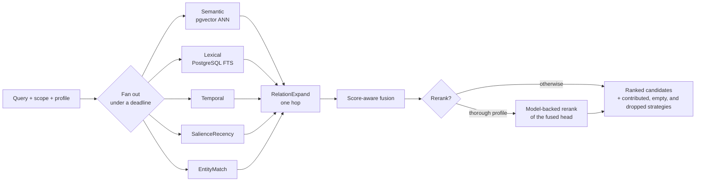
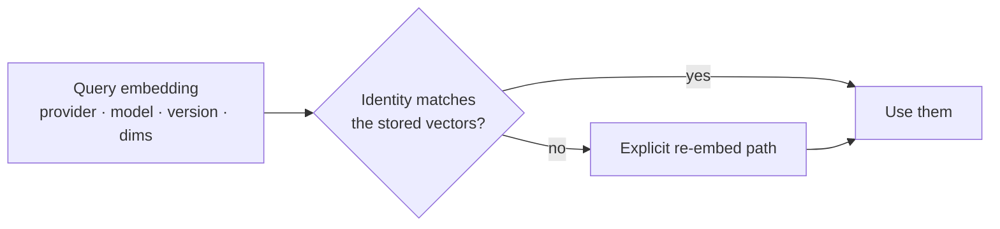
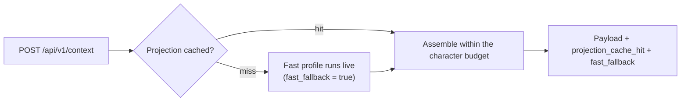

<!-- SPDX-License-Identifier: MemHouse-Sustainable-Use-1.0 -->

# Retrieval and context

MemHouse runs independent candidate generators in parallel, fuses their ranks,
and may rerank the fused head under one wall-clock deadline.

## Filtering happens before candidates leave retrieval

Each strategy applies Account, scope, lifecycle, provisional-subject, and source
filters **inside its query**. The API does not post-filter candidates.

## A read is performed for a peer

Personal knowledge belongs to its subject, so a read needs a reader. `search`,
`ask`, `get_context`, and the knowledge listing all accept `peer_key`, which
names the peer the results are read for. The key is trusted as supplied, the
same as on [ingest](ingest-pipeline.md#who-a-turn-is-attributed-to).

| The caller | Reads for | And sees |
| --- | --- | --- |
| Names `peer_key` | That peer | Public and internal statements, that peer's own statements, statements about the scope rather than about a person, and anything promoted to scope or account level |
| A machine credential naming no peer | Its own Peer | The same as a named reader |
| A peerless credential naming no peer | Nobody | Public statements only |
| A password session naming no peer | Itself | The same as a named reader |
| Server-side work — projection rebuild, dream-time, evaluation | Nobody in particular | The whole corpus, narrowed only by lifecycle |

Promotion above peer level is the consent record: an above-peer proposal waits
until its subject agrees, so a scope-level statement has already been agreed to.
See [governance](governance.md#consent-for-personal-knowledge).

Naming a reader borrows nothing from it. Scope authorization stays the calling
credential's. A `peer_key` that names no peer is an error, not a fallback to
the caller. The server-side posture comes from the absence of an authenticated
identity, never from the request, so a caller cannot ask for the whole corpus.

A machine credential reads as its own Peer by default when its authenticated actor
has one. This makes knowledge from its observations visible after governance accepts
and indexes it. A peerless credential reads public statements only. Neither posture
widens scope authorization. Use `peer_key` when the credential reads for a person.

A shared projection is filtered before it is built. A scope card or an entity
card carries shareable statements only — public or internal, about the scope, or
promoted — so a personal peer-level statement never reaches a shared projection.

## How semantic retrieval embeds a query

The configured embedder can set a model-specific query prefix. MemHouse adds it
only to query embeddings. Stored statements and document chunks remain unchanged.
For BGE retrieval models, set the prefix to `Represent this sentence for searching
relevant passages: `. Exact repeated queries reuse a bounded node-local vector
cache keyed by Account, embedder identity, and a text digest. The cache contains
no raw query text and is discarded on restart. Change the retrieval profile
version when you change the prefix, so evaluation reports identify the ranking
configuration.

## How the lexical strategy reads your query

Plain text matches statements sharing **any** of its terms, ranked by how many
of them a statement covers and how closely together. Ask a full question: it
does not need every content word to appear in one statement.

For English questions, the lexical analyzer (`lexical-question-v2`) removes a
small reviewed set of interrogative boilerplate. It keeps the remaining query
terms, names, dates, negation, and quoted text. It does not expand terms with a
hand-written synonym list. A statement that also places two of your terms
within eight words of each other earns a bounded bonus, so a
sentence that answers the question outranks one that merely mentions the same
words. Only the highest-ranked matches compete for that bonus; a statement far
down the list cannot be promoted by it. The analyzer version appears in the
content-free operator diagnostic, so a ranking can be reproduced without
recording query text.

Three operators override that, following PostgreSQL `websearch` syntax.

| Syntax | Meaning |
| --- | --- |
| `"exact phrase"` | Only statements containing that phrase, in order |
| `-term` | Excludes statements containing the term |
| `a or b` | Either term |

Using any of them switches the whole query to `websearch` parsing, where bare
terms must **all** appear in one statement.

## Why fusion, and why you must not re-sort

Each strategy scores in its own space: cosine distance, full-text rank, time
relevance, salience, mention confidence. Fusion makes them comparable by
mapping each returned list's score range from 0 to 1. A singleton or tied list
maps to 1 because it has no observed tail.

Each strategy contribution is 95% normalized score and 5% reciprocal-rank
tie-break. The profile weight then scales the contribution. The final
`fusion_score` is the weighted mean across configured strategies, so it stays
between 0 and 1. The rank term uses the profile's `rrf_k`, which defaults to 15.

!!! warning "The returned order is the answer"
    Re-sorting the returned candidates by a raw per-strategy score compares
    numbers from different scoring spaces and silently degrades results.

Strategy disagreement is computed *before* fusion, so it measures what the
strategies actually thought rather than an artefact of the merge. Fusion always
emits a ranked list, including from lists that are all bad, so a fused rank
cannot say "nothing was found".

## Three per-strategy outcomes

`reader_posture` reports `peer`, `public_only`, or `internal`. This content-free
diagnostic explains which authorization posture narrowed candidates. It does not
reveal whether hidden rows would match for another reader.

When lexical terms match active knowledge but reader visibility removes every
match, `retrieval_outcomes` adds `candidate_filter` with reason class
`authorization_filtered`. It returns no hidden ids, text, scores, or counts.
Strategies skipped by their applicability check report `not_applicable` with
reason class `applicability`.

A response separates strategies that **contributed** candidates, strategies that
ran and found **nothing**, and strategies that were **dropped** — disabled,
timed out, or failed. Collapsing the middle case into either of the others hides
the run worth knowing about: `salience_recency` reads no query text, so
applicability must keep it from turning a text-search miss into a recency page.
`disagreement.query_dependent_empty` is the flag for exactly that state.

Temporal runs only when you pass `as_of`. It filters to dated text matches and
ranks them by distance from that instant. SalienceRecency does not add a general
recency list. That keeps the visible head based on evidence about the question.
Blank context fallback may still use salience-recency.

## Profiles

A profile is a named, versioned bundle: which strategies run, their fusion
weights and rank constant, whether the head is reranked, and the deadline.

| Profile | Strategies | Rerank | Deadline | Used by |
| --- | --- | --- | --- | --- |
| `fast` | semantic, salience-recency | no | 100 ms | The only profile allowed to run live when context assembly misses its projection cache |
| `balanced` | semantic, lexical, temporal, entity-match | no | 300 ms | Default for `search` |
| `thorough` | all six, including one-hop relation expansion | yes | 1500 ms | Default for `ask` |
| `minimal` | direct/derived semantic lanes and lexical | no | 300 ms | Experimental; requires `MEMHOUSE_EXPERIMENTAL_MINIMAL_RECALL=true` |

The `minimal` profile deliberately skips temporal and salience seeds, entity
matching, relation expansion, and reranking. It does not delete or change their
data while experimental. Selection is explicit and observable in the ordinary
profile fields, and disabling the feature flag restores the existing profiles
without a migration.

Its semantic strategy embeds the query once and searches two independently
bounded lists: directly extracted memory and derived deduction/consolidation
memory. The lists are interleaved by lane rank, direct first on an exact tie,
then enter ordinary fusion with lexical results. Each semantic candidate records
its lane, operation, lane rank, and cosine distance so matched evaluation can
measure the trade-off without inferring it from prose.

The two lists read `RecallDocument`, a non-authoritative projection copied from
governed Knowledge after embedding. It is excluded from Account archives and
is rebuilt with the other retrieval caches. Every lookup joins canonical
Knowledge, applies Account, scope, reader, lifecycle, deletion, expiry, and
embedding-identity filters before ranking, and requires the projection's source
watermark to equal the current Knowledge timestamp. A lifecycle change is
therefore invisible immediately; refresh then removes the stale row. Hard
erasure cascades to the projection in the same database transaction.

Profiles inherit down the scope tree, nearest-wins, so a scope can tighten or
loosen retrieval without a global change. The profile version travels back with
every result as `profile_version`.

`deadline_ms` covers strategy execution and reranking. Late strategies are
dropped, not retried, and reported. Larger deadlines trade latency for recall.

A reranking profile reserves the rerank allowance before the strategies start,
and the result reports the reservation as `reserved_rerank_ms`. Reranking
decides which candidates you see; expansion mostly decides which ones you do
not. So the strategies are the stage that gives way under time pressure, and a
slow one costs recall rather than costing the ordering.

An operator-level allowlist can switch off an expensive strategy across the
whole deployment: a strategy absent from it never runs, whatever a profile
asks for.

Raw per-request strategy overrides are internal and evaluation-only; external
callers cannot select strategies directly.

## Evidence lineage is not reasoning text

`POST /api/v1/lineage` projects existing provenance and typed knowledge
relations into a bounded graph. It can connect a deduction or consolidation
result back to governed knowledge and immutable observations, but it does not
store or expose the model's private rationale. Scope and lifecycle filtering
happen before a node is returned; a visible derived statement never grants
access to a hidden source.

A split synthesis deduction reuses its durable prompt identity to report the
typed operation `reasoning_synthesis`. The version string itself remains
private provenance and is not returned in the graph.

Traversal has depth, per-node fan-out, and total-node budgets. Stable ordering,
cycle termination, and opaque missing or lifecycle-hidden references make the
same request reproducible without turning hidden content into a diagnostic.
Use lineage to inspect evidence. Use lifecycle and audit records to inspect
governed state changes. Use answer text only as a cited explanation over those
records.

## Stable identity is a live projection

`POST /api/v1/stable-profile` selects a small allowlist of stable, direct,
source-backed facts about the chosen reader. It is rebuilt from canonical
knowledge on every call and uses no model, so deletion, retraction,
supersession, or a scope change cannot leave a second profile store behind.

The profile keeps contradictory identity claims side by side. It excludes
transient state, preferences, behavioral summaries, inferred claims, and
sensitive traits. Each entry links to its governed knowledge id and direct
source ids; consumers cite that knowledge rather than the projection. Search
can include this orientation with `include_identity_profile` without changing
rank. A bounded adaptive Ask may admit those same governed knowledge rows as
candidates through its `profile` tool; it never cites the projection as a
separate fact.

## Entities are internal

Dream-time entity resolution links aliases such as "Dana", "Dana R.", and
"our copy lead" across validated statements.

The mention index rejects closed-class words, common sentence artefacts, and
timezone abbreviations. Exact aliases merge directly. Embedding similarity can
select a possible match, but a model must confirm every non-exact merge.

Entity rows and mentions are **rebuildable, pipeline-internal caches**. The
rows themselves reach no surface: no canonical name, alias, or entity id
appears in HTTP, MCP, SDK, LiveView, projection, or retrieval output.

One exception, and it is bounded by scope. An entity card may name itself with
a wording drawn from that card's own source statements in that card's own
scope, and may report a `kind` recomputed from the same wordings. Both are text
the card already returns, so neither carries a name across a scope boundary.
The entity row is not read to produce them.

Resolution errors affect accuracy, never scope or Account authorization.
Erasure and archive import rebuild entities from surviving governed statements.

### Rebuilding a scope holds no database connection while it works

Rebuilds use the ingest pipeline's
[read → model → write](ingest-pipeline.md#the-model-call-holds-no-database-connection)
shape. Model calls hold no database connection. The final transaction replaces
old mentions and writes rebuilt ones together, so failure leaves the previous
index intact.

## Cross-scope expansion is authorised twice

Scope relations and shared-entity edges can expand retrieval into a linked
scope — but only after **both** endpoint scopes pass the caller's
authorisation. A cross-link never grants access; it only follows access the
caller already has.

Expansion uses only the head of the interleaved seed lists. Shared-entity
edges ignore entities that occur throughout the visible corpus and cap the
neighbours contributed by each seed. These bounds prevent one common entity
from turning a small result request into a scan of the whole scope.

## Vectors carry an identity

An embedding is stored with its provider, model, version, and dimensions. Those
four values together are the vector-space identity.

A mismatch never silently substitutes or reuses vectors — the numbers are only
comparable within one pinned identity. Bump the embedding version whenever the
model artefact, tokenizer, pooling, or dimensions change.

## Context assembly is reasoning-free

`get_context` is a different operation from `search`. It assembles a budgeted
context payload — governed knowledge, a session summary, scope cards, and a
peer profile — from **projections**, and it never calls a generation model.

Two diagnostic flags come back with every response: `projection_cache_hit` says
a stored projection was reused, and `fast_fallback` says the projection was
missing and the fastest retrieval profile filled in live.

Projection updates preserve dirty marking, bounded delta compaction, source ids,
and PubSub/ETS invalidation. A model call does not belong on this read path.

## Ask answers with a confidence

By default, fixed `ask` retrieves with the `thorough` profile and restricts
retrieval to governed knowledge. A named `low`, `medium`, or `high` effort runs
the bounded read-only planner over governed knowledge, stable-profile
knowledge, and typed lineage. Exact and semantic source-message tools join that
closed set only when the caller explicitly passes `include_source_recall: true`.
Profile and lineage are selection tools: answer candidates remain governed
knowledge, or bounded immutable source excerpts with resolvable ids when that
permission is present. The answerer states what those retrieved statements make most probable and reports
`answer_confidence`, an integer from 0 to 100, for its own certainty.

Each effort preset reserves provider-backed retrieval calls before they run and
caps both query tokens and serialized admitted-evidence tokens. Evidence that
would cross the preset's total token ceiling is not admitted to the answer
context; the content-free recall diagnostics name the exhausted bound.

A model answer below 50 also sets `abstained`. That pair — cited answer, low
confidence, `abstained == true` — is the normal shape for a weakly supported
inference. Treat it as a lead to check rather than a conclusion to act on.

One reply is not an attempt at the question: when no retrieved statement
survives, the response is an empty citation list, `abstained == true`, and
`answer_confidence` 0. That reports the state of the index, not the subject. An
answer invented from an empty candidate set would be worse than silence. Every
model citation is intersected with the retrieved candidate ids before the
response leaves the server, and no surviving citation means that empty
abstention wins.

A failed model call is a third state, distinct from both a weak inference and
an empty index: `answer_degraded` names the failure, `abstained == true`, and
`answer_confidence` 0. The retrieved statements are real and still returned,
in `citations` and as plain text in `supporting_statements`, but `answer`
states that the call failed rather than presenting them as a conclusion. A
deployment with no model configured is different again — that is a chosen
configuration, not a failure, and answers by concatenating the top statements
at a fixed `answer_confidence` of 40 with `answer_degraded` left `null`.
