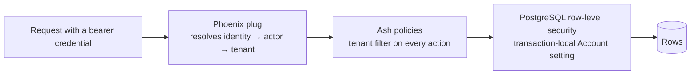
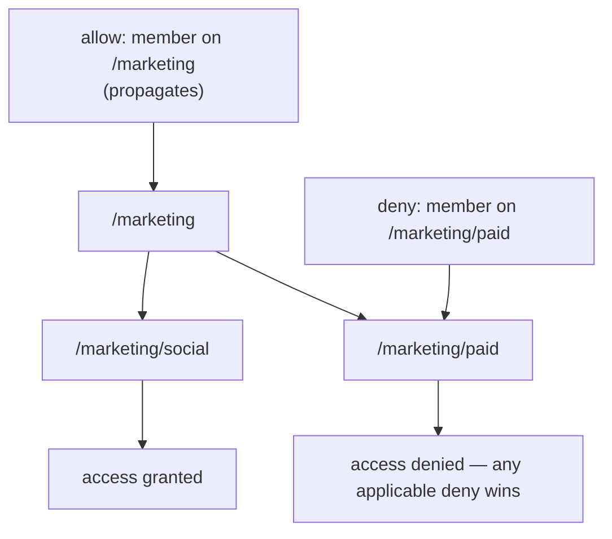

<!-- SPDX-License-Identifier: MemHouse-Sustainable-Use-1.0 -->

# Isolation and access control

Visibility depends on Account, authorized scopes, and lifecycle state, in that
order.

## Account isolation is enforced three times

Without a transaction Account, row-level security returns **no rows**.

**Account comes from the credential, never request data.** Legacy
`x-memhouse-account-key` and `account_key` values are accepted but ignored.

## Five kinds of caller

| Caller | Credential | May reach |
| --- | --- | --- |
| Anonymous | none | `/api/health`, `/api/ready`, password sign-in, the two browser sign-in forms |
| Any authenticated identity | password token **or** agent API key | `/api/v1` memory routes, `/mcp` |
| Human password identity | a token minted by password sign-in | additionally `/api/v1/self/*` |
| Any human browser session | cookie session + CSRF + re-check on every mount | `/console/*` |
| Human curator browser session | the same session, narrowed at mount to curator or account-admin | `/governance` |

Every human role may establish a browser session; pages enforce role-specific
visibility and actions. Machines cannot establish a session.

An agent API key gets a 403 on `/api/v1/self/*` even when it belongs to the
same peer as a human token. Contesting, redacting, and erasing one's own
knowledge are personal decisions a machine may not take on a person's behalf.

## Roles and deny-wins inheritance

There are exactly four roles: `account-admin`, `curator`, `member`, and
`reader`. Grants attach to a scope with an `allow` or `deny` effect and a
per-grant propagation setting.

**Any applicable deny removes access to that scope**, regardless of how many
allows also apply. A cross-linked scope read requires access to *both* relation
endpoints; a cross-link never grants access it did not already have.

## What a machine credential can never do

Machine credentials may:

- submit raw observations;
- read governed memory;
- resolve the calling peer's own frozen inline validation question;
- lower that peer's ask limits.

They can never reach approve, edit, reject, merge, defer, promotion, gate-rule
administration, or bulk curator actions. Those exist only in the human browser
console, which a machine credential cannot sign into.

A compromised or mistaken agent can submit attributed, reviewable observations;
it cannot edit organizational knowledge.

## Credential handling

- API keys are stored **hashed**. Plaintext keys are never persisted.
- Password identities use AshAuthentication with JWTs.
- A wrong email and a wrong password produce the same opaque 401, so sign-in
  cannot enumerate accounts.
- The bootstrap task refuses to run without an explicitly supplied password;
  there is no default credential.
- Model-provider secrets are stored as references, not values.

## The browser surface

The console Content-Security-Policy is same-origin only, forbids inline script,
uses `frame-ancestors 'none'`, and limits forms with `form-action 'self'`.
Initial render and every socket reconnect re-check token, identity kind, and
role.

## Content safety in logs and traces

Traces, structured logs, telemetry, audit metadata, and job arguments may
record ids, counts, profile names, model names, strategy names, timings, token
counts, and error classes.

They may **not** record raw messages, prompts, answers, API keys, account keys,
peer keys, restricted knowledge, document bytes, extracted text, connector
cursors, or secrets.

The readiness probe follows the same rule, because anyone who can reach the
port can read it without authenticating.

## Reporting a vulnerability

See
[`SECURITY.md`](https://github.com/memhousehq/memhouse/blob/main/SECURITY.md)
in the repository.
