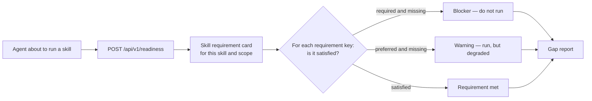
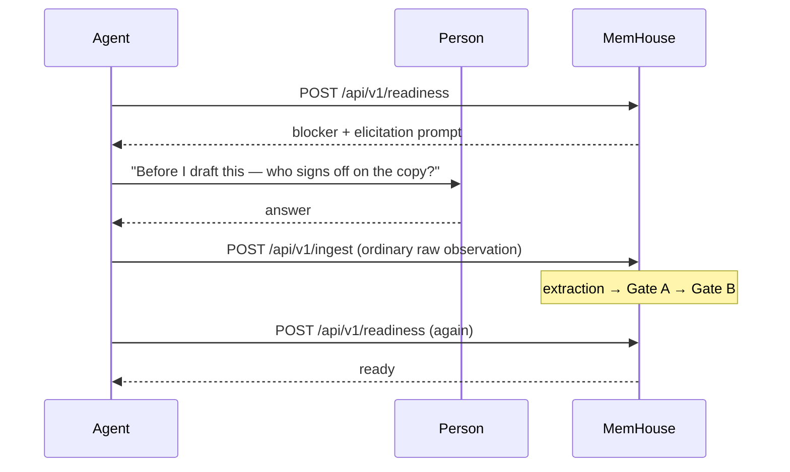

<!-- SPDX-License-Identifier: MemHouse-Sustainable-Use-1.0 -->

# Skill readiness

Skill readiness asks whether an agent has the governed knowledge a task needs
and reports what is missing.

## Requirement cards are procedural memory, not knowledge

A skill requirement card is **human-authored** and **plainly versioned**. It
describes task needs, not world facts, so Gate A/B do not apply.

Requirement keys inherit down the scope tree with **nearest-scope overrides**,
so `/marketing/social` can require something extra that `/marketing` does not,
or relax something it does.

Cards are authored by humans in the governance console.

## What can satisfy a requirement

Only two things:

- authorised `active` knowledge, or
- the calling peer's own usable `provisional` knowledge.

Everything else is a gap. `expired`, due-for-revalidation, and
`needs_revalidation` items become gaps immediately, before a sweeper runs.

## Blockers and warnings

| Requirement kind | Unmet effect |
| --- | --- |
| Required | **Blocker.** `ready` is false; the helper must not run. |
| Preferred | **Warning.** `ready` stays true; the caller proceeds knowingly. |

`ready` is true exactly when there are no blockers.

## Closing a gap

A gap marked `ask-peer` or `either` may produce an elicitation prompt — a
question the agent can put to the person.

Answers return through ordinary ingest and governance before readiness is
checked again.

!!! danger "A gap report is not advisory"
    An SDK helper must never override a server blocker, and must never write
    the missing knowledge directly. If it could, the whole check would be
    theatre.

## The report is reasoning-free

Gap reports call no model. They deterministically compare requirement keys with
governed knowledge.

The report carries its own contract identity in `report_version`, so a client
can tell which selector language and report shape it is reading.

See [Checking skill readiness](../guides/skill-readiness.md) for the request
and response, and [SDK helpers](../guides/sdk-helpers.md) for the Python and
TypeScript wrappers.
