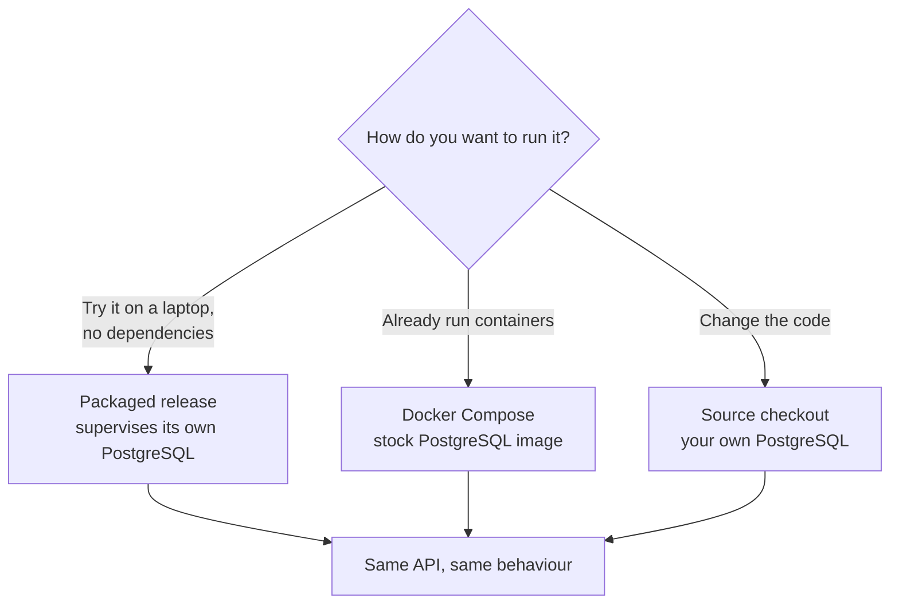

<!-- SPDX-License-Identifier: MemHouse-Sustainable-Use-1.0 -->

# Getting started

Choose an install path. Each runs the same release and differs only in how
PostgreSQL and the application are supervised.

| Path | Best for | PostgreSQL | Page |
| --- | --- | --- | --- |
| Packaged release | Trying it out, single-machine self-hosting | Supervised pg0 binary, started for you | [Install a release](install-release.md) |
| Docker Compose | Container hosts, existing infrastructure | Stock PostgreSQL container | [Run with Docker](install-docker.md) |
| Source | Development and contribution | Your own local server | [Run from source](install-source.md) |

Then follow the [Quickstart](quickstart.md).

## Prerequisites

- **A generation model, or an offline fallback.** Extraction and `ask` call a
  language model through a provider-neutral gateway. Any ReqLLM-supported or
  OpenAI-compatible endpoint works, including a self-hosted one. For an
  entirely offline trial, a deterministic local adapter can stand in — it is a
  development and test aid, never a production path.
- **Embedding artefacts, if you want semantic retrieval.** The default embedder
  runs locally through Ortex/ONNX and is deliberately offline: it downloads
  nothing, so you supply the ONNX model and tokenizer files. Lexical, temporal,
  and salience retrieval work without them.
- **Somewhere durable for blobs**, if you plan to ingest documents. A local
  directory by default; any S3-compatible bucket by configuration.

Configure these with environment variables; see
[Configuration](../reference/configuration.md).

## Surfaces

- a JSON API at `/api/v1` for ingest, search, ask, context, and readiness;
- an MCP endpoint at `/mcp` for agent tooling;
- a web console at `/console` where any signed-in person can explore the memory
  their roles reach, see where each statement came from, and act on what they
  are entitled to act on;
- a curator queue at `/governance` for approving, editing, and rejecting;
- liveness and readiness probes at `/api/health` and `/api/ready`.

The full list is in the [HTTP API reference](../reference/http-api.md).
