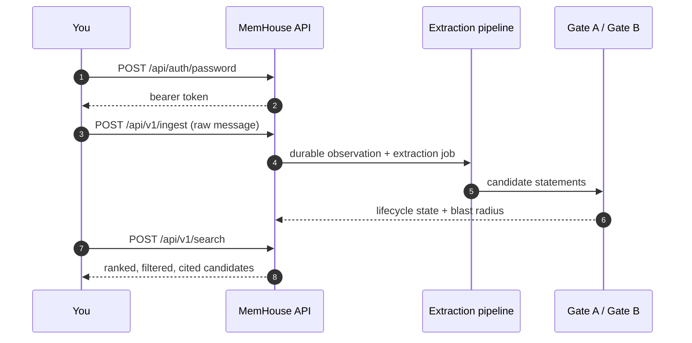

<!-- SPDX-License-Identifier: MemHouse-Sustainable-Use-1.0 -->

# Quickstart tutorial

Sign in, record an observation, read it back, and check skill readiness.

This assumes a running instance — see [Getting started](index.md) — reachable
at `http://127.0.0.1:4000`.



## 1. Bootstrap an administrator

Only needed once. It creates the community Account, registers a human
administrator, grants the administrator role on the root scope, and prints a
bearer token valid for 12 hours.

=== "From source"

    ```bash
    MEMHOUSE_BOOTSTRAP_PASSWORD='replace-with-a-long-password' \
      mix memhouse.identity.bootstrap \
        --email admin@example.test \
        --name 'Local Admin'
    ```

=== "From an unpacked release"

    A release contains no Mix tasks, so call the same function directly:

    ```bash
    bin/memhouse rpc '
      r = MemHouse.Identity.bootstrap_human(%{
            email: "admin@example.test",
            name: "Local Admin",
            password: System.fetch_env!("MEMHOUSE_BOOTSTRAP_PASSWORD")
          })
      IO.puts("peer=#{r.peer.id} token=#{r.token}")'
    ```

There is no default password. Copy the printed token now; it cannot be
recovered. Keep it out of logs and chat. It expires after 12 hours.

## 2. Sign in

```bash
curl -fsS -X POST http://127.0.0.1:4000/api/auth/password \
  -H 'content-type: application/json' \
  -d '{"email":"admin@example.test","password":"replace-with-a-long-password"}'
```

The response carries a bearer token. Export it:

```bash
export TOKEN='<token from the response>'
```

A wrong email and a wrong password produce the same opaque 401, so the endpoint
cannot be used to discover which accounts exist.

## 3. Record an observation

This records a raw observation. Agents cannot write knowledge directly.

```bash
curl -fsS -X POST http://127.0.0.1:4000/api/v1/ingest \
  -H "authorization: Bearer $TOKEN" \
  -H 'content-type: application/json' \
  -d '{
        "session_id": "quickstart-1",
        "scope_path": "/marketing/social",
        "content": "We publish the weekly roundup on Thursday mornings, and Dana signs off on the copy."
      }'
```

Missing scopes, sessions, and links are created on demand. The response is
**202 Accepted** with a `message_id`; extraction runs in the durable job lane
and never blocks this request.

Poll until extraction completes before searching for the new observation:

```bash
export MESSAGE_ID='<message_id from the response>'
curl -fsS http://127.0.0.1:4000/api/v1/ingest/$MESSAGE_ID \
  -H "authorization: Bearer $TOKEN"
```

The status response moves from `pending` to `completed` and then includes the
governed knowledge visible to you. Nothing in your request body can mint
knowledge.

## 4. Read it back

```bash
curl -fsS -X POST http://127.0.0.1:4000/api/v1/search \
  -H "authorization: Bearer $TOKEN" \
  -H 'content-type: application/json' \
  -d '{"query":"when does the roundup go out","scope_path":"/marketing/social"}'
```

The response includes the fused ranking and contributed or dropped strategies.
Do not re-sort it by per-strategy score; those scores are not comparable.

For a written answer with citations:

```bash
curl -fsS -X POST http://127.0.0.1:4000/api/v1/ask \
  -H "authorization: Bearer $TOKEN" \
  -H 'content-type: application/json' \
  -d '{"question":"Who approves the weekly roundup copy?","scope_path":"/marketing/social"}'
```

The answer carries `answer_confidence`, an integer from 0 to 100. `ask` does
not refuse: a weakly supported answer arrives with a low confidence and
`abstained` set to `true`, still with the citations behind it. Read that as a
lead, not a conclusion. If no statement was retrieved at all, `citations` is
empty and the answer says so. Both are correct outcomes, not errors.

## 5. Check readiness before running a skill

```bash
curl -fsS -X POST http://127.0.0.1:4000/api/v1/readiness \
  -H "authorization: Bearer $TOKEN" \
  -H 'content-type: application/json' \
  -d '{"skill":"write-copy","scope_path":"/marketing/social"}'
```

The report splits unmet requirements into `blockers` and `warnings`. `ready` is
true exactly when there are no blockers.

A gap is not permission to invent the missing fact. The answer comes back
through ordinary ingest and passes governance before readiness improves.

## What just happened to your data

The statement extracted in step 3 did **not** become account-wide fact. By
default it is visible to the peer who submitted it, as `provisional` knowledge.
Promoting it to the scope or the whole Account is a separate, human decision —
see [Governance gates](../concepts/governance.md) and
[Curating memory](../guides/governance-console.md).

## See it in the browser

Everything above is visible, with its provenance and its history, in the web
console:

```bash
open http://127.0.0.1:4000/sign-in
```

Sign in with the same email and password you bootstrapped. The overview counts
what you just stored, the explorer lists the statement, and its own page shows
the raw observation it was extracted from. See
[Exploring memory in the web console](../guides/web-console.md).

## Next

- [How it works](../concepts/index.md) — the model behind what you just did.
- [HTTP API reference](../reference/http-api.md) — every parameter.
- [Connecting an MCP client](../guides/mcp.md) — point a real agent at it.
