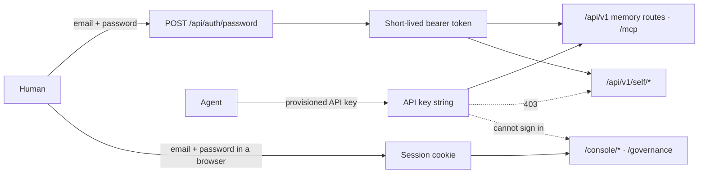

<!-- SPDX-License-Identifier: MemHouse-Sustainable-Use-1.0 -->

# Authentication

Every `/api/v1` route and `/mcp` require
`Authorization: Bearer <credential>`. Human tokens and agent API keys grant
different authority.



## Human sign-in

```bash
curl -fsS -X POST http://127.0.0.1:4000/api/auth/password \
  -H 'content-type: application/json' \
  -d '{"email":"admin@example.test","password":"..."}'
```

The response carries a bearer token. A wrong email and a wrong password produce
the same opaque 401 — the endpoint cannot be used to discover which accounts
exist.

Use the token as:

```
Authorization: Bearer <token>
```

## Agent API keys

Agents send a per-peer API key in the same header. MemHouse stores only its
hash, so record the plaintext when issued. New keys start with `memhouse_`.
Keys issued during the Cartulary beta keep their `cartulary_` prefix and remain
valid.

An API key is enough for the memory routes and MCP. It is **not** enough for:

- `/api/v1/self/*` — self-view, contest, redact, erase. These return 403 for a
  machine credential even when it belongs to the same peer as a human identity;
- the browser surface at `/console/*` and `/governance`. There is no header or
  parameter that substitutes for the sign-in form, so a key has nothing it can
  present; a key placed in a session cookie is refused like no credential.

Machines may not make these personal decisions.

## Browser sign-in

The console and the curator queue authenticate with a signed session cookie
rather than a bearer token.

```bash
open http://127.0.0.1:4000/sign-in
```

`/sign-in` admits any human role and lands on `/console`.
`/governance/sign-in` additionally requires the `curator` or `account-admin`
role. Both write the same session, so one sign-in opens whichever surface your
role allows.

Initial render and every socket reconnect re-check token, identity kind, and,
for governance, role. A cookie alone is not authorization.

Signing out drops the session. It does not revoke the token: session tokens are
stateless and stay valid on their signature until they expire.

See [Exploring memory in the web console](web-console.md).

## The Account comes from the credential

The verified identity determines the Account tenant.

An `account_key` field in a request body and the legacy
`x-memhouse-account-key` header are accepted and **ignored**, so an old client
fails closed into its own Account rather than reaching into someone else's.

## Roles

| Role | Typical use |
| --- | --- |
| `account-admin` | Operations, cost visibility, gate-rule administration |
| `curator` | Approve, edit, reject, merge, defer proposals |
| `member` | Ordinary read and ingest |
| `reader` | Read only |

Grants attach to a scope, propagate downward when configured to, and resolve
**deny-wins**: any applicable deny removes access to that scope.

## Bootstrapping the first identity

See the [Quickstart](../getting-started/quickstart.md#1-bootstrap-an-administrator).
The bootstrap task creates the community Account, the first human
administrator, and an administrator role grant on the root scope, then prints a
bearer token valid for 12 hours. That token is not recoverable afterwards.

## Trace correlation

Every response carries an `x-trace-id` header. If you send a W3C `traceparent`,
your trace id is retained; if you do not, a new request trace id is generated.
Use it when correlating a client-side failure with server telemetry — see
[Observability](../operations/observability.md).
