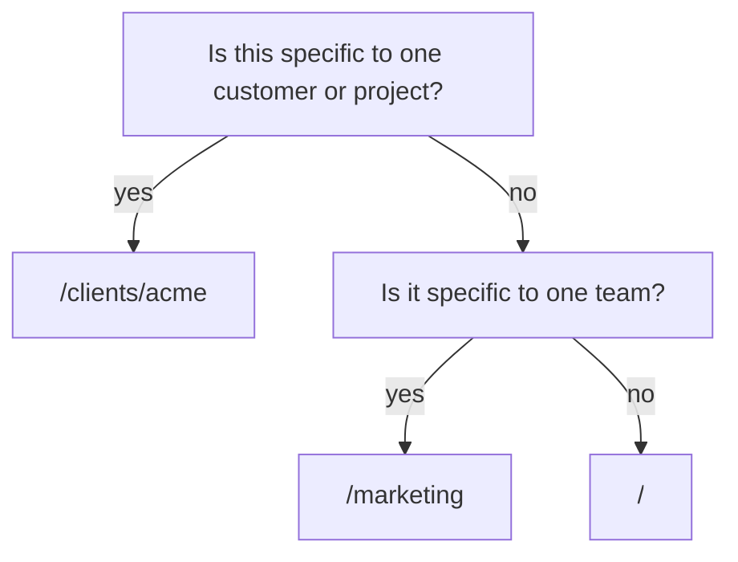

<!-- SPDX-License-Identifier: MemHouse-Sustainable-Use-1.0 -->

# Recording observations

`POST /api/v1/ingest` records what was said. Only the pipeline decides what
becomes knowledge.

## A minimal request

```bash
curl -fsS -X POST http://127.0.0.1:4000/api/v1/ingest \
  -H "authorization: Bearer $TOKEN" \
  -H 'content-type: application/json' \
  -d '{
        "session_id": "support-4821",
        "scope_path": "/support/tier1",
        "content": "The customer runs PostgreSQL 16 and cannot upgrade before Q4."
      }'
```

## Fields

| Field | Required | Default | Notes |
| --- | --- | --- | --- |
| `session_id` | yes | — | Any stable string. The session and its scope/participant links are created on demand. |
| `scope_path` | yes | — | Created on demand if it does not exist. |
| `content` | yes | — | The raw text of the observation. |
| `role` | no | `"user"` | Who was speaking. |
| `occurred_at` | no | now | When it was said, if backfilling. |

Missing scopes, the session, and its links are created on demand.

## The acting peer comes from your credential

A `peer_key` in the body is honoured only for internal callers that carry no
peer of their own. An authenticated caller cannot attribute an observation to
somebody else.

## What comes back

The response is **202 Accepted** after the message and extraction job are
durable. It does not wait for a model:

```json
{"data":{"message_id":"c479dd01-36a8-4f27-964e-27d425534b18","status":"accepted"}}
```

Poll `GET /api/v1/ingest/:message_id`. It reports `pending`, `failed`, or
`completed`; a completed result includes the governed knowledge visible to your
identity.

!!! note "That list is output, not input"
    Nothing in your request body can mint knowledge. Each proposed item still
    has to clear governance before anyone other than the submitting peer can
    see it.

A typical proposed item is `provisional`: real, visible to you, and not yet
part of what the scope believes. See [Governance gates](../concepts/governance.md).

## Choosing a scope

Choose the **narrowest correct scope** for the observation:



Anything at `/marketing` is visible at `/marketing/social`; nothing at
`/marketing/social` is visible at `/marketing`. Widening later is a governed
decision; narrowing later means the information already travelled.

## Backfilling history

To load past conversations, ingest each message with its real `occurred_at`,
then let the `ingest` job lane work through them. The belief-time and valid-time
distinction means a backfilled message is correctly treated as newly *learned*
but possibly long *true*.

Send `occurred_at` as ISO 8601. An offset is honoured; a timestamp without one
is read as UTC. A value that cannot be parsed falls back to the current time,
which silently dates the turn to the moment you loaded it — check the stored
`occurred_at` on the first few messages of a backfill before running the rest.

`occurred_at` matters more than it looks. It is what the extractor resolves
"last weekend" or "yesterday" against, and what dates an event whose statement
carries no absolute date of its own. Load a transcript without it and every
statement it produces is anchored to your import run.

## Replaying is safe

Deterministic idempotency makes replay merge provenance instead of duplicating
statements.

## When the model provider is down

The durable observation remains and extraction retries. Production never falls
back silently to a deterministic adapter. An account administrator can enqueue
a recovery sweep with `POST /api/v1/operations/reconcile`.

## Ingesting documents

Documents are the other kind of raw observation. They are submitted as document
versions rather than messages, are stored as immutable, hash-addressed
versions with their original bytes, and their extracted knowledge passes the
same pipeline and gates. See
[Documents and connectors](../concepts/documents.md).
