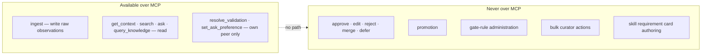
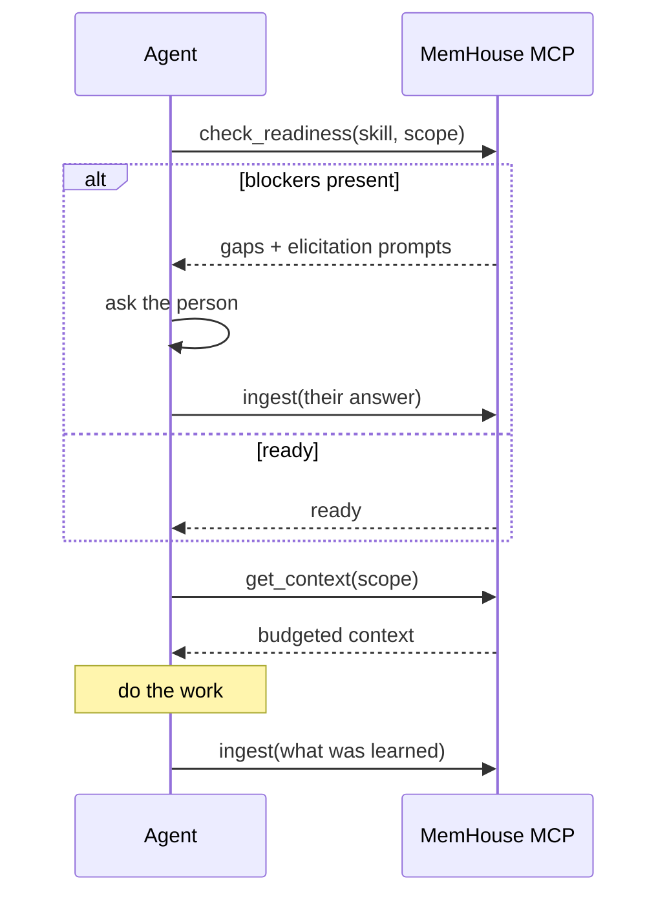

<!-- SPDX-License-Identifier: MemHouse-Sustainable-Use-1.0 -->

# Connecting an MCP client

`/mcp` uses bearer authentication and derives the Account from the credential,
like the JSON routes.

The advertised protocol revision is `2025-03-26`.

## Point a client at it

```json
{
  "mcpServers": {
    "memhouse": {
      "url": "http://127.0.0.1:4000/mcp",
      "headers": {
        "Authorization": "Bearer <api-key-or-token>"
      }
    }
  }
}
```

Use an agent API key for an agent. Human tokens work but attribute the agent's
writes to that person.

## The complete tool surface

Eight tools. This list is exhaustive by design.

| Tool | What it does |
| --- | --- |
| `ingest` | Submit a raw observation |
| `get_context` | Assemble reasoning-free context for a scope |
| `search` | Ranked retrieval over governed memory |
| `ask` | Cited answer; an abstention may retain citations when evidence supports a qualified inference |
| `query_knowledge` | List governed knowledge the caller may read |
| `check_readiness` | Skill-readiness gap report |
| `resolve_validation` | Answer the calling peer's own frozen inline question |
| `set_ask_preference` | Lower the calling peer's interruption limits |



MCP never exposes approve, edit, reject, merge, defer, promote, or gate-rule
actions; shared knowledge requires a human curator.

## Inline validation

`resolve_validation` answers a validation question attached to a read result.

Constraints worth knowing:

- a client may resolve only **its own peer's** frozen question;
- the question selector is deadline-bounded and **fails open**: if it cannot
  pick a question in time, the read returns normally with none attached;
- `set_ask_preference` can only *lower* that peer's interruption limits.

## What an agent should do with this

A reasonable loop:



Ingest what was learned. It becomes knowledge only after extraction and gates.

## Troubleshooting

| Symptom | Likely cause |
| --- | --- |
| 401 on every tool call | Missing or malformed `Authorization` header |
| Tools listed but calls return nothing | Credential is valid but the peer has no scope authorisation |
| `ask` always abstains | No governed knowledge in scope yet — check whether items are still `provisional` or `held` |
| Reads are slower than expected | `thorough` profile plus a cold projection cache; see [Retrieval](../concepts/retrieval.md) |

Every response carries `x-trace-id`; use it to correlate with server telemetry.
