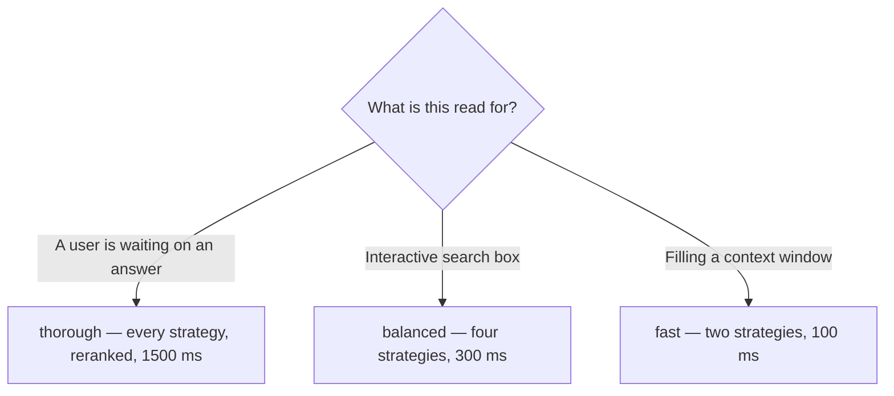

<!-- SPDX-License-Identifier: MemHouse-Sustainable-Use-1.0 -->

# Search and ask

`search` returns ranked evidence. `ask` writes a cited answer over that evidence
or abstains.

## search

```bash
curl -fsS -X POST http://127.0.0.1:4000/api/v1/search \
  -H "authorization: Bearer $TOKEN" \
  -H 'content-type: application/json' \
  -d '{
        "query": "who signs off on campaign copy",
        "scope_path": "/marketing/social",
        "profile": "balanced",
        "limit": 12
      }'
```

| Field | Default | Notes |
| --- | --- | --- |
| `query` | `""` | The search text. A full question works; `"phrase"`, `-term`, and `or` narrow it. |
| `scope_path` | `"/poc"` | Selects this scope **and its ancestors**. |
| `profile` | `"balanced"` | `fast`, `balanced`, or `thorough`. |
| `limit` | `12` | Candidate cap. Values are clamped to `1` through `100`. |
| `include_cross_links` | off | Follow scope relations you are authorised for at both ends. |
| `as_of` | now | Read memory as it stood at a point in time. |
| `min_score` | none | Drop candidates below this score inside each strategy, before fusion. |
| `source_filters` | none | Restrict by provenance kind. |
| `deadline` | profile default | `"disabled"` removes the time budget — offline use only. |

### Reading the response

```json
{
  "data": {
    "profile": "balanced",
    "profile_version": "f7-1",
    "candidates": [
      { "id": "...", "fusion_score": 0.84, "rrf_score": 0.84 }
    ],
    "contributed_strategies": ["semantic", "lexical", "entity_match"],
    "empty_strategies": [],
    "dropped_strategies": ["temporal"],
    "degraded": true,
    "degraded_components": ["temporal"],
    "disagreement": { "query_dependent_empty": false }
  }
}
```

- `candidates` is **already in the right order.** Do not re-sort by a
  per-strategy score: those scores live in different spaces and comparing them
  degrades results.
- Each candidate's `strategies` list names the retrieval strategies that
  returned it. Its `fusion_score` is the normalized, weighted fusion value used
  for ordering. It is not a probability or relevance percentage. Do not compare
  it across profiles or apply a relevance threshold to it. `rrf_score` is a
  deprecated alias for the same value.
- `dropped_strategies` lists strategies that did not run: they missed the
  deadline or a dependency was unavailable. `semantic` appears here when the
  embedder failed. Frequent deadline drops mean the profile's budget is too
  tight for your data size.
- `retrieval_outcomes` gives each component's status, deterministic drop reason,
  elapsed time, and remaining budget. The reason is one of
  `disabled`, `deadline_exhausted_before_start`, `timeout`,
  `dependency_unavailable`, `provider_error`, `invalid_result`, or
  `partial_rankings`. It contains no query or candidate text.
- `degraded` is the short form of the same news: `true` when a component was
  dropped or completed with a reason class, with the names in
  `degraded_components`. A dropped `reranker` is the case to watch, because the
  results still look model-ordered when they are ordered by fusion alone.
- `pre_rerank_remaining_ms` shows how much of the hard ceiling remained before
  reranking. Reranking receives the smaller of that value and
  `MEMHOUSE_RETRIEVAL_RERANK_TIMEOUT_MS`, and a run with `deadline` set to
  `"disabled"` is not capped at all.
- `reserved_rerank_ms` shows how much of the deadline was kept back from the
  strategies for that stage. A reranking profile spends it last but reserves it
  first, so a slow strategy costs recall instead of costing the ordering.
- `empty_strategies` lists strategies that ran and matched nothing. That is a
  result, not a failure — but a strategy in this list did not vote on the order.

`entity_match` weights each name your query mentions by how much it narrows the
scope. A name carried by most of the scope separates nothing, so it is ranked
low and, past
[`MEMHOUSE_RETRIEVAL_ENTITY_FREQUENCY_CEILING`](../reference/configuration.md#entity-match-selectivity),
not ranked on at all. A query naming only such people appears in
`empty_strategies` rather than returning the scope in extractor-confidence
order. Add a distinguishing term — a place, an artifact, a date — to get it
back.

!!! warning "Check the flag, not the page"
    `temporal` runs only with an explicit `as_of` and returns dated text matches.
    `salience_recency` does not read your query text and only serves a
    blank-query context read. When
    `disagreement.query_dependent_empty` is `true`, none of the strategies that
    do read your text produced a candidate, and the search returns an empty
    page rather than the scope in recency order. A run in that state usually
    means embeddings or entity mentions have not been rebuilt for the scope
    yet, or that every name you searched for is too common in it to rank on.
- Account, scope authorisation, and lifecycle filtering already happened inside
  retrieval. You do not need to post-filter.

## ask

```bash
curl -fsS -X POST http://127.0.0.1:4000/api/v1/ask \
  -H "authorization: Bearer $TOKEN" \
  -H 'content-type: application/json' \
  -d '{
        "question": "Who signs off on campaign copy?",
        "scope_path": "/marketing/social"
      }'
```

`question` is required. All `search` parameters apply; `profile` defaults to
`thorough`. Add `effort: "low"`, `"medium"`, or `"high"` to use the bounded
read-only planner. It may select governed knowledge through stable profile and
lineage reads; it has no write tool. Add the JSON boolean
`include_source_recall: true` only when this caller is allowed to recover a
bounded authorized source-message excerpt. An effort level by itself never
grants that broader read.

The response is the search payload plus `answer`, `citations`, `abstained`,
`answer_confidence`, `answer_degraded`, `answer_context_count`, and
`answerer_prompt_tokens`. The candidate list remains complete up to `limit`.
Only its bounded, final-ranked head enters the answer prompt.

!!! tip "Read the confidence, not only the answer"
    `ask` does not refuse. It answers with what the retrieved statements make
    most probable and reports its certainty as `answer_confidence`, an integer
    from 0 to 100. Below 50 the response also sets `abstained`, which marks the
    answer as a lead rather than a conclusion. Both still carry citations, so
    you can check the reasoning yourself.

    An empty citation list with `abstained` means no statement survived to
    ground an answer on. That is a report about the index, not a guess about
    the subject. An answer invented from an empty candidate set is worse than
    silence, and much harder to notice.

!!! warning "A degraded answer is not a low-confidence one"
    When the answering model call itself fails, `answer_degraded` names the
    failure instead of `null`, `abstained` is `true`, and `answer_confidence`
    is 0. `answer` states that the call failed — it is never the retrieved
    statements presented as a conclusion. Those statements are still there, as
    plain text in `supporting_statements`, so you lose nothing but the false
    confidence.

Fixed retrieval for `ask` is restricted to governed knowledge. With a named
effort, a citation may instead name an authorized immutable source message and
the response includes its bounded excerpt and stable source metadata. Citation
ids the model invented or did not retrieve are removed; if none survive, the
answer becomes the empty abstention with `answer_confidence` 0.

## Choosing a profile



Profiles inherit down the scope tree, nearest-wins, so a scope can be tuned
without a global change. See [Retrieval and context](../concepts/retrieval.md)
for the exact strategy sets and weights.

## Time travel with `as_of`

`as_of` reads past belief-time: what the system believed then, not what was true
then.

## What you will not find

Search and ask return no entity rows, names, aliases, surface forms, or ids.
These internal caches improve matching without affecting authorization
boundaries.

`get_context` is the one exception, and a narrow one: an entity card names
itself with a wording from its own scope. See
[Context](context.md#the-response).
