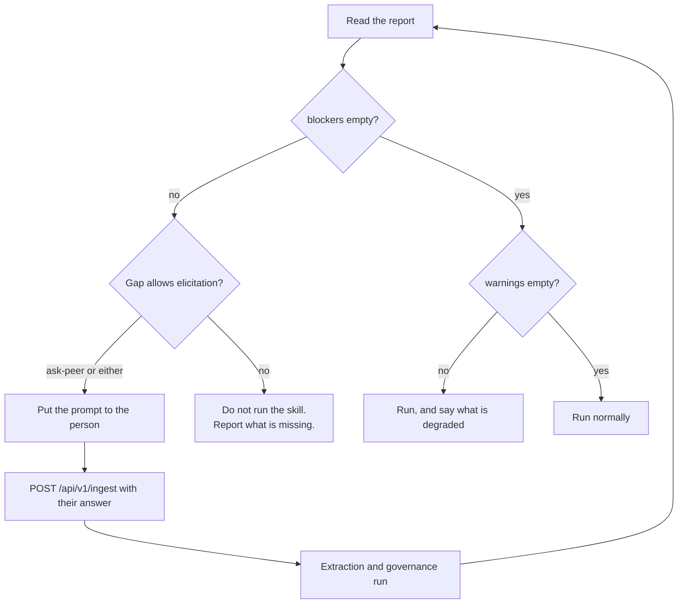

<!-- SPDX-License-Identifier: MemHouse-Sustainable-Use-1.0 -->

# Checking skill readiness

Check readiness before running a skill.

```bash
curl -fsS -X POST http://127.0.0.1:4000/api/v1/readiness \
  -H "authorization: Bearer $TOKEN" \
  -H 'content-type: application/json' \
  -d '{"skill":"write-copy","scope_path":"/marketing/social"}'
```

| Field | Required | Notes |
| --- | --- | --- |
| `skill` | yes | The named requirement card to evaluate. |
| `scope_path` | yes | Requirement keys inherit down the tree, nearest-scope wins. |
| `peer_id` / `peer_key` | no | Check another peer you are allowed to read. Defaults to the caller. |

## The report

```json
{
  "data": {
    "report_version": "f9-1",
    "skill": "write-copy",
    "scope_path": "/marketing/social",
    "peer_id": "...",
    "ready": false,
    "requirements": [ ... ],
    "blockers": [ ... ],
    "warnings": [ ... ]
  }
}
```

`ready` is true exactly when `blockers` is empty. Required gaps block; preferred
gaps warn.

## Acting on the result



!!! danger "Never route around a blocker"
    A gap is not permission to invent the missing fact, and an SDK helper must
    never override a server blocker or write knowledge directly. The answer
    returns through ordinary ingest and passes governance before readiness
    improves.

## Why a requirement can be unmet even though "we know that"

Only two things satisfy a requirement:

- authorised `active` knowledge, or
- the calling peer's own usable `provisional` knowledge.

So a requirement is a gap when the relevant statement is:

- still `held`, awaiting a curator;
- `provisional` and belongs to a *different* peer;
- `expired`, `needs_revalidation`, or past its revalidation date — counted as a
  gap **immediately**, without waiting for the background sweeper;
- outside the scopes the peer may read.

Readiness is per-peer: one agent may not act on another's inaccessible memory.

## Authoring requirement cards

Cards are human-authored, plainly versioned procedural memory. They are not
knowledge and do not pass Gate A or Gate B. Author them in the governance
console — see [Curating memory](governance-console.md).

Keep cards small enough that required keys remain actionable.

## In code

The `sdk/` helpers wrap this call for Python and TypeScript. See
[SDK helpers](sdk-helpers.md).

## Related

- [Skill readiness concepts](../concepts/skills.md)
- [HTTP API reference](../reference/http-api.md)
