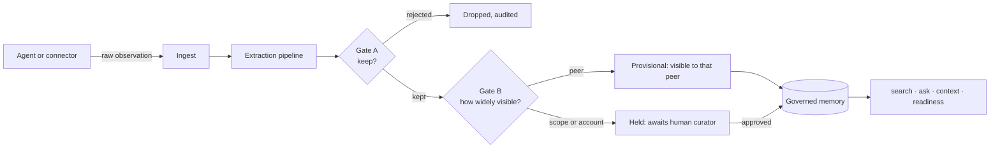

<!-- SPDX-License-Identifier: MemHouse-Sustainable-Use-1.0 -->

# MemHouse

MemHouse is a **governed memory system for agents**. Agents submit raw
observations; the pipeline writes knowledge; governance decides what is kept
and who may see it. Reads are scoped, inherited downward, cited, and able to
abstain.

It runs as one Elixir release on the BEAM, backed by PostgreSQL with pgvector
and full-text search. It supervises its own PostgreSQL for a no-dependency
install, or points at one you already run — with no behavioural difference
between the two.

!!! info "Status: community beta, version 0.4.0"
    The memory engine, governance, retrieval, document handling, packaging, and
    release machinery are implemented and covered by tests. Integration
    surfaces — generated OpenAPI, complete generated SDKs, and the gateway
    proxy — are not. See [Limitations](reference/limitations.md).

## Purpose

Each remembered fact has its own confidence, sensitivity, subject, provenance,
and lifecycle. Moving an observation into shared memory is explicit and
auditable.

## Start here

- :material-download: **[Install](getting-started/index.md)**

    Run a packaged release, a container, or a source checkout.

- :material-rocket-launch: **[Quickstart](getting-started/quickstart.md)**

    Sign in, record an observation, and read it back in about five minutes.

- :material-book-open-variant: **[How it works](concepts/index.md)**

    The memory model, the pipeline, the gates, and retrieval — with diagrams.

- :material-api: **[HTTP API](reference/http-api.md)**

    Every endpoint, its parameters, and its response shape.

## Core terms

| Term | Meaning |
| --- | --- |
| **Account** | The isolation boundary. Every durable row belongs to exactly one, derived from the authenticated identity — never from a header or request body. |
| **Scope** | A path in a containment tree, such as `/marketing/social`. Anything attached to a scope is visible to everything beneath it. |
| **Peer** | One participant: a human, or an agent holding an API key. The narrowest audience knowledge can have. |
| **Knowledge** | The only durable atom of memory: one natural-language statement with its own confidence, sensitivity, lifecycle state, subject, and provenance. Immutable once written. |
| **Raw observation** | What agents actually submit — a message or a document version. Agents never write knowledge directly. |
| **Gate A / Gate B** | The two checks between an observation and visible memory: what is kept, and how widely it may be seen. |
| **Blast radius** | How far a statement can travel: one peer, a scope, or the whole Account. Wider means a higher bar. |
| **Lifecycle state** | `proposed` → `provisional` / `active` / `held`, and later `superseded`, `expired`, `retracted`, and more. Retrieval filters on it. |
| **Projection / index / cache** | Derived, rebuildable data. Raw messages, governed knowledge, and the audit log are the system of record; everything else can be deleted and recomputed. |

Keep these dimensions separate:

- **Belief-time, valid-time, and salience are three different clocks.** When we
  learned something, when it was true, and how much it matters now are not the
  same number.
- **Confidence, sensitivity, and subject are three different axes.** In
  particular, who a statement is *about* is not who it came *from*.

Full definitions are in the [Glossary](reference/glossary.md).

## Documentation

This site covers installation, usage, and operations. Design material — the
product blueprint, functional requirements,
architecture and non-functional requirements, architecture decision records,
the roadmap, and evaluation evidence — is not published here. It lives in the
[`specs/` directory](https://github.com/memhousehq/memhouse/tree/main/specs)
of the repository, next to the code it describes. Contribution rules are in
[`CONTRIBUTING.md`](https://github.com/memhousehq/memhouse/blob/main/CONTRIBUTING.md)
and the agent operating contract is
[`AGENTS.md`](https://github.com/memhousehq/memhouse/blob/main/AGENTS.md).

## Licence

MemHouse is source-available fair-code, not OSI open source. Community and
core code is governed by
[`LICENSE.md`](https://github.com/memhousehq/memhouse/blob/main/LICENSE.md);
enterprise-marked code, when added, is governed by
[`LICENSE_EE.md`](https://github.com/memhousehq/memhouse/blob/main/LICENSE_EE.md).
