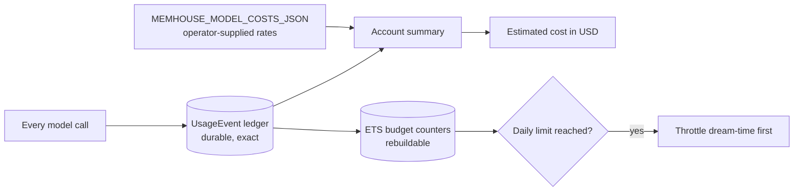

<!-- SPDX-License-Identifier: MemHouse-Sustainable-Use-1.0 -->

# Health and cost

## Liveness: `GET /api/health`

Unauthenticated. Touches no database and no queue.

```json
{"status": "ok", "app": "memhouse", "version": "f5-1"}
```

`version` identifies the extraction-and-pipeline contract, **not** the
application version. See
[Contract versions](../reference/contract-versions.md).

Point orchestrator **liveness** probes here.

## Readiness: `GET /api/ready`

Unauthenticated. Checks the database, Oban, queue depth, and model roles.
Returns 200 when all are `ok`; otherwise 503.

The body is the whole check map: per-component status, queue depths by queue
and job state, an error class per failing component, and `"f10-1"` — the
identity of the readiness payload shape, which operator tooling parses.

```bash
curl -fsS http://127.0.0.1:4000/api/ready
```

Point orchestrator **readiness** probes here.

!!! note "The payload is content-safe by construction"
    Component names, counts, model identities, versions, and error classes are
    allowed. Credentials, secrets, and stored content are not, because anyone
    who can reach the port can read this without authenticating. Adding a field
    here is a disclosure decision.

### Reading queue depth

Queue depths appear by queue and job state. What to watch:

| Symptom | Meaning |
| --- | --- |
| `ingest` backlog growing | Extraction cannot keep up, or the model provider is failing and jobs are retrying |
| `projection` backlog growing | Context reads will report `fast_fallback: true` until it drains |
| `lifecycle` never draining | Revalidation and expiry sweeps are stuck; stale knowledge may still satisfy requirements |
| `reconciler` non-empty | Durable records whose job never ran are being recovered — expected briefly after a crash |

## Cost: `GET /api/v1/operations/costs`

Requires an **account-admin** credential; any other role gets 403.

```bash
curl -fsS http://127.0.0.1:4000/api/v1/operations/costs \
  -H "authorization: Bearer $ADMIN_TOKEN"
```

Returns the exact recorded usage-event count, API request and ingest counts,
input/output/embedding token totals overall and per model role, logical storage
bytes, and an estimated model cost in USD.



!!! info "This is not a bill"
    The estimate uses your usage ledger and operator-supplied rates. Nothing is
    sent elsewhere.

### Budgets and throttling

`MEMHOUSE_BUDGET_LIMITS_JSON` sets daily token counters for admission control.
When a limit bites, **dream-time is throttled first**: background reasoning
yields before user-facing ingest and retrieval do.

The ETS counters in front of the ledger are rebuildable caches. The ledger
itself is durable and exact.

## Trace correlation

Every HTTP response carries `x-trace-id`. A caller sending a W3C `traceparent`
keeps its own trace id; a caller without one gets a newly generated request
trace id. See [Observability](observability.md).
