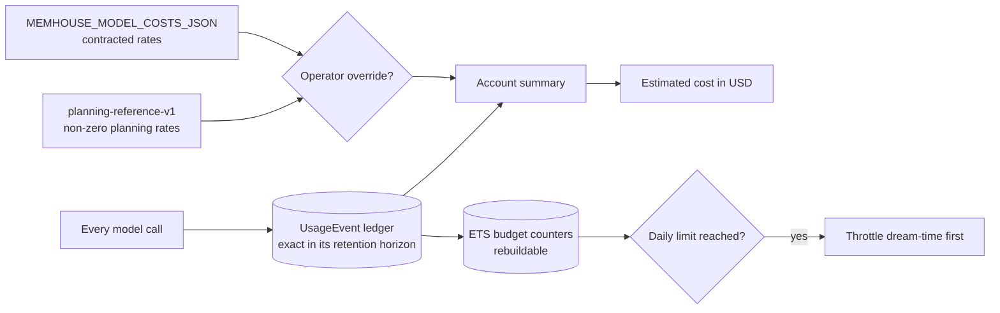

<!-- SPDX-License-Identifier: MemHouse-Sustainable-Use-1.0 -->

# Health and cost

## Liveness: `GET /api/health`

Unauthenticated. Touches no database and no queue.

```json
{"status": "ok", "app": "memhouse", "version": "f5-1"}
```

`version` identifies the extraction-and-pipeline contract, **not** the
application version. See
[Contract versions](../reference/contract-versions.md).

Point orchestrator **liveness** probes here.

## Readiness: `GET /api/ready`

Unauthenticated. Checks the database, Oban, queue depth, unfinished pipeline
runs, model roles, model call health, and the configured embedding index.
Returns 200 when all are `ok`; otherwise 503.

The body is the whole check map: per-component status, queue depths by queue
and job state, an error class per failing component, and `"f10-1"` — the
identity of the readiness payload shape, which operator tooling parses.

```bash
curl -fsS http://127.0.0.1:4000/api/ready
```

Point orchestrator **readiness** probes here.

!!! note "The payload is content-safe by construction"
    Component names, counts, model identities, versions, and error classes are
    allowed. Credentials, secrets, and stored content are not, because anyone
    who can reach the port can read this without authenticating. Adding a field
    here is a disclosure decision.

`checks.embedding_index` reports the embedder provider, model, version,
configured dimensions, and installed index dimensions. It is `error` when the
configured width has no installed index, and the endpoint returns 503.

`checks.model_calls` reports the prior 24 hours of attempts, errors, error
rate, unmetered failures, and error classes. It is informational: an upstream
provider failure does not make the application unready while durable jobs can
retry. `unmetered` means the provider returned no token usage, so the estimate
cannot include that call's unknown cost.

`checks.pipeline_runs.unfinished` groups all non-completed durable runs by
kind. Each group reports its count and `oldest_age_seconds`. This exposes
stranded work without exposing targets, payloads, or Account identities.

`governance.pending_human_reviews` counts open work that requires a person.
`governance.restricted_withheld` counts restricted proposals rejected under
the unattended policy. A headless setup check must report a non-zero pending
human count instead of waiting for a console action that cannot occur.

### Reading queue depth

Queue depths appear by queue and job state. What to watch:

| Symptom | Meaning |
| --- | --- |
| `ingest` backlog growing | Extraction cannot keep up, or the model provider is failing and jobs are retrying |
| `projection` backlog growing | Context reads will report `fast_fallback: true` until it drains |
| `lifecycle` never draining | Revalidation and expiry sweeps are stuck; stale knowledge may still satisfy requirements |
| `reconciler` non-empty | Durable records whose job never ran are being recovered — expected briefly after a crash |

Reconciliation runs once per hourly maintenance slot. It ignores work younger
than 5 minutes and processes at most 100 messages, document versions,
connectors, and scopes per pass. An administrator can request an extra pass
with `POST /api/v1/operations/reconcile`.

A cancelled or discarded Oban job changes its durable run to the matching
terminal state. A run with no Oban row changes to `discarded`. The next sweep
replays the same deterministic run, so queue cleanup cannot leave it pending.

## Cost: `GET /api/v1/operations/costs`

Requires an **account-admin** credential; any other role gets 403.

```bash
curl -fsS http://127.0.0.1:4000/api/v1/operations/costs \
  -H "authorization: Bearer $ADMIN_TOKEN"
```

Returns the retained usage-event count, API request and ingest counts,
input/output/embedding token totals overall and per model role, durable and
operational storage bytes, estimated model cost in USD, and prior-24-hour
model-call health. `model_cost_profile` names both the rate-table id and whether
it is the shipped planning reference or an operator override. It warns when
operational storage is larger than durable storage. Configure cleanup in
[Operational retention](../reference/configuration.md#operational-retention). It also
reports extractor calls, tokens, and estimated cost per ingested message. Call
counts include failed extractor calls. An unmetered failure has unknown token
usage and cost, so it contributes only to the call ratio. The summary and the
console Operations page also report the Account's current count of permanent
terminal extraction anchors so operator repair work is visible without stored
content.



!!! info "This is not a bill"
    The estimate uses your usage ledger. Without an override it applies the
    round, provider-neutral `planning-reference-v1` table so usage never looks
    silently free; those values are not current vendor prices. Configure exact
    contracted rates and a stable `MEMHOUSE_MODEL_COST_PROFILE` before using it
    for reconciliation. Nothing is sent elsewhere.

## Extraction evidence: `GET /api/v1/operations/extraction-evidence`

Requires an **account-admin** credential and a `scope_root` query parameter.
The response covers that exact scope and its descendants. Use it to audit one
isolated benchmark corpus without mixing in other Account activity.

The `data` envelope contains extraction-anchor and candidate-yield counts,
batch and provider-attempt distributions, token and duration totals, statement
classification distributions, and model/prompt/pipeline identities. It does
not contain statements, source ids, prompt or completion text, credentials, or
free-form metadata.

`accounting.complete` is false when settled batch evidence does not reconcile
to the exact usage ledger, or when a provider failure did not return token
usage. Treat an incomplete export as a failed audit, not as zero use.

## Extraction run budget: `PUT /api/v1/operations/extraction-budget`

Requires an **account-admin** credential. Register the guard before ingest. The
request contains exactly `scope_root`, positive `request_cap`, `token_cap`, and
`usd_micros_cap` integers, a future ISO 8601 `deadline_at`, and non-negative
`input_usd_micros_per_million` and `output_usd_micros_per_million` integers.
The response echoes those content-safe values and returns the durable
`requests_reserved`, `tokens_reserved`, and `usd_micros_reserved` counters. Its
`extraction_identity` reports the deployment build SHA, prompt and pipeline versions,
the batching switch, and the provider-independent batching admission identity. Benchmark
harnesses must compare this identity with the preregistered arm before ingest.

The guard applies to `ingest_extractor` provider attempts in the exact scope or
its descendants. Before a provider callback starts, one request, counted input
tokens, the configured maximum output tokens, and their ceiling-priced USD are
reserved atomically. The callback is refused when that worst-case reservation
would exceed a cap. Its task is killed at the remaining deadline. Missing guards
leave normal product traffic unchanged; an exhausted matching guard stays
terminal until an administrator registers a new corpus scope. Re-registering the
same scope updates caps and deadline but preserves reservation counters, which is
how a resumed benchmark remains cumulative.

Scope matching is literal: `%` and `_` in a corpus id are ordinary characters,
not SQL wildcard syntax. The Account always comes from the authenticated actor,
and row-level security prevents another Account with the same scope text from
reading or changing the guard.

### Extraction provider circuit

Both single-message and experimental batched extraction pass through one
Account/provider/role-scoped circuit at the model gateway. Five consecutive
transient failures open it for 30 seconds by default. Open-circuit work fails
fast without a provider call or UsageEvent, while its durable input and
PipelineRun remain available for the normal bounded job retry and visible
repair/terminal paths. After the interval exactly one half-open call probes
recovery. Calls admitted before the circuit opened may finish, but their stale
results only release their permits; they cannot close or extend the open
interval. The recovery probe waits for those permits to drain. Worker death
releases a probe permit and reopens the bounded interval.

Content-safe `[:memhouse, :model, :provider_circuit]` telemetry reports the
resolved role/provider identity, Account id, state transition or blocked
decision, and consecutive-failure count. It never includes observation,
prompt, completion, source, or credential data.

### Budgets and throttling

`MEMHOUSE_BUDGET_LIMITS_JSON` sets daily token counters for admission control.
When a limit bites, **dream-time is throttled first**: background reasoning
yields before user-facing ingest and retrieval do.

The ETS counters in front of the ledger are rebuildable caches. The ledger
itself is exact within its retention horizon.

## Experimental simplification profiles

No Honcho-informed extraction, recall, or dream-time experiment is a shipped
default merely because it appears in the repository. The proposed
[clean-room memory-simplification decision](https://github.com/memhousehq/memhouse/blob/main/specs/adr/0021-clean-room-memory-simplification.md)
requires versioned matched evaluation, content-safe operational evidence,
rollback rehearsal, and human architecture/licensing review before a default
changes. The isolated minimal-profile evaluation captures its maintenance plan
in each durable projection run: source and Knowledge indexes plus
RecallDocuments remain scheduled, while entity and context-projection stages
are explicitly reported as skipped. Current and legacy runs retain full
maintenance. Canonical observations, governed Knowledge, lifecycle audit, and
context dirty markers are unchanged, so skipped caches remain rebuildable for
rollback. After each evaluated case ingests, the evaluation barrier completes
only projection and entity-resolution runs created by that measured variant
before retrieval begins. Separate legacy entity-resolution runs are counted
explicitly; the minimal profile creates none.
Pre-existing Account work is excluded, and every non-completed state fails the
run instead of being reported as savings. A later reconciliation preserves the
scope's latest plan. Until a
reviewed decommission through issue #295, no production cache or migration is
removed.

## Trace correlation

Every HTTP response carries `x-trace-id`. A caller sending a W3C `traceparent`
keeps its own trace id; a caller without one gets a newly generated request
trace id. See [Observability](observability.md).
