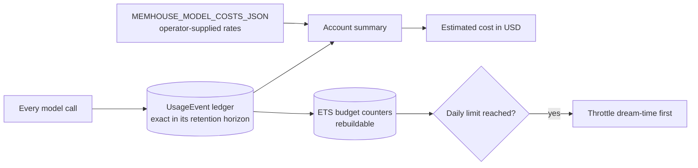

<!-- SPDX-License-Identifier: MemHouse-Sustainable-Use-1.0 -->

# Health and cost

## Liveness: `GET /api/health`

Unauthenticated. Touches no database and no queue.

```json
{"status": "ok", "app": "memhouse", "version": "f5-1"}
```

`version` identifies the extraction-and-pipeline contract, **not** the
application version. See
[Contract versions](../reference/contract-versions.md).

Point orchestrator **liveness** probes here.

## Readiness: `GET /api/ready`

Unauthenticated. Checks the database, Oban, queue depth, unfinished pipeline
runs, model roles, model call health, and the configured embedding index.
Returns 200 when all are `ok`; otherwise 503.

The body is the whole check map: per-component status, queue depths by queue
and job state, an error class per failing component, and `"f10-1"` — the
identity of the readiness payload shape, which operator tooling parses.

```bash
curl -fsS http://127.0.0.1:4000/api/ready
```

Point orchestrator **readiness** probes here.

!!! note "The payload is content-safe by construction"
    Component names, counts, model identities, versions, and error classes are
    allowed. Credentials, secrets, and stored content are not, because anyone
    who can reach the port can read this without authenticating. Adding a field
    here is a disclosure decision.

`checks.embedding_index` reports the embedder provider, model, version,
configured dimensions, and installed index dimensions. It is `error` when the
configured width has no installed index, and the endpoint returns 503.

`checks.model_calls` reports the prior 24 hours of attempts, errors, error
rate, unmetered failures, and error classes. It is informational: an upstream
provider failure does not make the application unready while durable jobs can
retry. `unmetered` means the provider returned no token usage, so the estimate
cannot include that call's unknown cost.

`checks.pipeline_runs.unfinished` groups all non-completed durable runs by
kind. Each group reports its count and `oldest_age_seconds`. This exposes
stranded work without exposing targets, payloads, or Account identities.

`governance.pending_human_reviews` counts open work that requires a person.
`governance.restricted_withheld` counts restricted proposals rejected under
the unattended policy. A headless setup check must report a non-zero pending
human count instead of waiting for a console action that cannot occur.

### Reading queue depth

Queue depths appear by queue and job state. What to watch:

| Symptom | Meaning |
| --- | --- |
| `ingest` backlog growing | Extraction cannot keep up, or the model provider is failing and jobs are retrying |
| `projection` backlog growing | Context reads will report `fast_fallback: true` until it drains |
| `lifecycle` never draining | Revalidation and expiry sweeps are stuck; stale knowledge may still satisfy requirements |
| `reconciler` non-empty | Durable records whose job never ran are being recovered — expected briefly after a crash |

Reconciliation runs once per hourly maintenance slot. It ignores work younger
than 5 minutes and processes at most 100 messages, document versions,
connectors, and scopes per pass. An administrator can request an extra pass
with `POST /api/v1/operations/reconcile`.

A cancelled or discarded Oban job changes its durable run to the matching
terminal state. A run with no Oban row changes to `discarded`. The next sweep
replays the same deterministic run, so queue cleanup cannot leave it pending.

## Cost: `GET /api/v1/operations/costs`

Requires an **account-admin** credential; any other role gets 403.

```bash
curl -fsS http://127.0.0.1:4000/api/v1/operations/costs \
  -H "authorization: Bearer $ADMIN_TOKEN"
```

Returns the retained usage-event count, API request and ingest counts,
input/output/embedding token totals overall and per model role, durable and
operational storage bytes, estimated model cost in USD, and prior-24-hour
model-call health. It warns when operational storage is larger than durable
storage. Configure cleanup in
[Operational retention](../reference/configuration.md#operational-retention). It also
reports extractor calls, tokens, and estimated cost per ingested message. Call
counts include failed extractor calls. An unmetered failure has unknown token
usage and cost, so it contributes only to the call ratio.



!!! info "This is not a bill"
    The estimate uses your usage ledger and operator-supplied rates. Nothing is
    sent elsewhere.

### Budgets and throttling

`MEMHOUSE_BUDGET_LIMITS_JSON` sets daily token counters for admission control.
When a limit bites, **dream-time is throttled first**: background reasoning
yields before user-facing ingest and retrieval do.

The ETS counters in front of the ledger are rebuildable caches. The ledger
itself is exact within its retention horizon.

## Trace correlation

Every HTTP response carries `x-trace-id`. A caller sending a W3C `traceparent`
keeps its own trace id; a caller without one gets a newly generated request
trace id. See [Observability](observability.md).
