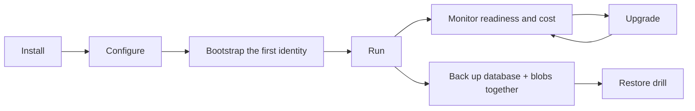

<!-- SPDX-License-Identifier: MemHouse-Sustainable-Use-1.0 -->

# Operations overview

The same release supports supervised or operator-run PostgreSQL. Database
location does not change product behavior.



| Task | Page |
| --- | --- |
| Install | [Release](../getting-started/install-release.md) · [Docker](../getting-started/install-docker.md) · [Source](../getting-started/install-source.md) |
| Configure | [Configuration reference](../reference/configuration.md) |
| Upgrade | [Upgrades](upgrades.md) |
| Watch it | [Health and cost](health-and-costs.md) · [Observability](observability.md) |
| Protect it | [Backup and restore](backup-restore.md) |
| Move it | [Export and import](portability.md) |

## Daily operational surface

```bash
# Liveness — no database, no queue. Point orchestrator liveness probes here.
curl -fsS http://127.0.0.1:4000/api/health

# Readiness — database, Oban, queue depths, model roles. 200 or 503.
curl -fsS http://127.0.0.1:4000/api/ready

# Usage and estimated cost. Requires an account-admin credential.
curl -fsS http://127.0.0.1:4000/api/v1/operations/costs \
  -H "authorization: Bearer $ADMIN_TOKEN"
```

!!! warning "Do not wire liveness to the readiness checks"
    A database blip would then kill containers instead of draining them.

## Operational rules

**1. Back up the database and the blob store at the same recovery point.**
The database stores content hashes and blob references, not the bytes.
Restoring only one side leaves durable document versions without their original
content.

**2. Keep the embedding identity pinned.** Provider, model, version, and
dimensions together define the vector space. Change any of them and vectors
must be regenerated through the explicit re-embed path — they are never
silently reused.

**3. Never run an old release against a newly migrated database.** Migrations
are forward operations. Rollback means restoring the pre-upgrade database and
blob snapshot *together*, then starting the prior release.

## What is safe to lose

| Must survive | May be rebuilt |
| --- | --- |
| Raw messages | Context projections |
| Governed knowledge | Entity rows and mentions |
| Document versions and original blobs | Document chunks |
| Hash-chain audit log | Vector and full-text indexes |
| Usage ledger | DiskANN indexes, ETS counters |

## Content safety

Readiness may expose component status, queue counts, model identities, versions,
and error classes. It must not expose credentials or stored content.

Production structured logs retain only a reviewed metadata allowlist. Exact API
and model usage lives in the usage ledger; the ETS budget counters in front of
it are rebuildable.

## Cost control

Daily token limits are admission control, and **dream-time is throttled first**
— background reasoning yields before user-facing ingest and retrieval do.

Cost estimates use operator-provided rates and the local usage ledger.

## Release and versioning

MemHouse uses Semantic Versioning; `mix.exs` is authoritative and a release tag
is exactly `v<version>`. The release checklist, the versioning policy, and the
required CI checks are maintainer process and live in the repository under
[`specs/process/`](https://github.com/memhousehq/memhouse/tree/main/specs/process).
