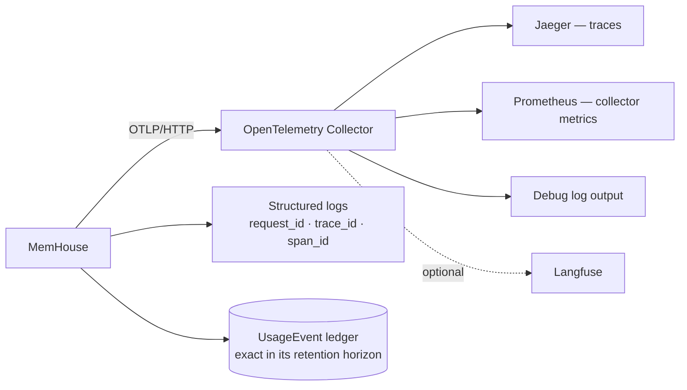

<!-- SPDX-License-Identifier: MemHouse-Sustainable-Use-1.0 -->

# Observability

MemHouse provides OpenTelemetry traces, structured logs, and a durable usage
ledger. Export is **off by default** and sends OTLP to your collector.



## Turn it on

```bash
MEMHOUSE_OTEL_ENABLED=true
OTEL_SERVICE_NAME=memhouse-dev
OTEL_EXPORTER_OTLP_ENDPOINT=http://localhost:14318
```

A local collector stack — collector, Jaeger, Prometheus — ships with the
repository:

```bash
docker compose -f dev/observability/docker-compose.yml up
```

Traces are then at `http://localhost:16686` under service `memhouse-dev`, and
collector metrics at `http://localhost:9090`.

The collector receives OTLP/HTTP from the host on port `14318` and forwards to
the standard container port `4318`. The non-standard host port avoids the
common local `4318` conflict; override `MEMHOUSE_OTEL_HTTP_PORT` if needed.

With the container path, the same stack is a Compose profile:

```bash
MEMHOUSE_OTEL_ENABLED=true docker compose --profile observability up --build
```

## Correlating one request

Every HTTP response carries `x-trace-id`, and `x-span-id` when a span is
active. A caller supplying a W3C `traceparent` keeps its own trace id; a caller
without one gets a fresh request trace id.

Search Jaeger for a response's `x-trace-id`. Logs carry `request_id`,
`trace_id`, and `span_id` for correlation.

## What is traced

Manual workflow spans:

| Span | Covers |
| --- | --- |
| `memhouse.memory.ingest_message` | Recording a raw observation |
| `memhouse.memory.extract_message` | Extraction of candidates |
| `memhouse.memory.query_knowledge` | Governed knowledge listing |
| `memhouse.memory.search` | Ranked retrieval |
| `memhouse.memory.ask` | Cited answer |
| `memhouse.memory.get_context` | Projection assembly |
| `memhouse.model.chat` / `.structured` / `.embed` / `.rerank` | Model gateway calls |
| `memhouse.documents.process_version` | Document parsing and derivation |
| `memhouse.documents.sync_connector` | Connector sync |

Model spans carry operation, role, provider, model, version, duration, and
token usage. Document spans carry version id, parser, byte/chunk/knowledge
counts, connector id, item count, and duration.

Every retrieval emits `[:memhouse, :retrieval, :outcomes]`. Measurements are
total latency and pre-rerank remaining budget. Metadata contains Account id,
profile, hard deadline, and content-free component outcomes with elapsed time
and one deterministic failure class. The latest outcome observed on the node is
also visible to account administrators at `/console/operations`; tool search
and ask results show the same additive details in `/console/tools`.

A bounded adaptive Ask also emits `[:memhouse, :recall, :planner]` once per
planner run. Its measurements are elapsed milliseconds, tool/model call counts,
query-token estimate, admitted-evidence token estimate, their bounded total,
and admitted item count. Provider-backed tools reserve their model-call cost
before execution. Metadata names the effort, deterministic playbook, and
exhausted bounds. It contains no query or evidence text. Use it to alert on
planner exhaustion and to compare call and latency budgets during the
[simplified-memory canary](simplified-memory-rollout.md).

## Reading a failed model call

A failed model call sets `error.type` on its span and writes the same string as
the error class on its usage event. Transport failures use `request_timeout` or
`transport_error`. Other failures use a content-safe exception module name.
An error row is `unmetered` when the provider returned no token usage; its
unknown cost is not shown as zero.

A call can also return HTTP 200 and still carry no usable answer, which is what
a hosted aggregator does when its own upstream failed part-way. These four
classes name that case, and they call for different responses:

| Error class | What happened | What to do |
| --- | --- | --- |
| `provider_upstream_error` | The endpoint accepted the request and then failed, cancelled, or cut the response short | Nothing. The job retries and normally succeeds. Investigate only if the rate is high or sustained |
| `provider_output_truncated` | The answer hit the output cap before it was complete | Raise `MEMHOUSE_MODEL_MAX_TOKENS`, or lower `MEMHOUSE_MODEL_REASONING_EFFORT` so less of the budget goes to reasoning. Retrying alone repeats this identically |
| `provider_content_filtered` | The endpoint withheld the answer | Retrying repeats it. The input or the model has to change |
| `missing_structured_object` / `missing_text_response` | The call finished normally and returned nothing usable — typically a model answering in prose instead of returning the structured result it was asked for | Check that the configured model supports tool calling or structured output |

An extraction that fails this way leaves the raw observation stored and the
knowledge simply not yet extracted; the job retries and nothing is lost.

## Span controls

Tune noise per debugging session:

| Setting | Default | Effect |
| --- | --- | --- |
| `MEMHOUSE_OTEL_HTTP_SPANS_ENABLED` | `true` | One server trace per HTTP request |
| `MEMHOUSE_OTEL_PHOENIX_SPANS_ENABLED` | `true` | Phoenix route naming |
| `MEMHOUSE_OTEL_MEMORY_SPANS_ENABLED` | `true` | The workflow spans above |
| `MEMHOUSE_OTEL_MODEL_SPANS_ENABLED` | `true` | Model gateway spans |
| `MEMHOUSE_OTEL_DOCUMENT_SPANS_ENABLED` | `true` | Document and connector spans |
| `MEMHOUSE_OTEL_OBAN_SPANS_ENABLED` | `true` | Background job spans |
| `MEMHOUSE_OTEL_ECTO_SPANS_ENABLED` | `false` | Deep database spans — many, low-level |
| `MEMHOUSE_OTEL_DB_STATEMENT_ENABLED` | `false` | SQL statement text; off because statements can carry sensitive values |

## Knowing when a scope lost its indexes

Every completed projection refresh emits the telemetry event
`[:memhouse, :retrieval, :projection_refresh]`, measuring `indexed`,
`statements`, `embedded`, `mentions`, and `coverage` (embedded ÷ statements,
`1.0` when the scope has nothing to index), tagged with `account_id` and
`scope_id`.

Ordinary governed writes in one scope coalesce into a ten-second run bucket.
A 15-second delay guarantees that the bucket closes before execution. One
refresh updates vectors, entity mentions, and context projections in dependency
order. A burst produces at most one refresh run per scope and bucket. Its
embedder batch contains only statements without vectors. Explicit rebuild and
re-embed operations retain their full-corpus behavior.

Alert on `coverage` below your threshold. Embeddings and entity mentions are
written by this lane alone, so a refresh that was cancelled or never enqueued
leaves the scope holding every statement while semantic and entity recall stay
silently empty — word-based search keeps answering, because its index is a
generated column no queue failure can lose.

The current figures for any scope are also on
[`/console/scopes`](../guides/web-console.md).
Running `search` or `ask` in [`/console/tools`](../guides/web-console.md) also
compares the scope's stored embedding identities with the configured query
identity. `missing_embeddings`, `no_mentions_indexed`,
`partial_mention_coverage`, and `identity_mismatch` direct the operator to
rebuild that scope's derived data. Account-admin search diagnostics also
distinguish a query that resolves no entity from one whose matching entity has
no statement in the selected authorized scope. The diagnostic is restricted to
the signed-in actor's readable scope and contains counts, reason codes, and
model identity only.

Account administrators can select a readable scope and profile in
[`/console/operations`](../guides/web-console.md). That panel resolves the
nearest inherited profile, reports its version, deadline, enabled and disabled
strategies, and classifies disabled strategies separately from missing indexes.
The probe is metadata-only: it makes no generation-model call and reads no
stored statement content. Which components a single request lost is shown on
that request's own result, not stored; the counter below is a rate signal, not
a historical health ledger.

`POST /api/v1/operations/reconcile` also checks active scopes for a completely
missing mention index. It enqueues the ordinary full scope rebuild with a
stable corpus watermark. Repeating reconciliation before the corpus changes
reuses the same pipeline run.

## Finding which retrieval component spent the time

Each component of a retrieval also emits
`[:memhouse, :retrieval, :component]`, measuring `elapsed_ms`, tagged with
`account_id`, `profile`, `component`, `status`, and `reason_class`. Strategies
within a phase run concurrently, but phases run sequentially (seed, then
expand), and profile resolution, fusion, and reranking also contribute to the
total latency. The `[:memhouse, :retrieval, :outcomes]` event reports
end-to-end `latency_ms`. Summarise `elapsed_ms` by `component` to see which
strategy contributed the most.

A dropped component still reports the time it was allowed to spend, so read
`status` alongside the duration.

## Knowing when retrieval ran degraded

Each retrieval component that was dropped, or completed with a reason class,
emits `[:memhouse, :retrieval, :degraded]` with a `count` of `1`, tagged with
`account_id`, `profile`, `component`, and `reason_class`. The same facts are
logged at warning level and returned to the caller as `degraded` and
`degraded_components`.

Alert on a sustained rate for `component: "reranker"`. A dropped reranker
changes nothing else in the result: the candidates still arrive in fusion
order. Only `degraded`, `degraded_components`, and this counter
say that the stage which judges relevance never ran.

The reason class says what to do about it. For the reranker, `"timeout"` means
the model did not answer within the smaller of
`MEMHOUSE_RETRIEVAL_RERANK_TIMEOUT_MS` and the budget left when the stage began.
The timeout outcome records that allowance as its `elapsed_ms`; read
`pre_rerank_remaining_ms` on the same result to see which of the two was
binding, then raise the reranker timeout, or the profile deadline if the
reranker was reached with too little left. `reserved_rerank_ms` is not the
reranker's timeout — it only keeps the strategies from spending the budget first.
`"provider_error"` is the provider failing rather than lagging.
`"partial_rankings"` is the mildest: the model judged only part of the head, and
that part was applied, so only the unjudged remainder kept fusion order.

## Operation aggregates are unsampled; traces are sampled; the ledger is exact

Every completed ingest batch, recall, answer, stable-profile projection, and
dream pass emits `[:memhouse, :operation, :completed]`. This unsampled event has
one fixed, content-safe envelope: `operation`, `run_id`, `version`, status and
failure class metadata, plus zero-defaulted counts for calls, tokens, items,
candidates, admission, deduplication, cache use, failures, and elapsed time.
Unknown metadata is discarded by the emitter. Reasoning update and synthesis
also use the same envelope, so their accepted/rejected contribution can be
evaluated separately.

Use these aggregates to reconcile logical work and alert on rates. They are not
a billing source: a process can exit before emitting its completion event, while
the durable usage ledger records every provider attempt that MemHouse could
meter.

For exact token totals, request counts, and cost, read the `UsageEvent` ledger
through
[`/api/v1/operations/costs`](health-and-costs.md).
Trace export is sampled and is a diagnostic aid, not an accounting record.

## Content safety is not configurable

Traces, logs, telemetry, audit metadata, and job arguments may record ids,
counts, profile names, model names, strategy names, timings, token counts, and
error classes.

They must **never** record raw messages, prompts, answers, API keys, account
keys, peer keys, restricted knowledge, document bytes, extracted text,
connector cursors, source metadata, or secrets.

Production logs retain only the reviewed metadata allowlist.

## Sending traces elsewhere

Any OTLP-compatible backend works. To forward to Langfuse directly rather than
through the local collector:

```bash
OTEL_EXPORTER_OTLP_TRACES_ENDPOINT=https://cloud.langfuse.com/api/public/otel/v1/traces
OTEL_EXPORTER_OTLP_TRACES_HEADERS=Authorization=Basic <base64 public:secret>
```

Use the local collector when you also need local inspection.

The measurement discipline behind evaluation runs — experiment labelling,
retrieval variants, and what may be claimed from a trace — is maintainer
material and lives in the repository under
[`specs/observability/`](https://github.com/memhousehq/memhouse/tree/main/specs/observability).
