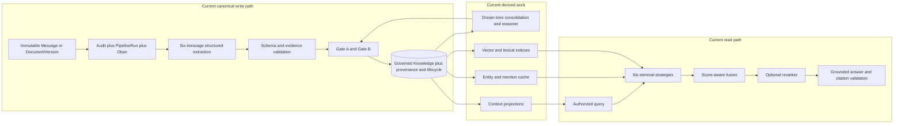
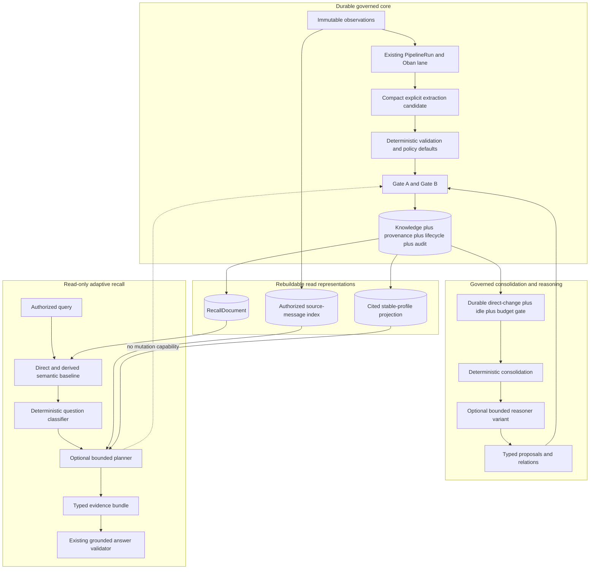

<!-- SPDX-License-Identifier: MemHouse-Sustainable-Use-1.0 -->

# ADR 0021: Clean-room, evidence-gated memory simplification

## Status

Proposed. Acceptance requires human architecture and licensing review.

Until that review and the evaluation gates in this record pass, the current
accepted write, retrieval, context, and dream-time decisions remain in force.
In particular, this record does not supersede ADR 0004, ADR 0013, ADR 0016, or
ADR 0020. A later rollout ADR must name any decision it supersedes.

## Context

MemHouse has accumulated independently useful retrieval strategies,
projections, caches, and background stages. The result is governed and
observable, but one configured read can consider semantic, lexical, temporal,
salience-recency, entity-match, relation-expansion, score-fusion, and reranking
components. Applicability rules skip irrelevant strategies; the full set still
creates more failure states, indexes, configuration, and evaluation
combinations.

The source study in [PR 297](https://github.com/memhousehq/memhouse/pull/297)
examined Honcho as one source of behavioral ideas. Honcho's hot path favors a
small explicit-fact extraction task, direct and derived semantic lanes, and a
query-aware recall loop. Its published benchmark results are promising, but
they are first-party results from configurations that vary batch geometry,
models, session history, and dream-time behavior. They do not isolate the
effect of an individual component and they do not prove that the same design
will improve MemHouse.

MemHouse also has a different trust boundary. Account isolation, PostgreSQL
row-level security, source/subject separation, exact provenance, governed
lifecycle transitions, retention and erasure, content-safe audit, durable
idempotency, and logical portability are product behavior. They are not
optional complexity to trade for a benchmark score.

This decision defines how to test a smaller system without weakening that
boundary. It records requirements independently from Honcho's implementation.
It does not authorize direct reuse of Honcho code or prompt text.

## Decision

MemHouse will pursue simplification as a sequence of versioned experiments
around one unchanged governed core:

1. Keep one canonical write path from immutable observations through validated
   proposals, Gate A/B, lifecycle, provenance, and audit.
2. Add one read-only adaptive recall seam. It may select among authorized
   evidence reads, but it cannot create, update, transition, or delete durable
   state.
3. Establish a minimal direct-versus-derived semantic profile as the candidate
   baseline. Compare every extra retrieval component by marginal contribution.
4. Treat compact extraction, token batching, source-message search, stable
   profiles, adaptive recall, and dream scheduling as experiments until their
   deterministic and matched-evaluation gates pass.
5. Retire a current component only after the measured winner has shipped behind
   a reversible compatibility boundary and survived rollback rehearsal.

The target is fewer default-path components, not fewer safety controls.

## Non-negotiable invariants

Every implementation under this record must preserve these invariants before
quality or cost is considered:

| Invariant | Required behavior | Existing owner/evidence |
| --- | --- | --- |
| Account isolation | The authenticated identity selects the Account. Every durable and retrieval query remains tenant-scoped, and PostgreSQL RLS fails closed. | `MemHouse.DataLayer`, Ash policies, ADR 0008, Account/RLS tests |
| Authorized candidate generation | Account, authorized scope, reader posture, lifecycle, target, valid time, and deletion filters execute before ranking or planner access. | `MemHouse.Retrieval` and `test/memhouse/f7_retrieval_entity_context_test.exs` |
| One writer | Models and read tools can emit only typed proposals or evidence. Only pipeline/governance actions write Knowledge, relations, lifecycle, consent, or audit. | `MemHouse.Pipeline`, `MemHouse.Governance`, ADR 0013 |
| Durable source first | Immutable Message or DocumentVersion, content-safe audit, replay-keyed `PipelineRun`, and its Oban job commit before provider work. | `MemHouse.Observations`, `MemHouse.Operations`, transactional F2 tests |
| Exact provenance | Every direct item cites supplied source ids and evidence; every derived item cites active governed contributors. | extraction/reasoning schemas and F5/dream-time tests |
| Governed visibility | Model confidence never grants visibility. Gate A/B, consent, sensitivity, target, and human decisions remain authoritative. | `MemHouse.Governance.Engine` and F4 tests |
| Replay and recovery | Stable operation identities, per-source completion, bounded retries, and reconciliation prevent duplicate effects and recover interrupted work. | `PipelineRun`, AshOban, `MemHouse.Pipeline.Reconciler` |
| Erasure and retention | A source deletion or lifecycle change invalidates or rebuilds every dependent representation; history follows current erasure policy. | `MemHouse.Governance.Erasure`, lifecycle and projection tests |
| Content-safe operations | Job arguments, error classes, audit metadata, traces, and usage records contain no prompt, message, answer, knowledge text, credentials, or secrets. | operations docs and content-leak tests |
| One data layer | PostgreSQL remains the only database in packaged-pg0, external-PostgreSQL, and container modes. No alternative vector service or cache becomes required. | ADR 0003 and packaged/external PostgreSQL CI |
| Portable truth | Logical exports contain durable governed truth and omit rebuildable representations. A clean import can reconstruct every derived component. | `MemHouse.Portability` and F10 tests |
| Human merge gate | Architecture, licensing, security, tenancy, migrations, default changes, and deletion remain human-reviewed. | repository agent contract and this ADR |

A proposal that cannot demonstrate these invariants is rejected even if it
improves a benchmark.

## Current state

The source and tests remain authoritative. This diagram names the current
cross-cutting shape relevant to the decision:

The current system has one canonical writer already. The simplification work
must deepen that boundary rather than introduce a second queue, write agent, or
memory store.

## Target state

The dashed edge is a prohibition, not a data flow. The planner has no mutation
tool and cannot invoke governance. It returns evidence to the existing answer
boundary. If it fails or exhausts its budget, the best completed authorized
evidence bundle proceeds with an explicit degradation outcome.

### Canonical write path

The canonical write path remains `Observations -> Pipeline -> Governance ->
Knowledge`. Compact extraction may reduce the model's requested output, and a
worker may batch adjacent anchors, but those changes must retain:

- one deterministic replay identity and completion state per anchor;
- an explicit anchor id separate from every supporting source id;
- source ids confined to the exact supplied window;
- provider calls outside database transactions;
- one atomic proposal, lifecycle, provenance, audit, and completion write per
  anchor; and
- the existing reconciler and Oban lane rather than a new polling queue.

Model omission can never make content less restrictive. Sensitivity, target,
and subject handling must either be model-provided and independently validated,
or derived by fail-closed code and policy. An omitted value cannot silently
become public or Account-wide.

### Read-only adaptive recall

Adaptive recall is a consumer of authorized reads, not an authority layer. Its
maximum tool set is:

- semantic search over separate direct and derived lanes;
- indexed exact/lexical search;
- recorded-time and valid-time range search;
- bounded source-message snippets when the caller explicitly permits source
  recall; and
- bounded provenance traversal for already authorized knowledge.

Every tool applies the same Account, scope, reader, lifecycle, target, time,
and deletion predicates as ordinary retrieval. Empty allowlists fail closed.
The registry contains no create, update, delete, transition, consent, audit, or
job-enqueue operation. Tools return typed ids, scores, times, and provenance,
not instructions to trust content.

The planner receives a query, content-free component outcomes, and tool
schemas. It does not receive hidden candidate metadata or unrestricted database
access. It may run only within a configured total wall-clock, tool-round,
candidate, and token budget. The answerer remains separate and all factual
output remains subject to deterministic citation validation and abstention.
For medium and high effort, the answer boundary preserves two thirds and half
of the base head respectively (eight and six under the default 12-item cap) and
reserves the remainder for genuinely new tool evidence. The entire base page
remains a deduplication set, and any unused headroom is refilled from its ranked
tail after planning. Knowledge tools use the caller-selected retrieval profile
rather than a planner-global profile. This makes adaptive evidence eligible for
the answer without changing fixed recall or allowing a rewritten query to
relabel base evidence as newly found.

### Consolidation and reasoning

Dream-time remains a second pipeline lane, not a second writer. Its durable
scope gate counts only newly governed direct facts, waits for the configured
idle period and minimum interval, deduplicates pending work, and applies the
normal budget before model reasoning. Derived output does not advance the
direct-change count.

Deterministic consolidation remains separable from optional model reasoning.
The current one-pass structured reasoner is the baseline. Any specialist or
query-driven variant has read-only exploration and emits the existing typed
proposal/relation schema; it cannot delete, activate, supersede, or widen a
record. Governance validates and applies accepted effects, and the watermark
advances only with the same short transaction. Provider or write failure leaves
the input eligible for replay.

## Honcho-informed dispositions

These are behavioral dispositions, not permission to reuse implementation
material:

| Disposition | Practice | MemHouse decision |
| --- | --- | --- |
| Adopt | Keep extraction focused on explicit durable facts | Keep profile and higher-order reasoning out of ingest; test a compact independently written schema while retaining exact evidence, subject, validity, and governance checks. |
| Adopt | Separate direct and derived semantic evidence | Add an experimental dual-lane profile so conclusions do not dilute primary evidence. |
| Adopt | Token/age batching as a control | Measure batch geometries within the existing Oban/replay model; preserve per-anchor commits and isolate poison inputs. |
| Adopt | Dream triggers count direct changes and respect idle/minimum intervals | Add durable scope gates so derived output cannot trigger a feedback loop and active scopes are not repeatedly reasoned over. |
| Adopt | Stable identity is a bounded summary, not truth | Build a cited, rebuildable projection whose entries resolve to governed Knowledge. |
| Adapt | Query-aware recall | Put bounded read-only planning before the existing answer validator; never expose write tools. |
| Adapt | Source-message fallback | Require explicit caller posture, authorization, bounded snippets, and a degradation/outcome record. Never widen scope on a zero-hit result. |
| Adapt | Aggregate operation telemetry | Keep exact usage/audit separate; add unsampled content-free operation totals only if existing ledgers cannot represent them. |
| Experiment | Semantic-only recall versus current fusion/rerank | A simpler path becomes default only after matched, category-level non-inferiority and cost/latency evidence. |
| Experiment | Specialist dream passes and surprisal | Compare them to the current single structured reasoner. Keep the simpler system unless a preregistered meaningful gain appears. |
| Reject | Direct model deletion, activation, or query-time memory writes | These bypass lifecycle, provenance, audit, and consent. |
| Reject | Best-effort post-commit work creation | Raw source, run, audit, and job remain transactionally coupled. |
| Reject | Directional durable copies per observer | Perspective is computed from authorized reader/subject fields; Knowledge is not duplicated. |
| Reject | Optional authorization or application-only tenant isolation | Authentication, Ash policies, and RLS remain mandatory. |
| Reject | Redis, an external vector database, or a custom queue as the default | They add operational dependencies without evidence that PostgreSQL, Oban, and bounded ETS caches are inadequate. |
| Reject | A durable peer card as independent evidence | Stable-profile text is a projection whose citations resolve to Knowledge. |
| Reject | Copying Honcho code or prompt text | The clean-room and licensing boundary below applies to every implementation. |

## Component ownership and deletion register

No new cache, projection, index, or stored representation may be implemented
unless it first has an owner, invalidation rule, rebuild/erasure behavior, and
deletion criterion in this table or a superseding ADR. Components without all
four are excluded.

| Representation | Durable truth? | Owner and writer | Invalidation/rebuild/erasure rule | Deletion criterion |
| --- | --- | --- | --- | --- |
| Batch admission/completion metadata | Operational state, not memory truth | `MemHouse.Pipeline`; the existing per-anchor `PipelineRun`, job, and usage paths write it | A completed anchor is immutable and skipped by retry. Repair/requeue is an explicit operator transition. Reconciliation considers only eligible incomplete anchors and never recreates completed effects. | Remove batch-only fields and counters if batching fails its gate; existing per-anchor replay identity remains. A second queue or batch truth table is excluded. |
| `RecallDocument` | No | `MemHouse.Retrieval`; pipeline-only projection refresh writes it from governed Knowledge | The Knowledge lifecycle transaction dirties the Account/scope watermark and enqueues the existing coalesced refresh. Full rebuild reads only currently visible source truth. Erasure deletes affected rows before rebuild. Import excludes it and schedules rebuild. | Delete if differential authorization tests cannot match source-of-truth reads, or if matched evaluation shows no maintenance/latency benefit. |
| Authorized source-message embedding/index | No; Message remains truth | `MemHouse.Observations` owns source rows; `MemHouse.Retrieval` owns the read index; existing pipeline jobs write it | Message creation/replacement, retention, session/scope membership, speaker correction, or erasure marks affected chunks stale. Reconciliation rebuilds from surviving messages. Export omits vectors/chunks. | Delete if source fallback gives no preregistered category gain, cannot meet authorization/erasure tests, or its storage/refresh budget is exceeded. Lexical source search may remain independently if proven. |
| Stable-profile projection | No | `MemHouse.Context` owns the contract; projection refresh is the sole writer | Any source lifecycle, visibility, validity, subject, or citation change dirties the profile. Rebuild is complete, bounded, and uses surviving governed Knowledge. Erasure removes unsupported entries before serving. | Delete if it is treated as evidence, cannot rebuild exactly, provides no context latency/token benefit, or causes stale/visibility regressions. |
| Dream scheduling state | Operational control state, not Knowledge | `MemHouse.Pipeline`; reuse or extend `DreamTimeWatermark` and replay-keyed `PipelineRun` through pipeline-only actions | Every governed direct-fact write updates the scope's eligible delta transactionally; new activity reschedules pending work; completion and watermark effects commit together. Erasure/retraction recomputes eligibility from surviving governed facts. | Remove new scheduling fields if idle/delta gating does not reduce work within quality/latency budgets. A process-local timer or independent scheduler table without replay semantics is excluded. |
| Query embedding cache | No; existing ETS cache | `MemHouse.Model.Embedding.QueryCache` | Keyed by Account, embedding identity, and normalized query digest; bounded eviction; discarded on restart or identity change | Delete if hit-rate and latency measurements do not justify it, or if identity/Account keying cannot be preserved. |
| Context projection ETS cache | No; existing ETS cache | `MemHouse.Context.Cache` | Projection writes publish Account/scope invalidation; audience-contract changes change the namespace; restart clears it | Delete if queue-mode invalidation cannot be made correct, or if measured latency does not justify the cache. |
| Recall evidence bundle | No; request-local only | `MemHouse.Retrieval` constructs, `Memory.ask` consumes | Dies with the request; bounded by ids, candidates, characters, and tokens; never exported or reconciled | Always ephemeral. Persisting it as memory requires a new ADR. |
| Recall trace/outcomes | Operational metadata only | `MemHouse.Retrieval` and `MemHouse.Operations` | Content-free allowlist; retention follows operational policy; no raw query, message, prompt, statement, answer, or hidden match | Delete individual fields that are unused for a gate or operation; delete the representation if content safety cannot be proven. |
| Experiment manifests and reports | Repository evidence, not runtime truth | `MemHouse.Eval` | Immutable by dataset/report identity; superseding runs append rather than rewrite; no user content beyond approved fixtures | Retain while a default or published claim depends on it; remove only with that claim/default and repository history intact. |

The compact extraction schema, deterministic question classifier, recall
planner, and scheduling algorithm are behavior, not durable representations.
Their version identities belong in existing run, provenance, profile, and
usage records. They do not justify new state tables by themselves.

## Evaluation and default gates

### Gate 1: deterministic safety

Every variant must first pass the complete existing deterministic suite plus
focused tests for:

- Account/RLS and scope authorization, including empty allowlists and
  cross-scope traversal;
- source/subject attribution, hostile model ids, exact support, valid time,
  sensitivity, target, and Gate A/B;
- crash points before and after each source completion, concurrent workers,
  replay, poison-source isolation, retry exhaustion, and reconciliation;
- lifecycle, supersession, consent, retention, erasure, projection rebuild, and
  logical import;
- citation confinement, abstention, tool-registry immutability, prompt
  injection, and total content budgets; and
- content-free audit, job arguments, errors, usage, telemetry, and traces.

A deterministic regression rejects the variant. Quality gains cannot waive
this gate.

### Gate 2: preregistered matched evaluation

Before a live or paid run, the experiment manifest must pin:

- MemHouse commit and application version;
- dataset id, digest, split, sample, and category map;
- provider, model, model version, prompt, pipeline, embedding, reranker, and
  retrieval-profile identities;
- batch geometry, tokenizer/version, dream mode and watermark state;
- deadline, candidate, context, tool-round, token, and cost limits;
- judge identity and whether it is independent from the system model; and
- primary quality, citation, abstention, latency, token, cost, safety, and
  degradation thresholds before results are read.

Current and candidate variants use the same ingest corpus, split, judge, and
limits unless the report explicitly marks and justifies a difference. Tuning
and published evaluation splits remain separate. Paid/live execution requires
operator approval; offline fixtures and deterministic validation do not.

### Gate 3: decision-specific evidence

The following choices require evidence before becoming a default:

| Choice | Minimum decision evidence |
| --- | --- |
| Compact extraction | Per-field and per-category extraction non-inferiority; zero subject, evidence, temporal, sensitivity, target, privacy, or attribution regression; fewer calls/tokens or lower cost. |
| Token batching | Quality plus queue-delay distribution, calls, tokens, cost, crash/retry behavior, poison isolation, and at least low- and high-volume workload results. No single global geometry is assumed. |
| Source-message search/fallback | Measured gain on source-detail and zero-knowledge-hit categories; authorization, context-bounding, retention, and erasure tests; storage and refresh cost. |
| `RecallDocument` | Differential equivalence to authorized source-of-truth reads; rebuild/import/erasure evidence; measured reduction in read complexity or latency. |
| Dual-lane semantic profile | Category-level quality, citation, and abstention non-inferiority to current balanced/thorough profiles with a preregistered latency, token, or cost improvement. |
| Read-only recall planner | Gain over the dual-lane baseline for enumeration, temporal/update, summary, and preference/advice categories; bounded p95 and maximum calls; no citation, abstention, prompt-injection, or authorization regression. |
| Idle/delta dream scheduling | Virtual-clock/restart/dedup/replay tests and lower redundant dream work without downstream quality loss. |
| Stable profile | Exact rebuild/erasure/visibility tests plus context latency/token benefit; citations always resolve to governed Knowledge. |
| Multiple dream specialists or surprisal | Matched gain over the current one-pass structured reasoner after calls, tokens, cost, accepted/rejected deductions, relations, contradictions, and source validity are counted. Simplicity wins ties. |
| Component retirement | Marginal ablation on held-out data, compatibility-period evidence, packaged-pg0/external-PostgreSQL parity, restore/import, rollback rehearsal, and human architecture/migration review. |

No Honcho first-party number is a MemHouse acceptance threshold. The relevant
comparison is MemHouse current versus MemHouse candidate under a matched
manifest.

## Rollout, migration, and rollback

1. **Additive experiment:** add new schemas, indexes, or profiles under an
   internal/evaluation-only identity. Current public defaults and response
   contract versions do not change.
2. **Shadow or offline comparison:** build derived representations through
   replay-safe background work and compare results without using them for user
   answers. No dual write to a second truth store is permitted.
3. **Explicit opt-in:** expose a named experimental profile only to authorized
   operators/evaluation callers. Its response names its version, components,
   degradation, and budget.
4. **Human default decision:** architecture, licensing, security/tenancy,
   evaluation, migration, and operator evidence receive human review. A default
   change updates the affected public contract identity, changelog, user docs,
   release suite, and accepted ADRs.
5. **Compatibility period:** keep the prior default available for at least one
   released compatibility window. Operators can switch back without restoring
   data or reversing lifecycle history.
6. **Retirement:** remove code paths first while preserving reversible schema
   migrations. Drop a derived table or index only after backup/restore,
   export/import, packaged-pg0, external-PostgreSQL, and rollback rehearsals.

Rollback always selects the previous profile/prompt/pipeline version, stops new
derived refresh work, and rebuilds old derived state from durable observations
and governed Knowledge. Rollback must not rewrite Knowledge, provenance,
lifecycle, consent, or audit history. A migration that makes that impossible is
not allowed under this ADR.

If a candidate causes an authorization, citation, erasure, audit, replay, or
data-loss regression, disable it immediately rather than waiting for aggregate
quality evidence. If only quality, latency, or cost regresses, select the prior
profile and retain the experiment artifacts for diagnosis.

## Conditional retirement plan

The following components may be removed from the ordinary default path only by
the component-retirement gate:

- always-on entity-match and entity/mention refresh work;
- unconditional relation expansion;
- query-independent salience-recency on text questions;
- multi-list score fusion where a single or dual lane is sufficient;
- model reranking where it has no marginal category gain;
- projections or caches that do not reduce a measured serving cost; and
- configuration knobs, indexes, telemetry fields, and operator procedures that
  exist only for a retired component.

Removal from a default is not necessarily immediate deletion. The prior path
stays selectable through its compatibility window. Durable provenance,
lifecycle, audit, consent, observations, and Knowledge are never candidates for
this cleanup.

## Clean-room licensing and attribution boundary

Honcho is distributed under GNU AGPL-3.0. MemHouse code is distributed under
the MemHouse Sustainable Use License. This record is engineering process, not
legal advice; a human with appropriate authority owns legal conclusions.

For every Honcho-informed change:

- Authors work from independently stated behavior, invariants, evaluation
  hypotheses, and black-box acceptance tests in this ADR and its issues.
- Do not paste, translate, mechanically transform, or closely paraphrase
  Honcho code, prompts, schemas, tests, comments, or documentation into
  MemHouse.
- Do not preserve Honcho identifiers, module decomposition, wording, or control
  flow merely because they are convenient. MemHouse names and seams follow its
  own domain model.
- Source links are provenance for the observed idea, not implementation input.
  Keep them commit-pinned and label inferences and first-party benchmark claims.
- New prompts begin from MemHouse's current schema, safety requirements, and
  independently authored test cases. Prompt review must check for distinctive
  phrase overlap before merge.
- A contributor implementing a story must attest in the PR that the code,
  prompt, schema, fixtures, and tests were independently authored.
- Any request to reuse expressive material directly stops implementation and
  requires explicit legal approval, license compliance instructions, and
  preserved notices before work resumes.

Human licensing review is required to move this ADR to `Accepted` and again
for any exception to these rules. Architecture review must also confirm that a
proposed simplification follows MemHouse's own boundaries rather than Honcho's
source structure.

## Consequences

The immediate consequence is discipline rather than a runtime change. Current
profiles and stores remain supported while experiments gain one common trust,
measurement, and rollback contract.

This approach takes longer than replacing the retrieval pipeline in one patch.
It also makes the result defensible: a component is removed because matched
evidence says it is redundant, not because another project's architecture
looks smaller or reports a higher score.

Some experiments add temporary complexity. That is acceptable only while they
are versioned, opt-in, observable, and deletable. Issue 295 is the required
cleanup step; an experiment is not complete while failed variants and their
state remain as permanent alternatives.

The design deliberately keeps governance records that make MemHouse larger
than Honcho. Simplification applies to model tasks, recall plumbing, derived
representations, and default execution, not to the evidence and consent model.

## Rejected alternatives

**Clone Honcho's architecture.** Rejected because the trust, licensing,
identity, and persistence models differ, and first-party benchmark results do
not establish component causality.

**Replace the current read path before a baseline exists.** Rejected because
there would be no matched evidence that quality or cost improved and no safe
rollback target.

**Let one query-time agent search and write memory.** Rejected because it
combines evidence selection, prose generation, and durable authority across the
governance boundary.

**Keep every old and new path indefinitely.** Rejected because permanent
experiments increase the complexity this decision exists to remove.

**Collapse durable Knowledge, provenance, lifecycle, and audit into one search
document.** Rejected because those records implement observable policy and
portable truth. `RecallDocument` is a rebuildable read projection only.

**Support SQLite in addition to PostgreSQL.** Rejected by ADR 0003. Backend
parity under this decision means packaged pg0 and external PostgreSQL running
the same schema and behavior.

## Implementation sequence

The dependency-ordered work is tracked by umbrella issue
[#285](https://github.com/memhousehq/memhouse/issues/285):

1. [#287](https://github.com/memhousehq/memhouse/issues/287) registers matched
   evaluation and baseline gates.
2. [#178](https://github.com/memhousehq/memhouse/issues/178) tests compact,
   token-batched extraction.
3. [#288](https://github.com/memhousehq/memhouse/issues/288) adds authorized
   source-message search, and
   [#289](https://github.com/memhousehq/memhouse/issues/289) adds bounded
   evidence lineage.
4. [#290](https://github.com/memhousehq/memhouse/issues/290) adds a cited stable
   profile; [#291](https://github.com/memhousehq/memhouse/issues/291) adds the
   bounded read-only planner; and
   [#292](https://github.com/memhousehq/memhouse/issues/292) compares the
   minimal retrieval profile.
5. [#293](https://github.com/memhousehq/memhouse/issues/293) changes dream
   scheduling and [#294](https://github.com/memhousehq/memhouse/issues/294)
   evaluates reasoning specializations under the one-writer rule.
6. [#295](https://github.com/memhousehq/memhouse/issues/295) retires failed or
   redundant components only after evidence, and
   [#296](https://github.com/memhousehq/memhouse/issues/296) governs rollout,
   rollback, and operational budgets.

## Evidence and related decisions

- Research input: [PR 297](https://github.com/memhousehq/memhouse/pull/297),
  based on commit-pinned Honcho and MemHouse source and test evidence.
- Current canonical write and recovery boundary:
  `specs/architecture/transactional-writes-audit-jobs.md`.
- Current extraction and answer boundary:
  `specs/architecture/model-layer-structured-extraction.md`.
- Governance and isolation:
  `specs/architecture/gate-a-b-governance.md` and
  `specs/architecture/identity-tenancy-rbac.md`.
- Current retrieval and projection boundary:
  `specs/architecture/retrieval-entity-context.md`, ADR 0004, ADR 0016, and
  ADR 0020.
- Current dream-time writer boundary: ADR 0013.
- PostgreSQL-only deployment parity: ADR 0003.
- Evaluation and release evidence:
  `specs/architecture/evaluation-ci-release-readiness.md`.

Honcho sources used to establish behavioral provenance remain commit-pinned in
the source study. This ADR intentionally does not reproduce its code or prompt
text.
