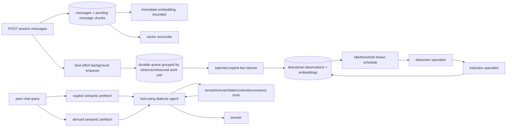
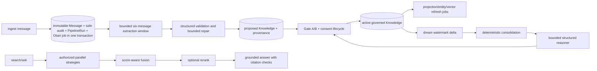
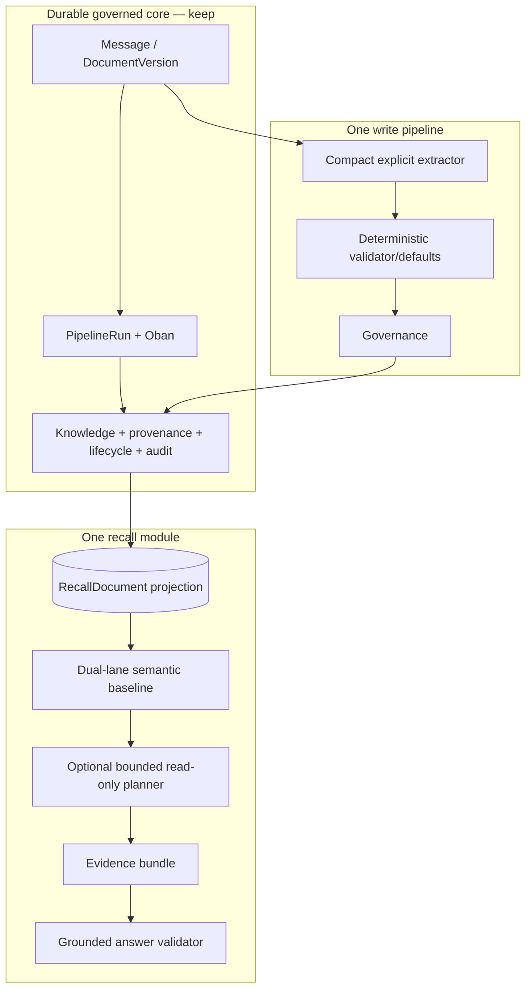

<!-- SPDX-License-Identifier: MemHouse-Sustainable-Use-1.0 -->

# Honcho and MemHouse: source-level memory-system study

Status: research and implementation-planning input, not an architecture decision.

## Executive recommendation

MemHouse should not attempt to become a Honcho clone. It should preserve the parts that are its product boundary—Account row-level isolation, evidence-grounded extraction, governed lifecycle transitions, content-safe audit, durable jobs, exportability, and deterministic replay—while testing three Honcho-inspired simplifications behind evaluation flags:

1. **Make the ingest model do less.** Keep MemHouse's deterministic subject, evidence, temporal, sensitivity, and target validation, but test a shorter, explicit-fact-only extraction instruction and a smaller output shape. Derive or default fields in trusted code where policy permits. Honcho's hot path uses one prompt, one structured call, and an `explicit` string list; profile and higher-order reasoning are separate ([Honcho deriver prompt](https://github.com/plastic-labs/honcho/blob/444897975c95393b0d48024470ece03c025d3aa4/src/deriver/prompts.py#L40-L89), [call and persistence fan-out](https://github.com/plastic-labs/honcho/blob/444897975c95393b0d48024470ece03c025d3aa4/src/deriver/deriver.py#L38-L168)).
2. **Establish a semantic-first recall baseline before adding machinery.** Honcho retrieves observations with filtered cosine top-k and lets a bounded, tool-using answer agent broaden the search when needed ([document query](https://github.com/plastic-labs/honcho/blob/444897975c95393b0d48024470ece03c025d3aa4/src/crud/document.py#L291-L433), [two-lane prefetch](https://github.com/plastic-labs/honcho/blob/444897975c95393b0d48024470ece03c025d3aa4/src/dialectic/core.py#L178-L256)). MemHouse should measure this baseline against its six-strategy fusion and rerank engine, then retain only strategies with demonstrated incremental quality per cost/latency segment.
3. **Add adaptive recall behavior at one bounded seam.** A read-only recall planner can start with two independent semantic lanes—direct facts and derived knowledge—then choose exact text, temporal, or provenance expansion only when the question requires it. It must return an evidence bundle to the existing grounded answer step; it must not receive mutation tools. This borrows Honcho's query-aware search behavior without adopting its direct agent writes or weakening authorization.

Do not copy Honcho implementation code or prompts. Honcho is AGPL-3.0; MemHouse is source-available under its Sustainable Use License. The backlog below therefore specifies independently authored behavior, contracts, and tests.

The benchmark evidence is promising but does not prove that any one architecture choice caused the scores. The pinned Honcho benchmark repository reports 90.4% on LongMemEval S, 0.899 on LoCoMo, and BEAM scores of 0.630/0.649/0.631/0.406 at 100K/500K/1M/10M. Those runs used different batching, dream, session-history, and model settings, and were produced from an older Honcho commit than the one studied here. MemHouse currently has no upstream-scale, independent live-model result suitable for a quality comparison.

## Revision, method, and confidence

This study read primary source rather than product descriptions:

| Artifact | Pinned revision | Role in this study |
|---|---:|---|
| Honcho | [`444897975c95393b0d48024470ece03c025d3aa4`](https://github.com/plastic-labs/honcho/tree/444897975c95393b0d48024470ece03c025d3aa4) | Current implementation traced from API through storage, dream, and dialectic recall |
| Honcho benchmarks | [`20c497bff02ff8737268be6d91c197767dc7bac0`](https://github.com/plastic-labs/honcho-benchmarks/tree/20c497bff02ff8737268be6d91c197767dc7bac0) | First-party raw result JSON; result directory identifies Honcho commit `a1d689b` |
| MemHouse | [`3c58e2367ba2c06b411bc921de528f918f3507a1`](https://github.com/memhousehq/memhouse/tree/3c58e2367ba2c06b411bc921de528f918f3507a1) | Current behavior and constraints to preserve |

The source and tests are authoritative for implemented behavior. Architecture documents are used only to explain intended invariants or explicitly missing evidence. “Inference” labels below identify conclusions not directly encoded as one branch or assertion. No live provider, paid benchmark, load test, or database plan was run for this research.

## Clean-room and license boundary

Honcho's repository carries the GNU Affero General Public License v3 ([license](https://github.com/plastic-labs/honcho/blob/444897975c95393b0d48024470ece03c025d3aa4/LICENSE#L1-L12)). MemHouse states that its non-enterprise content uses the MemHouse Sustainable Use License and is source-available, not OSI open source ([MemHouse license](https://github.com/memhousehq/memhouse/blob/3c58e2367ba2c06b411bc921de528f918f3507a1/LICENSE.md#L1-L18)). This document describes observed behavior, schemas, and independently implementable requirements. It deliberately does not reproduce Honcho prompts or implementation blocks.

Implementation rules for every story in this document:

- Write prompts, code, schemas, fixtures, and documentation independently from the behavioral requirement.
- Do not paste, translate, mechanically transform, or closely paraphrase Honcho code or prompt text.
- Keep source links in the design record as provenance for the idea, not as implementation material.
- Require legal review before any proposal to copy expressive material directly, and preserve applicable notices if counsel approves it.
- Prefer black-box acceptance tests and evaluation hypotheses over source-shaped module or function designs.

## System shapes at a glance

### Honcho

Honcho's fundamental memory address is directional: `(workspace, observer, observed)`. One speaker's extracted representation is copied to every configured observer's Collection. A peer can observe itself and, through session membership configuration, other peers ([observer selection](https://github.com/plastic-labs/honcho/blob/444897975c95393b0d48024470ece03c025d3aa4/src/deriver/enqueue.py#L294-L393), [Collection uniqueness](https://github.com/plastic-labs/honcho/blob/444897975c95393b0d48024470ece03c025d3aa4/src/models.py#L334-L375)).

### MemHouse

MemHouse's durable address begins with Account and Scope, then independently records source, subject, visibility, lifecycle, and provenance. Ingest couples the raw observation, audit evidence, replay-keyed run, and job transactionally; extraction is model-outside-transaction; a knowledge proposal becomes retrievable only after governance ([transactional contract](https://github.com/memhousehq/memhouse/blob/3c58e2367ba2c06b411bc921de528f918f3507a1/test/memhouse/f2_transactional_writes_audit_jobs_test.exs#L116-L174), [extractor boundary](https://github.com/memhousehq/memhouse/blob/3c58e2367ba2c06b411bc921de528f918f3507a1/lib/memhouse/pipeline/extractor.ex#L3-L30)).

## Detailed side-by-side

### 1. Ingestion, ordering, and work creation

| Concern | Honcho | MemHouse | Recommendation |
|---|---|---|---|
| Durable source | Message row plus locally chunked pending `MessageEmbedding` rows commit together. A session advisory lock and unique `(workspace, session, seq)` preserve order ([create](https://github.com/plastic-labs/honcho/blob/444897975c95393b0d48024470ece03c025d3aa4/src/crud/message.py#L299-L413)). | Immutable Message, content-safe audit, PipelineRun, and Oban job share a transaction; Account is installed into the DB session for RLS ([job configuration rationale](https://github.com/memhousehq/memhouse/blob/3c58e2367ba2c06b411bc921de528f918f3507a1/config/config.exs#L123-L181)). | Keep MemHouse. It is simpler operationally because no post-commit enqueue gap needs inference or repair. |
| Async handoff | FastAPI schedules queue insertion after message commit. `enqueue` catches and logs every exception instead of surfacing it ([API](https://github.com/plastic-labs/honcho/blob/444897975c95393b0d48024470ece03c025d3aa4/src/routers/messages.py#L108-L176), [enqueue](https://github.com/plastic-labs/honcho/blob/444897975c95393b0d48024470ece03c025d3aa4/src/deriver/enqueue.py#L26-L80)). **Inference:** representation work can be absent after a successful ingest if this callback fails; vector reconciliation repairs embeddings, but this trace did not find an equivalent sweep that recreates a missing representation queue record. | The source row is the recovery marker: messages are stamped only after successful write, and the reconciler reoffers stale unstamped messages using the original deterministic run key ([reconciler](https://github.com/memhousehq/memhouse/blob/3c58e2367ba2c06b411bc921de528f918f3507a1/lib/memhouse/pipeline/reconciler.ex#L64-L102)). | Reject Honcho's post-commit best-effort enqueue pattern. |
| Batching | One deterministic work-unit groups all observers of the same observed peer. Claiming waits for a token threshold or maximum age unless flush is enabled; workers claim with `INSERT ... ON CONFLICT DO NOTHING` ([queue generation](https://github.com/plastic-labs/honcho/blob/444897975c95393b0d48024470ece03c025d3aa4/src/deriver/enqueue.py#L169-L212), [claim gate](https://github.com/plastic-labs/honcho/blob/444897975c95393b0d48024470ece03c025d3aa4/src/deriver/queue_manager.py#L330-L473)). Defaults are 512 tokens to claim, 1,024 input tokens per call, and a 30-minute age flush ([config](https://github.com/plastic-labs/honcho/blob/444897975c95393b0d48024470ece03c025d3aa4/src/config.py#L930-L954)). | Extraction is anchored to one message with up to five prior same-session/same-scope messages; each message owns a replay-keyed run. | **Adopt experimentally:** add batch geometry as an evaluation-layer option, not a second queue. A single Oban job may claim adjacent unprocessed anchors and write each anchor's completion atomically. Measure 128/1K/4K/16K tokens; preserve per-message provenance and retry identity. |
| Backpressure | Immediate message embedding has process-local concurrency/pending caps; saturation falls back to a periodic vector reconciler ([route](https://github.com/plastic-labs/honcho/blob/444897975c95393b0d48024470ece03c025d3aa4/src/routers/messages.py#L163-L174), [embedding defaults](https://github.com/plastic-labs/honcho/blob/444897975c95393b0d48024470ece03c025d3aa4/src/config.py#L801-L810)). Polling uses startup jitter, per-sleep jitter, and exponential idle/error backoff ([queue loop](https://github.com/plastic-labs/honcho/blob/444897975c95393b0d48024470ece03c025d3aa4/src/deriver/queue_manager.py#L475-L581)). | Oban queue concurrency provides backpressure; persistent runs expose pending/failed state. | Keep Oban; consider only the token accumulation heuristic. Do not add a custom polling queue. |

### 2. Extraction and representation

Honcho's extraction path is deliberately shallow. It formats timestamped turns, gives the model a target peer, asks only for explicit, self-contained atomic facts, and accepts a Pydantic `PromptRepresentation` whose useful output is an explicit list. One structured JSON call is retried up to three times, then the same result is stored for each observer ([prompt](https://github.com/plastic-labs/honcho/blob/444897975c95393b0d48024470ece03c025d3aa4/src/deriver/prompts.py#L40-L89), [call](https://github.com/plastic-labs/honcho/blob/444897975c95393b0d48024470ece03c025d3aa4/src/deriver/deriver.py#L106-L238), [representation schema](https://github.com/plastic-labs/honcho/blob/444897975c95393b0d48024470ece03c025d3aa4/src/utils/representation.py#L140-L157)). It does not ask the ingest model to create a profile, working representation, deduction, relation, sensitivity, or governance target.

MemHouse asks for a richer candidate: exact supporting span, normalized statement, confidence class, kind, subject type/reference, sensitivity, target level, source ids, and optional valid-time bounds. It independently validates hostile output, restricts peer/scope subjects to caller-provided allowlists, checks exact evidence spans and grounded dates, derives direct/indirect evidence, and applies a third-party confidence discount ([prompt](https://github.com/memhousehq/memhouse/blob/3c58e2367ba2c06b411bc921de528f918f3507a1/lib/memhouse/pipeline/extractor.ex#L95-L217), [schema contract](https://github.com/memhousehq/memhouse/blob/3c58e2367ba2c06b411bc921de528f918f3507a1/lib/memhouse/model/schema.ex#L23-L68), [cast](https://github.com/memhousehq/memhouse/blob/3c58e2367ba2c06b411bc921de528f918f3507a1/lib/memhouse/model/schema.ex#L230-L352)). It permits two validation repairs and, only after exhaustion, can retain valid members of a mixed response; every provider attempt is metered ([repair loop](https://github.com/memhousehq/memhouse/blob/3c58e2367ba2c06b411bc921de528f918f3507a1/lib/memhouse/model/structured_generator.ex#L3-L27), [recovery](https://github.com/memhousehq/memhouse/blob/3c58e2367ba2c06b411bc921de528f918f3507a1/lib/memhouse/model/schema.ex#L275-L305)).

What to simplify safely:

- Preserve `supporting_span`, source ids, subject identity, and validity because they enforce governance and audit semantics, not merely model convenience.
- Derive source ids when the candidate cites only the anchor and derive evidence level/confidence discount in code, as MemHouse already does.
- Test whether `kind`, `sensitivity`, and `target_level` should remain model outputs. A safe candidate is deterministic defaults plus policy escalation classifiers after extraction; the unsafe candidate is silently defaulting sensitive content to public.
- Keep the six-message window as the deterministic baseline, but add token-batch experiments. Honcho's benchmark results themselves demonstrate that batch size is a variable, not a universal constant.
- Keep one extractor call and keep profile/deduction logic out of ingest. This already aligns with Honcho.

### 3. Storage model, identity, and indexing

#### Honcho inventory

| Row / index | Purpose and noteworthy behavior |
|---|---|
| `Workspace`, `Peer`, `Session`, `session_peers` | Globally unique workspace name; peer and session names unique within workspace; many-to-many membership carries configuration and joined/left timestamps ([models](https://github.com/plastic-labs/honcho/blob/444897975c95393b0d48024470ece03c025d3aa4/src/models.py#L40-L200)). |
| `Message` | Bigint internal id plus public NanoID, token count, stable session sequence; session lookup B-tree, global public-id uniqueness, `(workspace, session, sequence)` uniqueness, and English FTS GIN ([schema/indexes](https://github.com/plastic-labs/honcho/blob/444897975c95393b0d48024470ece03c025d3aa4/src/models.py#L205-L269)). The grep implementation nevertheless uses `%ILIKE%`, so the declared FTS index does not serve that path ([grep](https://github.com/plastic-labs/honcho/blob/444897975c95393b0d48024470ece03c025d3aa4/src/crud/message.py#L925-L959)). |
| `MessageEmbedding` | One row per local chunk, nullable pgvector, sync state/attempts; HNSW cosine with `m=16`, `ef_construction=64`, plus reconciliation index ([schema](https://github.com/plastic-labs/honcho/blob/444897975c95393b0d48024470ece03c025d3aa4/src/models.py#L276-L331)). |
| `Collection` | Unique directional `(observer, observed, workspace)` memory partition ([schema](https://github.com/plastic-labs/honcho/blob/444897975c95393b0d48024470ece03c025d3aa4/src/models.py#L334-L375)). |
| `Document` | Observation text, one of explicit/deductive/inductive/contradiction, reinforcement count, vector, JSONB source ids, optional session, soft deletion and sync state. HNSW vector, GIN source-id, and reconciliation indexes ([schema](https://github.com/plastic-labs/honcho/blob/444897975c95393b0d48024470ece03c025d3aa4/src/models.py#L378-L473)). |
| Peer card | A bounded list inside the observer peer's internal JSON metadata, keyed for self or observed peer. Form validation permits only four identity-like prefixes, at most 40 entries and 200 characters each ([constraints](https://github.com/plastic-labs/honcho/blob/444897975c95393b0d48024470ece03c025d3aa4/src/utils/agent_tools.py#L42-L73)). |
| `QueueItem`, `ActiveQueueSession` | Durable JSON payload and deterministic work key; partial unique pending indexes for reconciler and dream; unique work-unit claim ([schema](https://github.com/plastic-labs/honcho/blob/444897975c95393b0d48024470ece03c025d3aa4/src/models.py#L476-L546)). |

Exact observation dedup lowercases and trims, always includes level, and includes session for explicit facts. Existing exact matches increment `times_derived` atomically; semantic dedup can reject a new item or soft-delete an inferior existing item. Durable documents commit before external-vector upsert and remain `pending` for reconciliation if the process fails ([dedup keys](https://github.com/plastic-labs/honcho/blob/444897975c95393b0d48024470ece03c025d3aa4/src/crud/document.py#L436-L470), [write and sync](https://github.com/plastic-labs/honcho/blob/444897975c95393b0d48024470ece03c025d3aa4/src/crud/document.py#L482-L768)).

#### MemHouse inventory

MemHouse intentionally stores more dimensions. `KnowledgeItem` is the durable atom and carries statement/hash, kind, subject, confidence, evidence level, sensitivity, target, lifecycle state, verification and corroboration, supersession/deduction identities, retention and valid-time fields, source ids, full model/prompt/embedding/pipeline identity, vector, and soft-delete state. Provenance, attribution, lifecycle, relation, and projection are separate typed records ([resource](https://github.com/memhousehq/memhouse/blob/3c58e2367ba2c06b411bc921de528f918f3507a1/lib/memhouse/knowledge.ex#L31-L319)). PipelineRun, UsageEvent, DreamTimeWatermark, governance decisions, and a hash-chained audit record operational and policy state independently.

Important current indexes include:

- Account-scoped uniqueness for peers, scopes, sessions, session membership, grants, policies, model-role versions, documents/versions, projections, pipeline idempotency keys, usage calls, and dream watermarks ([domain migration](https://github.com/memhousehq/memhouse/blob/3c58e2367ba2c06b411bc921de528f918f3507a1/priv/repo/migrations/20260727142300_f1_ash_domain_backbone.exs#L124-L520), [runs](https://github.com/memhousehq/memhouse/blob/3c58e2367ba2c06b411bc921de528f918f3507a1/priv/repo/migrations/20260727150730_f2_transactional_writes_audit_jobs.exs#L24-L66), [watermark](https://github.com/memhousehq/memhouse/blob/3c58e2367ba2c06b411bc921de528f918f3507a1/priv/repo/migrations/20260809100000_issue_204_dream_time_watermarks.exs#L11-L40)).
- GIN full-text vectors for knowledge and document chunks; bounded relation/entity expansion indexes ([initial FTS](https://github.com/memhousehq/memhouse/blob/3c58e2367ba2c06b411bc921de528f918f3507a1/priv/repo/migrations/20260727101000_create_memory_poc.exs#L82-L116), [retrieval indexes](https://github.com/memhousehq/memhouse/blob/3c58e2367ba2c06b411bc921de528f918f3507a1/priv/repo/migrations/20260728092147_f7_retrieval_entity_context.exs#L52-L92)).
- 1,024-dimensional pgvectorscale DiskANN cosine indexes for knowledge and chunks with scope-label prefiltering; HNSW 384 fallbacks remain migration compatibility, and the unused entity alias vector index was dropped ([DiskANN](https://github.com/memhousehq/memhouse/blob/3c58e2367ba2c06b411bc921de528f918f3507a1/priv/repo/migrations/20260808122100_vectorscale_diskann_1024.exs#L14-L68), [labels](https://github.com/memhousehq/memhouse/blob/3c58e2367ba2c06b411bc921de528f918f3507a1/priv/repo/migrations/20260809090000_diskann_scope_label_prefilter.exs#L52-L80), [alias cleanup](https://github.com/memhousehq/memhouse/blob/3c58e2367ba2c06b411bc921de528f918f3507a1/priv/repo/migrations/20260814120000_drop_unused_entity_alias_embedding_index.exs#L1-L31)).
- Forced Account RLS on tenant tables, with the runtime role switched to a restricted application role ([configuration](https://github.com/memhousehq/memhouse/blob/3c58e2367ba2c06b411bc921de528f918f3507a1/config/config.exs#L52-L71), [policy creation](https://github.com/memhousehq/memhouse/blob/3c58e2367ba2c06b411bc921de528f918f3507a1/priv/repo/migrations/20260727142300_f1_ash_domain_backbone.exs#L738-L772)).

The right simplification is not to collapse these records into Honcho's `Document`. Most encode user-visible governance or portable evidence. Instead, define one internal **RecallDocument projection** over active Knowledge with the minimum searchable fields and rebuild it from durable records. This gives retrieval a Honcho-like simple contract without deleting the source-of-truth model.

### 4. Embeddings, search, ranking, and context

#### Honcho recall

- Observation search is a filtered cosine nearest-neighbor query. PostgreSQL is the default; Turbopuffer and LanceDB are optional. When externally migrated, the vector store returns ordered ids and PostgreSQL reloads authorized rows in that order ([vector configuration](https://github.com/plastic-labs/honcho/blob/444897975c95393b0d48024470ece03c025d3aa4/src/config.py#L1409-L1443), [query](https://github.com/plastic-labs/honcho/blob/444897975c95393b0d48024470ece03c025d3aa4/src/crud/document.py#L206-L433)).
- Message semantic search oversamples chunks, deduplicates message ids, retrieves surrounding messages, and merges overlapping snippets. PostgreSQL oversamples 2x; external search uses 3x or 6x with date filters ([message search](https://github.com/plastic-labs/honcho/blob/444897975c95393b0d48024470ece03c025d3aa4/src/crud/message.py#L649-L861)).
- Dialectic precomputes one query embedding and performs two separate top-k searches to prevent direct facts and derived conclusions from diluting each other: 10 each at minimal reasoning, 25 each otherwise ([prefetch](https://github.com/plastic-labs/honcho/blob/444897975c95393b0d48024470ece03c025d3aa4/src/dialectic/core.py#L178-L256)).
- If observation search returns zero during dialectic, the tool automatically tries message semantic search with the same embedding ([fallback](https://github.com/plastic-labs/honcho/blob/444897975c95393b0d48024470ece03c025d3aa4/src/utils/agent_tools.py#L1790-L1889)).
- A session allowlist fails closed. Derived levels that cannot be proven session-pure are removed, and the reasoning-chain tool is not exposed under an allowlist ([memory scoping](https://github.com/plastic-labs/honcho/blob/444897975c95393b0d48024470ece03c025d3aa4/src/utils/agent_tools.py#L1099-L1156), [tool selection](https://github.com/plastic-labs/honcho/blob/444897975c95393b0d48024470ece03c025d3aa4/src/dialectic/core.py#L116-L132)).

There is no score fusion, lexical-plus-vector observation retrieval, or observation reranker in this path. Breadth comes from multiple agent-selected calls and a detailed workflow prompt.

#### MemHouse recall

MemHouse runs applicable strategies under one wall-clock budget. Balanced uses semantic, lexical, temporal, and entity match; thorough adds salience/recency and one-hop relation expansion, then reranks the first 20. Each strategy filters authorization and lifecycle before returning candidates ([profiles](https://github.com/memhousehq/memhouse/blob/3c58e2367ba2c06b411bc921de528f918f3507a1/config/config.exs#L183-L306), [engine](https://github.com/memhousehq/memhouse/blob/3c58e2367ba2c06b411bc921de528f918f3507a1/lib/memhouse/retrieval/engine.ex#L3-L63)). Fusion independently min-max normalizes each list and combines 95% normalized score with a 5% normalized reciprocal-rank tie-break, divided by configured total weights ([fusion](https://github.com/memhousehq/memhouse/blob/3c58e2367ba2c06b411bc921de528f918f3507a1/lib/memhouse/retrieval/fusion.ex#L14-L60), [calculation](https://github.com/memhousehq/memhouse/blob/3c58e2367ba2c06b411bc921de528f918f3507a1/lib/memhouse/retrieval/fusion.ex#L133-L175)). Timeouts drop a strategy without retry; reranker failure preserves fusion order and reports degradation ([engine lifecycle](https://github.com/memhousehq/memhouse/blob/3c58e2367ba2c06b411bc921de528f918f3507a1/lib/memhouse/retrieval/engine.ex#L65-L203)).

Context is reasoning-free and projection-backed. Node-local ETS caches clean projections by Account/scope/key and invalidates them through PubSub; query embeddings use a bounded 1,000-entry LRU keyed by Account, embedding identity, and a query digest ([context cache](https://github.com/memhousehq/memhouse/blob/3c58e2367ba2c06b411bc921de528f918f3507a1/lib/memhouse/context/cache.ex#L3-L77), [embedding cache](https://github.com/memhousehq/memhouse/blob/3c58e2367ba2c06b411bc921de528f918f3507a1/lib/memhouse/model/embedding/query_cache.ex#L3-L62)). Keep both; they are small, content-safe, rebuildable components.

**Simplification experiment:** implement `semantic_dual_lane_v1` as an internal profile: one query embedding, top-k direct facts, top-k derived facts, stable interleave/dedup, no entity cache, relation expansion, fusion normalization, or rerank. Compare it with balanced/thorough by category. If a strategy does not improve a preregistered quality metric outside noise while meeting latency/cost budgets, remove it from the default rather than layering another heuristic.

### 5. Dream, reflection, consolidation, and profiles

#### Honcho

Dream scheduling counts only new explicit observations, avoiding a derived-output feedback loop. It requires a default threshold of 50, a default 60-minute idle delay, at least eight hours between completed dreams, and no pending queue item. New user activity cancels in-process timers ([scheduler](https://github.com/plastic-labs/honcho/blob/444897975c95393b0d48024470ece03c025d3aa4/src/dreamer/dream_scheduler.py#L248-L405), [cancellation](https://github.com/plastic-labs/honcho/blob/444897975c95393b0d48024470ece03c025d3aa4/src/deriver/enqueue.py#L34-L52)). This is a useful anti-thrashing rule.

The `omni` dream runs optional geometric-surprisal sampling, then a deduction agent and an induction agent sequentially. Each agent explores via recent observations, semantic memory, and messages, and writes through typed tools. Deduction may create linked conclusions, delete stale observations, and rewrite a peer card; induction requires at least two sources and creates patterns. Failures are isolated per specialist, so induction may run after deduction failure and partial mutations may survive ([orchestrator](https://github.com/plastic-labs/honcho/blob/444897975c95393b0d48024470ece03c025d3aa4/src/dreamer/orchestrator.py#L71-L311), [deduction contract](https://github.com/plastic-labs/honcho/blob/444897975c95393b0d48024470ece03c025d3aa4/src/dreamer/specialists.py#L512-L643), [induction contract](https://github.com/plastic-labs/honcho/blob/444897975c95393b0d48024470ece03c025d3aa4/src/dreamer/specialists.py#L646-L772)).

Peer cards are identity summaries, not sources of truth. The prompt uses a six-month stability heuristic, bans behavioral content, and requires complete-list replacement; a dedicated refresh agent has only recent/search/update-card tools and at most six iterations ([card policy](https://github.com/plastic-labs/honcho/blob/444897975c95393b0d48024470ece03c025d3aa4/src/dreamer/specialists.py#L74-L130), [refresh](https://github.com/plastic-labs/honcho/blob/444897975c95393b0d48024470ece03c025d3aa4/src/dreamer/specialists.py#L775-L879)). This clean separation between stable identity and behavioral memory is worth adapting to MemHouse projections.

Surprisal is disabled by default. When enabled, it samples up to 200 recent/random/all explicit and deductive vectors, requires at least `2*k` observations, builds the configured tree, min-max normalizes scores, and supplies the top 10% as optional exploration hints rather than hard selection ([config](https://github.com/plastic-labs/honcho/blob/444897975c95393b0d48024470ece03c025d3aa4/src/config.py#L1301-L1325), [algorithm](https://github.com/plastic-labs/honcho/blob/444897975c95393b0d48024470ece03c025d3aa4/src/dreamer/surprisal.py#L46-L172)). Treat this as a research hypothesis, not a default.

#### MemHouse

Dream-time is incremental per Account/scope. A scope advisory lock reads the last durable watermark, runs deterministic consolidation, builds a maximum 50-item delta/working set, calls the model outside the transaction, then re-locks and applies schema-validated outputs through ordinary governance. The watermark advances with the writes; provider/write failure leaves it unchanged ([pipeline](https://github.com/memhousehq/memhouse/blob/3c58e2367ba2c06b411bc921de528f918f3507a1/lib/memhouse/pipeline/dream_time.ex#L3-L15), [snapshot/reason/apply](https://github.com/memhousehq/memhouse/blob/3c58e2367ba2c06b411bc921de528f918f3507a1/lib/memhouse/pipeline/dream_time.ex#L84-L178)). The reasoner emits at most schema-valid proposed deductions/relations, requires at least two contributors per deduction, never overwrites contradictions, and has no mutation tools ([reasoner prompt](https://github.com/memhousehq/memhouse/blob/3c58e2367ba2c06b411bc921de528f918f3507a1/lib/memhouse/model/reasoner.ex#L3-L75)).

Before the model call, deterministic consolidation merges exact or >=0.97 cosine near-duplicates only when subject, kind, visibility, valid time, and embedding identity match. It also creates set aggregates for a deliberately narrow statement grammar. Supersession, copied provenance, relations, lifecycle, audit, and governance remain durable ([merge](https://github.com/memhousehq/memhouse/blob/3c58e2367ba2c06b411bc921de528f918f3507a1/lib/memhouse/pipeline/consolidator.ex#L3-L23), [duplicate constraints](https://github.com/memhousehq/memhouse/blob/3c58e2367ba2c06b411bc921de528f918f3507a1/lib/memhouse/pipeline/consolidator.ex#L81-L154), [aggregate write](https://github.com/memhousehq/memhouse/blob/3c58e2367ba2c06b411bc921de528f918f3507a1/lib/memhouse/pipeline/consolidator.ex#L156-L290)).

Keep MemHouse's structured, governed dream write boundary. Adapt only:

- schedule from explicit/direct input deltas plus idle/minimum-interval gates, so active scopes do not repeatedly reason during bursts;
- split deterministic consolidation from optional model reasoning in configuration and reporting;
- build a bounded stable-identity projection from governed facts, with full rebuild after erasure; never make it a second source of truth;
- experimentally compare one structured reasoner call with two read-only specialists, but require both variants to emit proposals into the same schema/governance transaction. Do not give the model delete or activate tools.

### 6. Reasoning and answering

Honcho's dialectic is a query-time agent. The system instruction embeds observer and observed peer cards, tells the agent to search preferences first for advice, use exact grep plus at least three semantic phrasings for enumeration, verify derived observations through their reasoning chain, look for update language around dates, present contradictions rather than choose one, and abstain when evidence is absent ([prompt workflow](https://github.com/plastic-labs/honcho/blob/444897975c95393b0d48024470ece03c025d3aa4/src/dialectic/prompts.py#L82-L172), [contradiction/update/abstention](https://github.com/plastic-labs/honcho/blob/444897975c95393b0d48024470ece03c025d3aa4/src/dialectic/prompts.py#L173-L237)). Minimal mode exposes only memory and message semantic search; other levels add context, grep, dates, temporal semantic search, and reasoning-chain traversal. Recent session history can be injected before the query ([tools/history](https://github.com/plastic-labs/honcho/blob/444897975c95393b0d48024470ece03c025d3aa4/src/dialectic/core.py#L116-L176)).

This concentrates category-specific behavior in one readable place and avoids a bespoke retrieval pipeline for every question class. The trade-offs are nondeterministic tool selection, repeated provider/vector calls, long prompts, and weak machine-checkable citation guarantees. Honcho can also expose a deductive-write tool during dialectic according to its prompt; MemHouse should reject query-time memory mutation.

MemHouse `Ask` retrieves with the thorough profile, supplies a bounded list of knowledge ids/statements/validity to a structured answer model, requires citations for every factual basis, intersects returned citations with authorized candidates, forces abstention below 50% confidence, and degrades provider failure to a content-safe abstention ([Ask entry](https://github.com/memhousehq/memhouse/blob/3c58e2367ba2c06b411bc921de528f918f3507a1/lib/memhouse/memory.ex#L635-L671), [answer validation](https://github.com/memhousehq/memhouse/blob/3c58e2367ba2c06b411bc921de528f918f3507a1/lib/memhouse/memory.ex#L1704-L1797)). This is a stronger output boundary but has less adaptive recall.

Recommended hybrid:

1. A deterministic classifier recognizes `fact`, `enumeration`, `temporal/update`, `summary`, or `preference/advice`, with `unknown` as the safe default.
2. One bounded planner receives only query, content-free recall diagnostics, and read-only tool schemas. It may issue at most three rounds and a fixed total candidate/token budget.
3. Every tool executes normal Account/scope/reader filtering in SQL. Exact search, dates, message context, and provenance expansion return typed evidence, not prose instructions.
4. The planner never answers and never writes. It produces an ordered evidence bundle plus search trace.
5. Existing Answer produces structured answer/citations/abstention. A deterministic validator rejects unsupported citations and reports which recall components degraded.

### 7. Configuration, caching, observability, and failure behavior

| Concern | Honcho | MemHouse | Decision |
|---|---|---|---|
| Configuration | Pydantic settings precedence is constructor > environment > dotenv > TOML > file secrets > defaults ([precedence](https://github.com/plastic-labs/honcho/blob/444897975c95393b0d48024470ece03c025d3aa4/src/config.py#L676-L698)). Model configs support Anthropic/OpenAI/Gemini, fallbacks, structured-output mode, provider escape hatches, and prompt-cache policies ([model config](https://github.com/plastic-labs/honcho/blob/444897975c95393b0d48024470ece03c025d3aa4/src/config.py#L203-L291)). | Runtime env resolves five Account-level roles through one gateway; provider/model/version/prompt/pipeline identity is recorded. | Keep MemHouse's role model. Reduce exposed knobs only after experiments identify stable defaults. |
| Cache | Optional Redis/Redis Cluster with namespace, 300-second default TTL, and fetch-lock controls; provider prompt caching is per model ([cache](https://github.com/plastic-labs/honcho/blob/444897975c95393b0d48024470ece03c025d3aa4/src/config.py#L141-L151), [Redis](https://github.com/plastic-labs/honcho/blob/444897975c95393b0d48024470ece03c025d3aa4/src/config.py#L1276-L1298)). | Small node-local query-vector and context-projection caches; durable projections live in PostgreSQL. | Prefer MemHouse's fewer dependencies. Do not introduce Redis unless distributed measurements show ETS/PubSub inadequate. |
| Telemetry | Optional Sentry, Prometheus, structured CloudEvents, local JSONL metrics/traces, and Langfuse export. High-volume child events may be deterministically sampled while aggregate envelopes always emit; raw payload traces are opt-in, capped, and purpose-allowlisted ([telemetry config](https://github.com/plastic-labs/honcho/blob/444897975c95393b0d48024470ece03c025d3aa4/src/config.py#L1209-L1273), [files/export](https://github.com/plastic-labs/honcho/blob/444897975c95393b0d48024470ece03c025d3aa4/src/config.py#L1500-L1537)). | OpenTelemetry export is opt-in; usage, retrieval outcomes, queue depth, costs, and content-safe audit are first-class. | Adapt Honcho's parent aggregate/child sampling rule and per-stage counts, but keep content off by default and never treat sampled traces as audit. |
| Job errors | Queue worker marks only the first item in a failed representation batch errored, allowing the remainder to progress ([error policy](https://github.com/plastic-labs/honcho/blob/444897975c95393b0d48024470ece03c025d3aa4/src/deriver/queue_manager.py#L589-L618)). Dream specialists can partially succeed. | PipelineRun has durable status/error/attempt and a deterministic key; reconciler distinguishes missing/cancelled/discarded jobs before replay. Dream watermark advances only with applied output. | Keep MemHouse. For batch extraction, record completion per anchor so one poison message cannot discard or indefinitely block siblings. |
| External vector failure | Source document commits first, sync state remains pending, reconciler retries ([document sync](https://github.com/plastic-labs/honcho/blob/444897975c95393b0d48024470ece03c025d3aa4/src/crud/document.py#L679-L768)). | PostgreSQL/DiskANN is the primary portable store; derived indexes are rebuildable. | Same principle already applies. Avoid a second vector service by default. |

### 8. API surfaces

Honcho exposes workspace/session/message CRUD, peer/session membership, peer cards/conclusions, directional peer chat (including streaming and structured response schema), scopes, webhooks, and health/metrics through FastAPI. Message creation is session-nested and chat is observer/observed directional; authentication is optional by default and JWT-backed when enabled ([message route](https://github.com/plastic-labs/honcho/blob/444897975c95393b0d48024470ece03c025d3aa4/src/routers/messages.py#L95-L176), [chat preflight](https://github.com/plastic-labs/honcho/blob/444897975c95393b0d48024470ece03c025d3aa4/src/dialectic/chat.py#L48-L125), [auth defaults](https://github.com/plastic-labs/honcho/blob/444897975c95393b0d48024470ece03c025d3aa4/src/config.py#L731-L741)). Authorization is application-level workspace/session/observer filtering; this study found no database RLS tenant wall.

MemHouse exposes Account-derived authenticated ingest, search, ask, reasoning-free context, sessions, governance/self-governance, documents/connectors, skills, MCP, console, health/readiness, and portability. The public memory contract should not be reshaped around Honcho's collection id. If directional perspective is useful, express it as an authorized reader/subject query over existing source, subject, scope, and target fields.

## Prompt and structured-output inventory

The following is a descriptive inventory, not reusable prompt text.

| Stage | Honcho prompt/schema | MemHouse counterpart | Clean-room lesson |
|---|---|---|---|
| Ingest extraction | Target peer + timestamped turns; explicit, atomic, self-contained facts; output is an explicit list ([source](https://github.com/plastic-labs/honcho/blob/444897975c95393b0d48024470ece03c025d3aa4/src/deriver/prompts.py#L40-L89)). | Durable-memory taxonomy, negative examples, exact evidence span, subject allowlist, validity, sensitivity/target; max 24 candidates ([prompt](https://github.com/memhousehq/memhouse/blob/3c58e2367ba2c06b411bc921de528f918f3507a1/lib/memhouse/pipeline/extractor.ex#L98-L190), [schema](https://github.com/memhousehq/memhouse/blob/3c58e2367ba2c06b411bc921de528f918f3507a1/lib/memhouse/model/schema.ex#L180-L227)). | A/B an independently written compact prompt while holding validator/governance constant. |
| Structured repair | Provider/Pydantic JSON response; deriver retries call three times. | Two repairs with content-free validation errors, previous object returned only to provider, safe mixed-item recovery after exhaustion ([source](https://github.com/memhousehq/memhouse/blob/3c58e2367ba2c06b411bc921de528f918f3507a1/lib/memhouse/model/structured_generator.ex#L64-L160)). | Keep MemHouse; it is a reusable deep module. |
| Dream deduction | Discovery then write/delete/card tools; source ids mandatory; update and contradiction instructions; 12 tool iterations ([source](https://github.com/plastic-labs/honcho/blob/444897975c95393b0d48024470ece03c025d3aa4/src/dreamer/specialists.py#L512-L643)). | One structured pass over delta + working set; deductions require >=2 contributors; relation enum; governed application ([source](https://github.com/memhousehq/memhouse/blob/3c58e2367ba2c06b411bc921de528f918f3507a1/lib/memhouse/model/reasoner.ex#L49-L75)). | Test specialist search behavior, never direct mutation authority. |
| Dream induction | Pattern types, >=2 source ids, evidence-count confidence heuristic; 10 iterations ([source](https://github.com/plastic-labs/honcho/blob/444897975c95393b0d48024470ece03c025d3aa4/src/dreamer/specialists.py#L646-L745)). | Same structured reasoner emits deductions and typed relations; no distinct inductive store. | Only add induction if held-out evaluation shows value over current reasoner. |
| Stable profile | Complete replacement list; four identity entry kinds; stability/evidence/form rules ([source](https://github.com/plastic-labs/honcho/blob/444897975c95393b0d48024470ece03c025d3aa4/src/dreamer/specialists.py#L74-L130)). | Peer/scope projections and entity cards are rebuildable, governed views. | Build profile as a deterministic or structured projection with citations and rebuild semantics. |
| Query-time dialectic | Long operational workflow for preference, enumeration, summaries, updates, contradictions, and abstention; tool loop ([source](https://github.com/plastic-labs/honcho/blob/444897975c95393b0d48024470ece03c025d3aa4/src/dialectic/prompts.py#L82-L237)). | Thorough retrieval then structured grounded answer; citations and confidence checked in code. | Split planner from answer. Put category behavior in planner policy and keep final validation deterministic. |

## Test evidence and limits

The implementation reading is reinforced by executable contract tests, not inferred from module names alone. Honcho tests cover durable work-unit claiming and token-bounded, chronological batching ([queue tests, lines 87–123](https://github.com/plastic-labs/honcho/blob/444897975c95393b0d48024470ece03c025d3aa4/tests/deriver/test_queue_processing.py#L87-L123), [lines 662–699](https://github.com/plastic-labs/honcho/blob/444897975c95393b0d48024470ece03c025d3aa4/tests/deriver/test_queue_processing.py#L662-L699)); cancellation of both self and peer-to-peer dreams when the observed peer becomes active, with workspace isolation ([dream scheduler tests, lines 34–79](https://github.com/plastic-labs/honcho/blob/444897975c95393b0d48024470ece03c025d3aa4/tests/dreamer/test_dream_scheduler.py#L34-L79), [lines 244–295](https://github.com/plastic-labs/honcho/blob/444897975c95393b0d48024470ece03c025d3aa4/tests/dreamer/test_dream_scheduler.py#L244-L295)); scope union confinement ([scope tests, lines 438–464](https://github.com/plastic-labs/honcho/blob/444897975c95393b0d48024470ece03c025d3aa4/tests/routes/test_scope_reads.py#L438-L464)); and the deliberate split in which deduction may update the peer card while induction cannot ([model configuration tests, lines 10–82](https://github.com/plastic-labs/honcho/blob/444897975c95393b0d48024470ece03c025d3aa4/tests/dreamer/test_model_config_usage.py#L10-L82)). These tests make several otherwise subtle prompt and scheduling behaviors first-class contracts.

MemHouse tests pin a different set of non-negotiable boundaries: observation, content-safe audit, pipeline run, and queued job commit atomically ([transactional tests, lines 116–153](https://github.com/memhousehq/memhouse/blob/3c58e2367ba2c06b411bc921de528f918f3507a1/test/memhouse/f2_transactional_writes_audit_jobs_test.exs#L116-L153)); background extraction produces source-linked knowledge and completes its durable run ([lines 276–305](https://github.com/memhousehq/memhouse/blob/3c58e2367ba2c06b411bc921de528f918f3507a1/test/memhouse/f2_transactional_writes_audit_jobs_test.exs#L276-L305)); default governance defers belief to a human and records both gate decisions and lifecycle/audit history ([governance tests, lines 34–107](https://github.com/memhousehq/memhouse/blob/3c58e2367ba2c06b411bc921de528f918f3507a1/test/memhouse/f4_real_gate_a_b_governance_test.exs#L34-L107)); dream reasoning rejects hostile references outside the supplied active account/scope working set ([reasoning schema tests, lines 75–125](https://github.com/memhousehq/memhouse/blob/3c58e2367ba2c06b411bc921de528f918f3507a1/test/memhouse/model/schema_reasoning_test.exs#L75-L125)); and evaluation reports fail closed on missing reproducibility identity, require tuning/published split separation and ablations, and require zero-effect dream replay ([evaluation tests, lines 55–92](https://github.com/memhousehq/memhouse/blob/3c58e2367ba2c06b411bc921de528f918f3507a1/test/memhouse/f11_evaluation_ci_release_readiness_test.exs#L55-L92), [lines 477–509](https://github.com/memhousehq/memhouse/blob/3c58e2367ba2c06b411bc921de528f918f3507a1/test/memhouse/f11_evaluation_ci_release_readiness_test.exs#L477-L509)). Those are the regression boundaries every simplification story below preserves.

This study did not execute either repository's full test suite: it is a read-only comparison of pinned snapshots, and the proposed behavior is not implemented yet. Therefore, tests establish intended contracts at those revisions; they do not prove production performance, complete branch coverage, or benchmark causality. Each story below supplies a deterministic gate plus an evaluation gate so future changes must demonstrate both correctness and outcome.

## Benchmark evidence and caveats

The benchmark repository states that each result directory is named for the Honcho commit used to reproduce it ([README](https://github.com/plastic-labs/honcho-benchmarks/blob/20c497bff02ff8737268be6d91c197767dc7bac0/README.md#L1-L5)). All quoted files live under `a1d689b`, while this study inspected Honcho `4448979`; the results therefore do **not** validate the exact source revision described above.

| Benchmark | First-party raw result | Material run settings |
|---|---:|---|
| LongMemEval S | 452/500, **90.4%** ([JSON](https://github.com/plastic-labs/honcho-benchmarks/blob/20c497bff02ff8737268be6d91c197767dc7bac0/a1d689b/longmemeval_s_results_20251212_201328.json#L77-L87)) | Gemini 2.5 Flash Lite preview extraction, Claude Haiku 4.5 dialectic, 16,384-token representation batches, session-history injection 0, dreaming disabled ([metadata](https://github.com/plastic-labs/honcho-benchmarks/blob/20c497bff02ff8737268be6d91c197767dc7bac0/a1d689b/longmemeval_s_results_20251212_201328.json#L9-L63)). |
| LoCoMo | 1,540 questions, **0.899141** average ([JSON](https://github.com/plastic-labs/honcho-benchmarks/blob/20c497bff02ff8737268be6d91c197767dc7bac0/a1d689b/locomo_results_20251215_175728.json#L78-L86)) | 128-token batches, 32,768 dialectic session-history tokens, dreaming enabled with Sonnet/Haiku specialist configuration ([metadata](https://github.com/plastic-labs/honcho-benchmarks/blob/20c497bff02ff8737268be6d91c197767dc7bac0/a1d689b/locomo_results_20251215_175728.json#L10-L64)). |
| BEAM 100K | **0.630296**, 400 questions ([JSON](https://github.com/plastic-labs/honcho-benchmarks/blob/20c497bff02ff8737268be6d91c197767dc7bac0/a1d689b/beam_100K_20251215_151001.json#L65-L80)) | 8,192-token batches, no session history, dreaming enabled ([metadata](https://github.com/plastic-labs/honcho-benchmarks/blob/20c497bff02ff8737268be6d91c197767dc7bac0/a1d689b/beam_100K_20251215_151001.json#L9-L63)). |
| BEAM 500K | **0.648610**, 700 questions ([JSON](https://github.com/plastic-labs/honcho-benchmarks/blob/20c497bff02ff8737268be6d91c197767dc7bac0/a1d689b/beam_500K_20251216_143054.json#L65-L80)) | 4,096-token batches, 32,768 session history, dreaming disabled ([metadata](https://github.com/plastic-labs/honcho-benchmarks/blob/20c497bff02ff8737268be6d91c197767dc7bac0/a1d689b/beam_500K_20251216_143054.json#L9-L63)). |
| BEAM 1M | **0.630654**, 700 questions ([JSON](https://github.com/plastic-labs/honcho-benchmarks/blob/20c497bff02ff8737268be6d91c197767dc7bac0/a1d689b/beam_1M_20251216_152717.json#L65-L80)) | 4,096-token batches, 32,768 session history, dreaming disabled; extractor identifier differs from earlier run ([metadata](https://github.com/plastic-labs/honcho-benchmarks/blob/20c497bff02ff8737268be6d91c197767dc7bac0/a1d689b/beam_1M_20251216_152717.json#L9-L63)). |
| BEAM 10M | **0.405675**, 200 questions ([JSON](https://github.com/plastic-labs/honcho-benchmarks/blob/20c497bff02ff8737268be6d91c197767dc7bac0/a1d689b/beam_10M_20251216_184546.json#L65-L80)) | Same broad 4,096/session-history/dream-off shape, but fewer conversations/questions ([metadata](https://github.com/plastic-labs/honcho-benchmarks/blob/20c497bff02ff8737268be6d91c197767dc7bac0/a1d689b/beam_10M_20251216_184546.json#L1-L63)). |

These are first-party reports, not an independent reproduction. The raw JSON is useful because it records settings and per-question outcomes, but the files do not isolate ingestion, dream, retrieval, prompt, or model effects. The LongMemEval and LoCoMo runs even move batch size and dream state in opposite directions. Do not infer that dreaming, large batches, agentic recall, or any specific index caused the score.

MemHouse's evaluation framework supports LoCoMo, LongMemEval, ConvoMem, and BEAM with dataset hashes, role identities, profile versions, per-question evidence, dream replay counts, and deterministic citation/correctness gates. Its documentation explicitly says lexical RAG scores are baseline signals rather than upstream-judge parity, historical `poc-0` reports are not current `f7-1`, and upstream-scale independent evidence does not exist ([evaluation boundary](https://github.com/memhousehq/memhouse/blob/3c58e2367ba2c06b411bc921de528f918f3507a1/specs/architecture/evaluation-ci-release-readiness.md#L39-L73), [limitations](https://github.com/memhousehq/memhouse/blob/3c58e2367ba2c06b411bc921de528f918f3507a1/docs/reference/limitations.md#L60-L76)). Therefore no source-backed claim that Honcho “beats MemHouse” is currently possible. The defensible statement is: Honcho publishes strong first-party upstream-scale numbers; MemHouse has the harness but lacks comparable current upstream-scale results.

## Target architecture: fewer components, unchanged trust boundary

Proposed removals from the default path, conditional on evaluation:

- Do not run entity matching, relation expansion, salience, rerank, and fusion for every ordinary text question. Make dual-lane semantic the candidate default; enable a proven extra only for its applicable category.
- Do not add Redis, an external vector database, a custom queue manager, or direct model tools for mutation.
- Do not create a separate durable peer-card source. A stable profile is a rebuildable cited projection.
- Do not add separate dream agents until one structured pass has a measured deficit they solve.

Components that must remain even if they make MemHouse look “more complex” than Honcho: Account/RLS, reader authorization in candidate queries, source/subject separation, governed lifecycle, provenance, audit, idempotency, retention/erasure, portable PostgreSQL truth, and content-safe usage records.

## Dependency-ordered implementation stories

Each story is independently implementable, but phase gates prevent an attractive local simplification from becoming an unmeasured product regression.

The published tracker hierarchy is umbrella [#285](https://github.com/memhousehq/memhouse/issues/285), with ingest-economics dependency [#178](https://github.com/memhousehq/memhouse/issues/178) and implementation subissues [#286](https://github.com/memhousehq/memhouse/issues/286)–[#296](https://github.com/memhousehq/memhouse/issues/296). The source-derived stories below are more granular than GitHub issues; this map keeps their ownership exact:

| Tracker issue | Stories in this study |
|---|---|
| [#286 — clean-room architecture boundary](https://github.com/memhousehq/memhouse/issues/286) | S0.1 and the license constraints on every later story |
| [#287 — matched quality/cost/latency/safety ablations](https://github.com/memhousehq/memhouse/issues/287) | S0.2 and shared evaluation gates |
| [#178 — ingest economics](https://github.com/memhousehq/memhouse/issues/178) | S1.1, S1.2, and their call/token/provider-time measures |
| [#288 — governed semantic and exact source-message search](https://github.com/memhousehq/memhouse/issues/288) | S2.1, source fallback in S2.2, and search tools in S3.1 |
| [#289 — bounded evidence lineage](https://github.com/memhousehq/memhouse/issues/289) | Provenance traversal and typed evidence in S3.1/S3.2 |
| [#290 — compact stable profile](https://github.com/memhousehq/memhouse/issues/290) | S4.2 |
| [#291 — bounded recall planner and effort presets](https://github.com/memhousehq/memhouse/issues/291) | S3.1 and S3.2 |
| [#292 — minimal hybrid retrieval experiment](https://github.com/memhousehq/memhouse/issues/292) | S2.1 and S2.2 |
| [#293 — scoped-change/idle/budget dream gate](https://github.com/memhousehq/memhouse/issues/293) | S4.1 |
| [#294 — update/contradiction/synthesis contracts](https://github.com/memhousehq/memhouse/issues/294) | S4.3, preserving one governed writer |
| [#295 — decommission failed stages/caches](https://github.com/memhousehq/memhouse/issues/295) | S2.3 and S5.2 |
| [#296 — budgeted rollout and rollback](https://github.com/memhousehq/memhouse/issues/296) | S5.1, S5.2, rollout gates, and operator documentation |

### Phase 0 — measurement and clean-room guardrails

#### S0.1 — Register the experiment and license boundary

**Story:** As a maintainer, I want a versioned experiment record so every implementation is independent and every score can be reproduced.

**Acceptance:**

- ADR names this study as behavioral inspiration, records AGPL clean-room rules, and forbids source-shaped copying.
- Experiment manifest records MemHouse commit, dataset id/hash/split, provider/model/version, prompt/pipeline/profile identity, batch geometry, dream state, limits, judge, and cost.
- PR template requires author attestation that prompts/code were independently written; any exception requires legal approval.

**Gate:** deterministic manifest/schema tests; no quality claim.

#### S0.2 — Produce current MemHouse baselines

**Story:** As a product owner, I want comparable baseline evidence before removing components.

**Acceptance:**

- Run current `balanced` and `thorough` on held-out LoCoMo, LongMemEval S, and at least BEAM 100K; add 1M before changing the default.
- Record ingestion yield, extraction precision sample, answer/citation/abstention, category metrics, p50/p95 latency, tokens, cost, degradation, and dream replay effects.
- Use an independent-family judge where required; retain raw reports.

**Gate:** existing deterministic suite remains green; paid/live execution requires explicit operator approval. No architecture story proceeds to default without these reports.

### Phase 1 — compact extraction without weakening evidence

#### S1.1 — Add an explicit-fact compact schema

**Story:** As the ingest pipeline, I want a smaller model contract while trusted code preserves governance fields.

**Acceptance:**

- Independently authored prompt asks only for durable explicit atomic statements, exact support span, subject reference, source ids, and explicit valid-time evidence.
- Code derives evidence level, confidence discount, Account/scope/source identities, and safe policy defaults.
- Sensitivity/target defaulting has a fail-closed escalation path; no candidate can become less restrictive because the compact model omitted a field.
- Existing hostile-output, relayed-agent, subject-allowlist, evidence-span, temporal, provenance, and Gate A/B tests pass unchanged.

**Gate:** extractor precision/recall non-inferiority on a preregistered sample; zero privacy/attribution regressions; provider calls and input/output tokens decrease by target set in S0.1.

#### S1.2 — Token-batched anchored extraction

**Story:** As an operator, I want configurable batching without losing per-message replay and provenance.

**Acceptance:**

- One Oban worker can claim adjacent same-Account/scope/session unstamped messages up to a token target; every extracted item cites only supplied message ids.
- Per-anchor completion is atomic; a poison anchor is isolated and siblings remain retryable.
- Concurrent workers cannot process one anchor twice into duplicate lifecycle/audit history.
- Config supports at least 128, 1K, 4K, and 16K evaluation variants without adding a new queue table.

**Gate:** crash/retry/property tests; compare extraction quality, queue delay, calls, tokens, and cost. Do not select one global batch size unless evidence supports it.

### Phase 2 — simple recall baseline and projection seam

#### S2.1 — Introduce `RecallDocument`

**Story:** As retrieval, I want one minimal read model over governed memory so strategies do not each understand the full domain graph.

**Acceptance:**

- Projection includes durable knowledge id, Account/scope, subject, statement, level/direct-vs-derived, validity, visibility filter keys, provenance handles, embedding identity/vector, and watermark only.
- It is rebuildable, excluded from logical exports, dirtied transactionally, erased/rebuilt safely, and never grants access.
- Read queries apply Account RLS, authorized scope, lifecycle, target, subject, valid-time, and deletion predicates before ranking.

**Gate:** differential tests show projection results equal current authorized source-of-truth queries for a generated matrix of readers/scopes/states/times.

#### S2.2 — Add `semantic_dual_lane_v1`

**Story:** As a caller, I want fast high-signal recall with one embedding and two non-diluting lanes.

**Acceptance:**

- Query embedding is computed once/cacheable by Account and identity.
- Direct and derived top-k queries execute independently, then stable-dedup/interleave with recorded distances.
- Zero governed hits may add authorized raw-message semantic snippets only when the caller opted into source recall; no automatic scope widening.
- Response retains component outcomes, authorization posture, degradation, and trace reproducibility.

**Gate:** category-level non-inferiority target from S0.1; strict latency/token/cost improvement over balanced and thorough. If it fails, retain it only as an ablation.

#### S2.3 — Remove unproven default strategies

**Story:** As an operator, I want fewer moving pieces in the default path.

**Acceptance:**

- Each of lexical, temporal, entity, relation, salience, fusion, and rerank has a held-out marginal-ablation report.
- A component remains default only when it improves a named category above the preregistered threshold within latency/cost budget.
- Removed defaults remain available for one compatibility version and produce a deprecation diagnostic; derived cache tables/indexes are dropped only in later, reversible migrations after export/upgrade tests.

**Gate:** full release matrix and packaged PostgreSQL/DiskANN tests; human architecture and migration review.

### Phase 3 — bounded adaptive recall

#### S3.1 — Typed read-only recall tools

**Story:** As a recall planner, I want a small authorized tool set for question-specific evidence gathering.

**Acceptance:**

- Tools: semantic direct/derived search, indexed exact/lexical search, valid/recorded date range, raw-message snippets with bounded context, and provenance traversal.
- Every tool returns typed ids/scores/times/provenance and content-free outcome metadata; it cannot create, transition, delete, or update any durable record.
- Empty allowlists fail closed, provenance traversal cannot cross unauthorized scope/session boundaries, and total returned content is bounded.

**Gate:** authorization fuzz/property tests and adversarial prompt-injection fixtures; no mutation capability in tool registry.

#### S3.2 — Recall planner separated from answerer

**Story:** As a user, I want enumeration, update, summary, and preference questions to gather the right evidence without trusting an agent's final prose.

**Acceptance:**

- Independently authored planner policy recognizes question class and may perform at most three tool rounds under a total time/candidate/token budget.
- Enumeration requires exact plus multiple semantic perspectives and deterministic id dedup; temporal/update requires an update-language/date pass; derived evidence can request provenance verification.
- Planner outputs only a typed evidence bundle and trace. Existing Answer remains the only prose generator and deterministic citation/abstention validation remains mandatory.
- Planner timeout/error falls back to the best completed evidence bundle and reports degradation.

**Gate:** held-out category gains over `semantic_dual_lane_v1`; no overall abstention or citation regression; bounded p95 and maximum provider/tool calls.

### Phase 4 — dream scheduling and stable profiles

#### S4.1 — Idle and explicit-delta dream scheduling

**Story:** As an operator, I want dream work to consolidate after activity bursts, not compete with them.

**Acceptance:**

- Schedule from new governed direct facts only; derived output never advances the trigger count.
- Per-scope idle delay, minimum interval, threshold, pending-run dedup, and new-activity reschedule are durable rather than process-local.
- Consolidation-only and model-reasoning modes are separately configurable/metered.

**Gate:** virtual-clock tests for burst, cancellation, restart, duplicate scheduler, and derived feedback loop; watermark replay remains zero-effect.

#### S4.2 — Cited stable-profile projection

**Story:** As context assembly, I want a compact stable identity view without a second truth store.

**Acceptance:**

- Projection has a small typed taxonomy, per-entry source knowledge ids, stability policy, restrictive visibility inheritance, maximum entries/length, and complete deterministic rebuild.
- Behavioral tendencies and transient state remain ordinary knowledge; unsupported entries disappear after erasure/retraction rebuild.
- Ask/context never treats profile text as independent evidence; citations resolve to underlying Knowledge.

**Gate:** erasure, supersession, visibility, and stale-profile tests; human review of independently authored taxonomy/prompt.

#### S4.3 — Specialist-vs-structured reasoner experiment

**Story:** As a researcher, I want to know whether query-driven dream exploration beats one bounded working set.

**Acceptance:**

- Variant A is current one-call structured reasoner; variant B has read-only deduction then induction planners, both emitting the existing proposal schema.
- Neither variant can delete/activate directly; both use the same governance, inheritance, contributor validation, watermark, and replay transaction.
- Report deductions accepted/rejected, relation quality, contradiction handling, source validity, calls/tokens/cost, and downstream benchmark delta.

**Gate:** keep the simpler variant unless the more complex one produces a preregistered meaningful gain. Surprisal remains a later ablation, disabled by default.

### Phase 5 — operational cleanup

#### S5.1 — One aggregate telemetry envelope per memory operation

**Story:** As an operator, I want stage economics without retaining content or reconstructing totals from sampled spans.

**Acceptance:**

- Ingest batch, recall, answer, dream, and profile refresh each emit an unsampled aggregate with run id, version identities, counts, timings, tokens, cache hits, dedup outcomes, tool rounds, and failure class.
- High-volume child spans may be deterministically sampled by run id; audit remains separate and unsampled.
- Raw prompt/payload tracing is default-off, explicitly allowlisted, size-capped, access-controlled, and retention-bounded.

**Gate:** telemetry contract and content-leak tests; dashboards reconcile aggregate totals without child events.

#### S5.2 — Delete obsolete code and indexes

**Story:** As a maintainer, I want the measured winner to become the only default implementation.

**Acceptance:**

- Remove superseded profiles, caches, resources, migrations-for-new-installs, configuration knobs, and operator docs only after compatibility period and backup/restore rehearsal.
- Existing archives restore through supported migrations; no durable provenance/audit/governance data is dropped.
- Architecture diagrams, limitations, config reference, health/readiness, and eval matrices match the final implementation.

**Gate:** full CI, packaged pg0/external PostgreSQL, upgrade/rollback, export/import, security, and release checks; human review required.

## Practices to adopt, adapt, validate, or reject

| Disposition | Practice | Reason |
|---|---|---|
| Adopt | Explicit-only ingest objective; no profile/deduction work in the hot path | Small model task, clear failure boundary. |
| Adopt | Separate direct and derived semantic lanes | Prevents high-level conclusions from diluting primary evidence with one embedding. |
| Adopt | Token/age batching as a measured control | Potential call/cost savings; benchmark metadata shows sensitivity to batch geometry. |
| Adopt | Count only direct facts for dream triggers; idle/minimum-interval gates | Avoids feedback loops and burst contention. |
| Adopt | Stable profile as bounded rebuildable summary, never source of truth | Faster context without duplicating authority. |
| Adapt | Query-aware tool use | Put it in a bounded read-only planner before the existing answer validator. |
| Adapt | Message zero-hit fallback | Require explicit source-recall posture and normal authorization; report fallback. |
| Adapt | Parent/child telemetry with sampling | Preserve MemHouse's content-safe audit and usage ledger; aggregate totals unsampled. |
| Validate | Semantic-only recall versus fusion/rerank | Simpler is valuable only if held-out quality and abstention hold. |
| Validate | Two dream specialists, surprisal, and peer-specific perspective | Interesting hypotheses; no isolated causal benchmark evidence. |
| Reject | Direct model deletion, activation, or query-time memory writes | Violates governance, audit, replay, and user-consent boundaries. |
| Reject | Best-effort post-commit job creation | MemHouse's transactional source/run/job contract is safer and operationally clearer. |
| Reject | Optional auth or application-only tenant wall | Account isolation and RLS are product invariants. |
| Reject | Redis/external vector database as default | Adds dependencies without evidence that PostgreSQL/ETS is inadequate. |
| Reject | Copying Honcho code/prompts | AGPL versus MemHouse licensing boundary; use independent requirements/tests. |

## Risks and unanswered questions

- **Quality redistribution:** a shorter extractor may improve precision and cost while losing time, sensitivity, or subject recall. Hold deterministic validators constant and report per-field/per-category failures.
- **Agent cost and nondeterminism:** Honcho's dialectic prompt can require many searches. Bound rounds and compare to a deterministic query classifier before adopting an LLM planner.
- **Enumeration completeness:** top-k vector retrieval alone is structurally poor at “all/count” questions. Keep indexed exact search or dataset-aware scans for that category.
- **Temporal truth:** Honcho's dialectic prompt chooses recent updates in prose, whereas MemHouse models valid and recorded time. Do not replace typed time with prompt convention.
- **Contradiction semantics:** Honcho may delete an outdated observation and creates contradiction-level documents; MemHouse preserves lifecycle and typed relation history. Keep the latter.
- **Directional copies:** Honcho's observer/observed collections optimize perspective but physically duplicate facts. MemHouse should derive perspective at authorized read time, not copy durable Knowledge per observer.
- **Peer-card trust:** Honcho's form validator checks prefixes/length, not semantic subject correctness. MemHouse profiles need cited sources and deterministic authorization.
- **Batch poison and latency:** large batch targets can delay low-volume users and magnify one malformed response. Age flush, per-anchor completion, and queue-latency SLOs are mandatory.
- **Index claims:** source inspection identifies declared indexes but not actual query plans or corpus selectivity. Run `EXPLAIN (ANALYZE, BUFFERS)` on representative sizes before dropping or adding indexes.
- **Benchmark comparability:** first-party Honcho settings differ by dataset and scale, and current MemHouse upstream-scale evidence is absent. Architecture decisions must use same-dataset, same-judge, fully versioned ablations.
- **License interpretation:** this is engineering guidance, not legal advice. Counsel owns any decision involving direct reuse.

## Source map

### Honcho primary implementation

- Data model and indexes: [`src/models.py`](https://github.com/plastic-labs/honcho/blob/444897975c95393b0d48024470ece03c025d3aa4/src/models.py#L40-L546)
- Message API and ordered write: [`src/routers/messages.py`](https://github.com/plastic-labs/honcho/blob/444897975c95393b0d48024470ece03c025d3aa4/src/routers/messages.py#L95-L176), [`src/crud/message.py`](https://github.com/plastic-labs/honcho/blob/444897975c95393b0d48024470ece03c025d3aa4/src/crud/message.py#L299-L413)
- Queue construction/worker: [`src/deriver/enqueue.py`](https://github.com/plastic-labs/honcho/blob/444897975c95393b0d48024470ece03c025d3aa4/src/deriver/enqueue.py#L26-L393), [`src/deriver/queue_manager.py`](https://github.com/plastic-labs/honcho/blob/444897975c95393b0d48024470ece03c025d3aa4/src/deriver/queue_manager.py#L330-L618)
- Extraction: [`src/deriver/prompts.py`](https://github.com/plastic-labs/honcho/blob/444897975c95393b0d48024470ece03c025d3aa4/src/deriver/prompts.py#L40-L116), [`src/deriver/deriver.py`](https://github.com/plastic-labs/honcho/blob/444897975c95393b0d48024470ece03c025d3aa4/src/deriver/deriver.py#L38-L340)
- Observation persistence/retrieval: [`src/crud/document.py`](https://github.com/plastic-labs/honcho/blob/444897975c95393b0d48024470ece03c025d3aa4/src/crud/document.py#L206-L783), [`src/utils/agent_tools.py`](https://github.com/plastic-labs/honcho/blob/444897975c95393b0d48024470ece03c025d3aa4/src/utils/agent_tools.py#L870-L1156)
- Dream: [`src/dreamer/orchestrator.py`](https://github.com/plastic-labs/honcho/blob/444897975c95393b0d48024470ece03c025d3aa4/src/dreamer/orchestrator.py#L71-L311), [`src/dreamer/specialists.py`](https://github.com/plastic-labs/honcho/blob/444897975c95393b0d48024470ece03c025d3aa4/src/dreamer/specialists.py#L74-L879), [`src/dreamer/dream_scheduler.py`](https://github.com/plastic-labs/honcho/blob/444897975c95393b0d48024470ece03c025d3aa4/src/dreamer/dream_scheduler.py#L248-L405), [`src/dreamer/surprisal.py`](https://github.com/plastic-labs/honcho/blob/444897975c95393b0d48024470ece03c025d3aa4/src/dreamer/surprisal.py#L46-L172)
- Dialectic: [`src/dialectic/prompts.py`](https://github.com/plastic-labs/honcho/blob/444897975c95393b0d48024470ece03c025d3aa4/src/dialectic/prompts.py#L6-L237), [`src/dialectic/core.py`](https://github.com/plastic-labs/honcho/blob/444897975c95393b0d48024470ece03c025d3aa4/src/dialectic/core.py#L53-L333), [`src/dialectic/chat.py`](https://github.com/plastic-labs/honcho/blob/444897975c95393b0d48024470ece03c025d3aa4/src/dialectic/chat.py#L48-L125)
- Configuration/telemetry/cache/vector choices: [`src/config.py`](https://github.com/plastic-labs/honcho/blob/444897975c95393b0d48024470ece03c025d3aa4/src/config.py#L676-L698), [`src/config.py`](https://github.com/plastic-labs/honcho/blob/444897975c95393b0d48024470ece03c025d3aa4/src/config.py#L786-L1443)

### MemHouse primary implementation

- Ingest/extraction/write/ask: [`lib/memhouse/memory.ex`](https://github.com/memhousehq/memhouse/blob/3c58e2367ba2c06b411bc921de528f918f3507a1/lib/memhouse/memory.ex#L94-L248), [`lib/memhouse/memory.ex`](https://github.com/memhousehq/memhouse/blob/3c58e2367ba2c06b411bc921de528f918f3507a1/lib/memhouse/memory.ex#L958-L1200), [`lib/memhouse/memory.ex`](https://github.com/memhousehq/memhouse/blob/3c58e2367ba2c06b411bc921de528f918f3507a1/lib/memhouse/memory.ex#L1704-L1797)
- Extractor/schema/repair: [`lib/memhouse/pipeline/extractor.ex`](https://github.com/memhousehq/memhouse/blob/3c58e2367ba2c06b411bc921de528f918f3507a1/lib/memhouse/pipeline/extractor.ex#L3-L280), [`lib/memhouse/model/schema.ex`](https://github.com/memhousehq/memhouse/blob/3c58e2367ba2c06b411bc921de528f918f3507a1/lib/memhouse/model/schema.ex#L23-L440), [`lib/memhouse/model/structured_generator.ex`](https://github.com/memhousehq/memhouse/blob/3c58e2367ba2c06b411bc921de528f918f3507a1/lib/memhouse/model/structured_generator.ex#L3-L200)
- Durable domains: [`lib/memhouse/observations.ex`](https://github.com/memhousehq/memhouse/blob/3c58e2367ba2c06b411bc921de528f918f3507a1/lib/memhouse/observations.ex), [`lib/memhouse/knowledge.ex`](https://github.com/memhousehq/memhouse/blob/3c58e2367ba2c06b411bc921de528f918f3507a1/lib/memhouse/knowledge.ex), [`lib/memhouse/operations.ex`](https://github.com/memhousehq/memhouse/blob/3c58e2367ba2c06b411bc921de528f918f3507a1/lib/memhouse/operations.ex), [`lib/memhouse/governance.ex`](https://github.com/memhousehq/memhouse/blob/3c58e2367ba2c06b411bc921de528f918f3507a1/lib/memhouse/governance.ex)
- Retrieval: [`lib/memhouse/retrieval/engine.ex`](https://github.com/memhousehq/memhouse/blob/3c58e2367ba2c06b411bc921de528f918f3507a1/lib/memhouse/retrieval/engine.ex#L3-L203), [`lib/memhouse/retrieval/strategies.ex`](https://github.com/memhousehq/memhouse/blob/3c58e2367ba2c06b411bc921de528f918f3507a1/lib/memhouse/retrieval/strategies.ex#L70-L341), [`lib/memhouse/retrieval/fusion.ex`](https://github.com/memhousehq/memhouse/blob/3c58e2367ba2c06b411bc921de528f918f3507a1/lib/memhouse/retrieval/fusion.ex#L3-L175)
- Dream: [`lib/memhouse/pipeline/dream_time.ex`](https://github.com/memhousehq/memhouse/blob/3c58e2367ba2c06b411bc921de528f918f3507a1/lib/memhouse/pipeline/dream_time.ex#L3-L385), [`lib/memhouse/pipeline/consolidator.ex`](https://github.com/memhousehq/memhouse/blob/3c58e2367ba2c06b411bc921de528f918f3507a1/lib/memhouse/pipeline/consolidator.ex#L3-L330), [`lib/memhouse/model/reasoner.ex`](https://github.com/memhousehq/memhouse/blob/3c58e2367ba2c06b411bc921de528f918f3507a1/lib/memhouse/model/reasoner.ex#L3-L75)
- Jobs/recovery/cache/config: [`lib/memhouse/pipeline/reconciler.ex`](https://github.com/memhousehq/memhouse/blob/3c58e2367ba2c06b411bc921de528f918f3507a1/lib/memhouse/pipeline/reconciler.ex#L3-L199), [`lib/memhouse/context/cache.ex`](https://github.com/memhousehq/memhouse/blob/3c58e2367ba2c06b411bc921de528f918f3507a1/lib/memhouse/context/cache.ex#L3-L77), [`config/config.exs`](https://github.com/memhousehq/memhouse/blob/3c58e2367ba2c06b411bc921de528f918f3507a1/config/config.exs#L123-L315)
- Evaluation boundary: [`specs/architecture/evaluation-ci-release-readiness.md`](https://github.com/memhousehq/memhouse/blob/3c58e2367ba2c06b411bc921de528f918f3507a1/specs/architecture/evaluation-ci-release-readiness.md#L39-L73)

### Benchmark raw evidence

- [LongMemEval S](https://github.com/plastic-labs/honcho-benchmarks/blob/20c497bff02ff8737268be6d91c197767dc7bac0/a1d689b/longmemeval_s_results_20251212_201328.json#L1-L87)
- [LoCoMo](https://github.com/plastic-labs/honcho-benchmarks/blob/20c497bff02ff8737268be6d91c197767dc7bac0/a1d689b/locomo_results_20251215_175728.json#L1-L86)
- [BEAM 100K](https://github.com/plastic-labs/honcho-benchmarks/blob/20c497bff02ff8737268be6d91c197767dc7bac0/a1d689b/beam_100K_20251215_151001.json#L1-L80), [500K](https://github.com/plastic-labs/honcho-benchmarks/blob/20c497bff02ff8737268be6d91c197767dc7bac0/a1d689b/beam_500K_20251216_143054.json#L1-L80), [1M](https://github.com/plastic-labs/honcho-benchmarks/blob/20c497bff02ff8737268be6d91c197767dc7bac0/a1d689b/beam_1M_20251216_152717.json#L1-L80), [10M](https://github.com/plastic-labs/honcho-benchmarks/blob/20c497bff02ff8737268be6d91c197767dc7bac0/a1d689b/beam_10M_20251216_184546.json#L1-L80)
